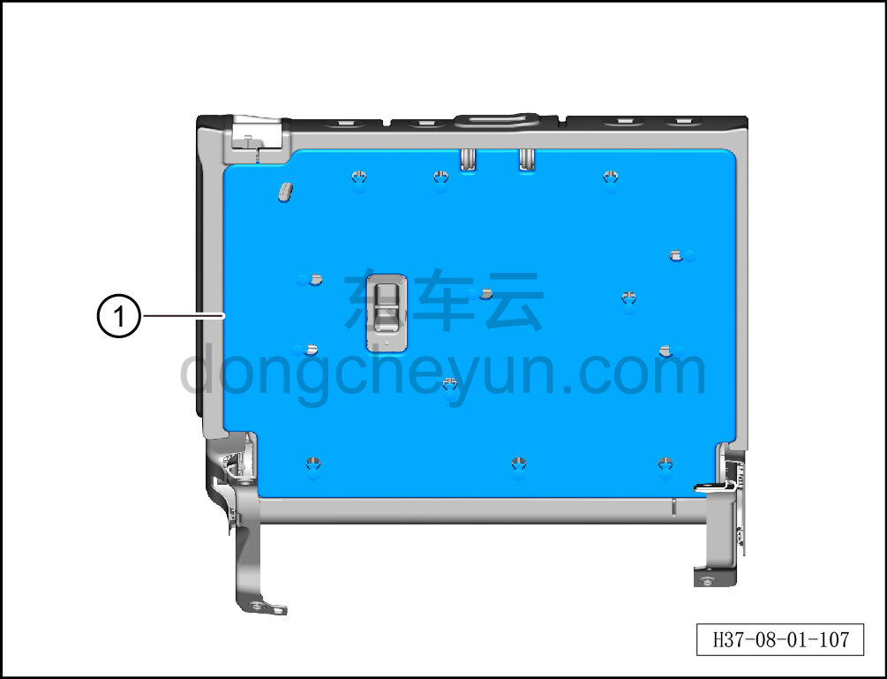

# Снятие и установка задней накладки спинки левого сиденья

> Внутренняя и внешняя отделка › Сиденья › Снятие и установка заднего сиденья  
> Оригинал: `拆卸与安装左侧座椅靠背后端护板` · [dongcheyun 56746](https://dongcheyun.com/p/56746), страница `c169702936e84fa580de0bdac3109c7d` · [оглавление](../README.md)

**Порядок снятия**

1. Выключите все электроприборы, отключите питание.

2. Выполните обесточивание автомобиля для ремонта. См. [3.1.4.1 Обесточивание автомобиля](../03-техническое-обслуживание/005-обесточивание-автомобиля.md)

3. Снимите левую спинку заднего сиденья. См. [8.1.5.6 Снятие и установка левой спинки заднего сиденья](034-снятие-и-установка-левой-спинки-заднего-сиденья.md)

4. Снимите обивку левой спинки заднего сиденья. См. [8.1.5.4 Снятие и установка обивки левой спинки заднего сиденья](032-снятие-и-установка-обивки-левой-спинки-заднего-сиденья.md)

5. Снимите заднюю накладку спинки левого сиденья.

a. С помощью инструмента для снятия внутренней облицовки отсоедините 13 крепёжных клипс задней накладки спинки левого сиденья и снимите заднюю накладку спинки левого сиденья ①.

**Порядок установки**

Установка выполняется в обратном порядке.

**Внимание:**

**-После завершения установки проверьте нормальность работы переключателя замка спинки.**
