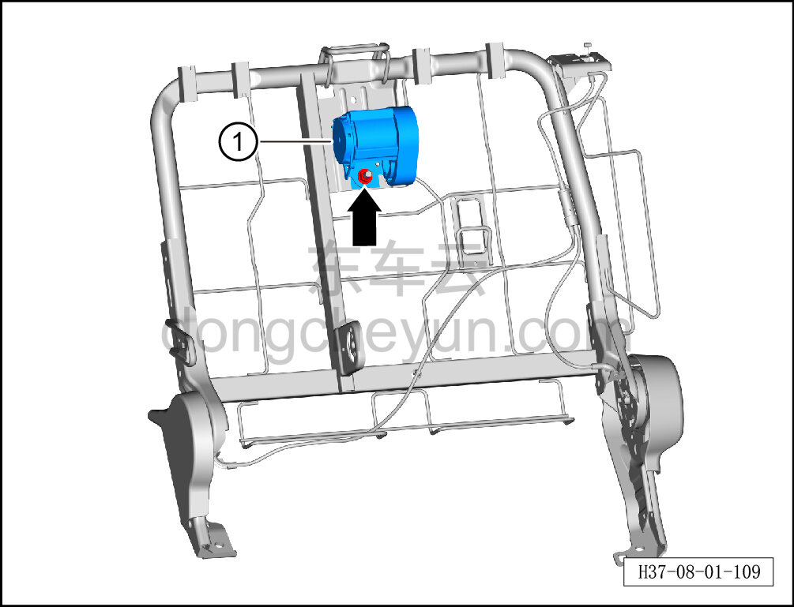
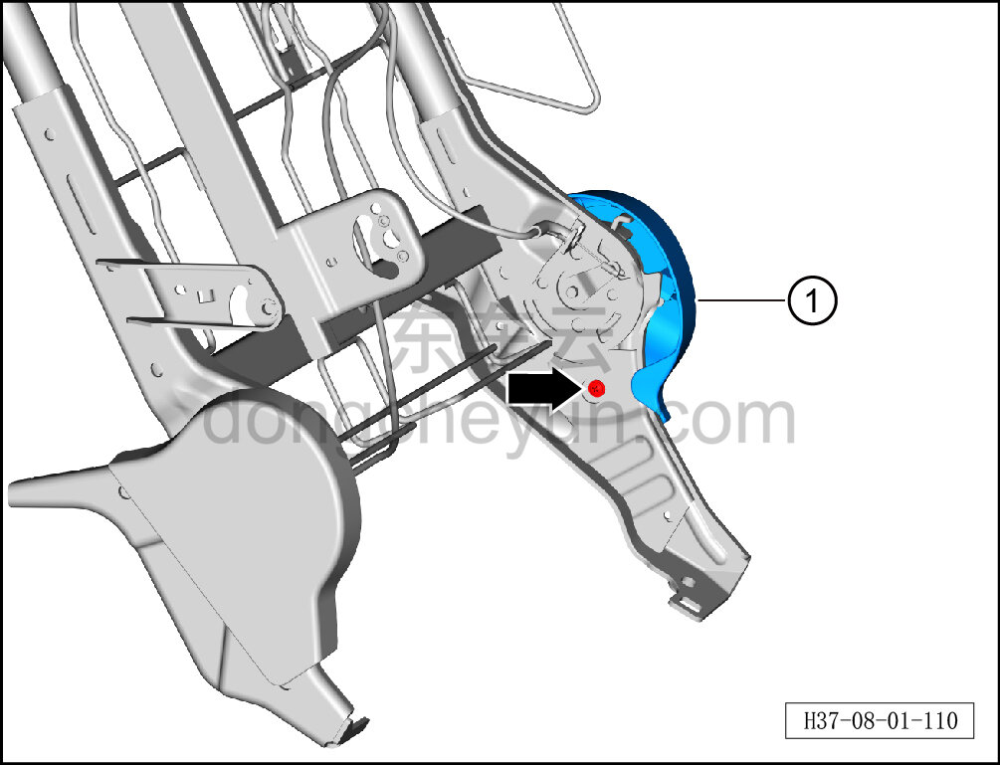
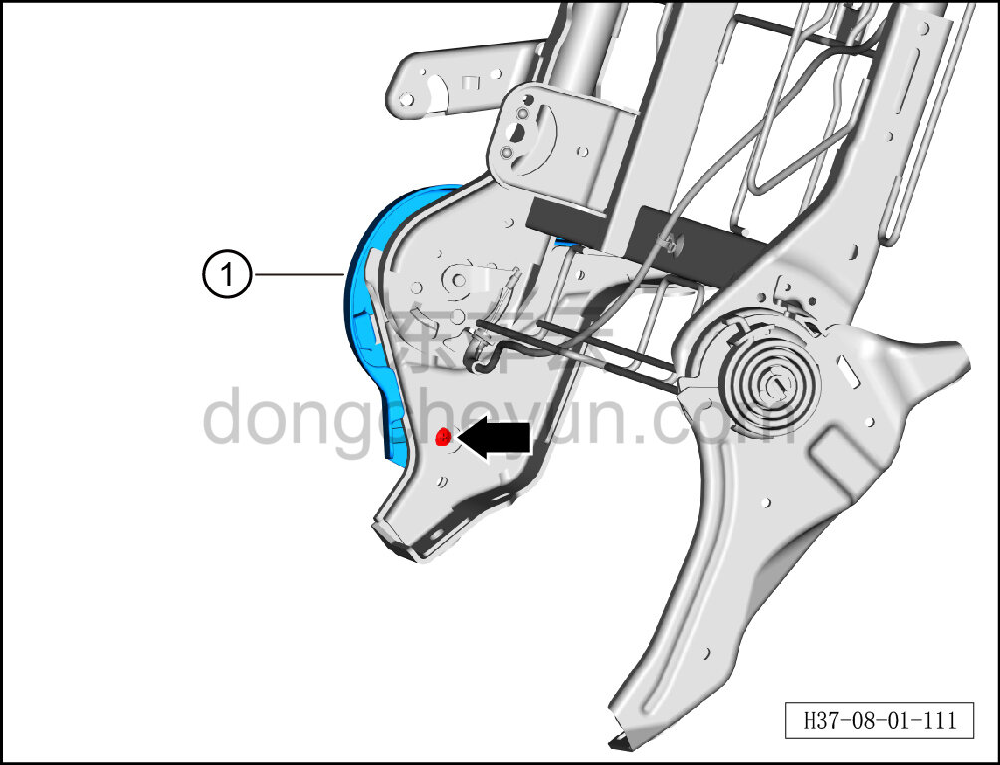
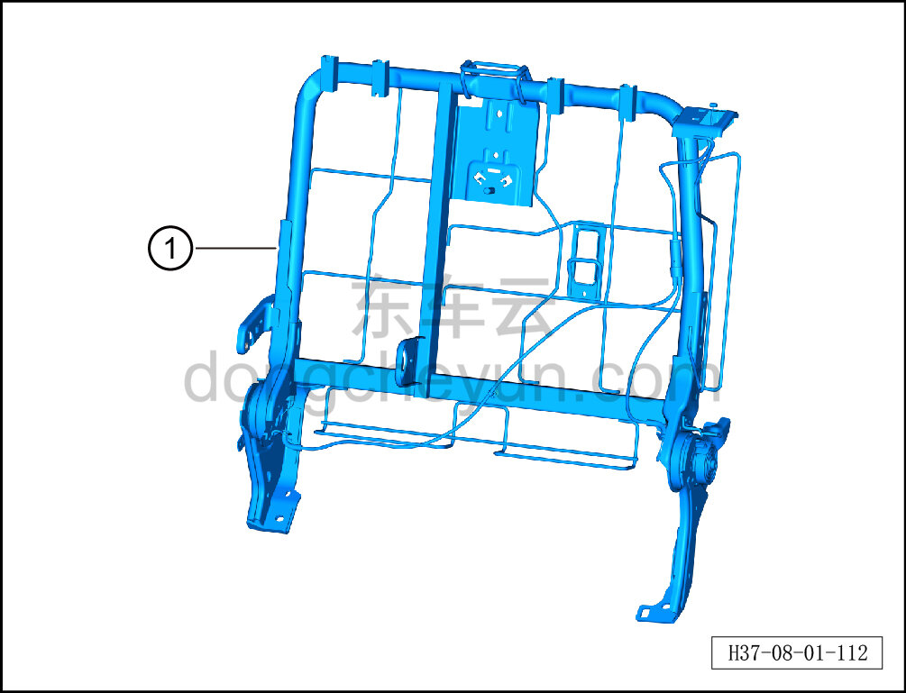

# Снятие и установка каркаса спинки секции 60% заднего сиденья в сборе

> Внутренняя и внешняя отделка › Сиденья › Снятие и установка заднего сиденья  
> Оригинал: `拆卸与安装后排六分靠背骨架总成` · [dongcheyun 56746](https://dongcheyun.com/p/56746), страница `d11809e1b50a4abebdf3befaa99b3e24` · [оглавление](../README.md)

**Порядок снятия**

1. Выключите все электроприборы, отключите питание.

2. Выполните обесточивание автомобиля для ремонта. См. [3.1.4.1 Обесточивание автомобиля](../03-техническое-обслуживание/005-обесточивание-автомобиля.md)

3. Снимите левую спинку заднего сиденья. См. [8.1.5.6 Снятие и установка левой спинки заднего сиденья](034-снятие-и-установка-левой-спинки-заднего-сиденья.md)

4. Снимите обивку левой спинки заднего сиденья. См. [8.1.5.4 Снятие и установка обивки левой спинки заднего сиденья](032-снятие-и-установка-обивки-левой-спинки-заднего-сиденья.md)

5. Снимите заднюю накладку спинки левого сиденья. См. [8.1.5.17 Снятие и установка задней накладки спинки левого сиденья](045-снятие-и-установка-задней-накладки-спинки-левого.md)

6. Снимите пенонаполнитель спинки секции 60% в сборе. См. [8.1.5.18 Снятие и установка пенонаполнителя спинки секции 60% в сборе](046-снятие-и-установка-пенонаполнителя-спинки-секции-60-в.md)

7. Снимите каркас спинки секции 60% заднего сиденья в сборе.

a. С помощью торцевой головки 16 мм выверните крепёжную гайку среднего ретрактора заднего сиденья, извлеките средний ретрактор заднего сиденья ①.

b. С помощью крестовой отвёртки выверните крепёжный винт левой наружной накладки заднего сиденья, извлеките левую наружную накладку заднего сиденья ①.

c. С помощью крестовой отвёртки выверните крепёжный винт левой внутренней накладки заднего сиденья, извлеките левую внутреннюю накладку заднего сиденья ①.

d. Снимите каркас спинки секции 60% заднего сиденья в сборе ①.

**Порядок установки**

Установка выполняется в обратном порядке.

**Внимание:**

**-После завершения установки проверьте нормальность работы переключателя замка спинки.**
