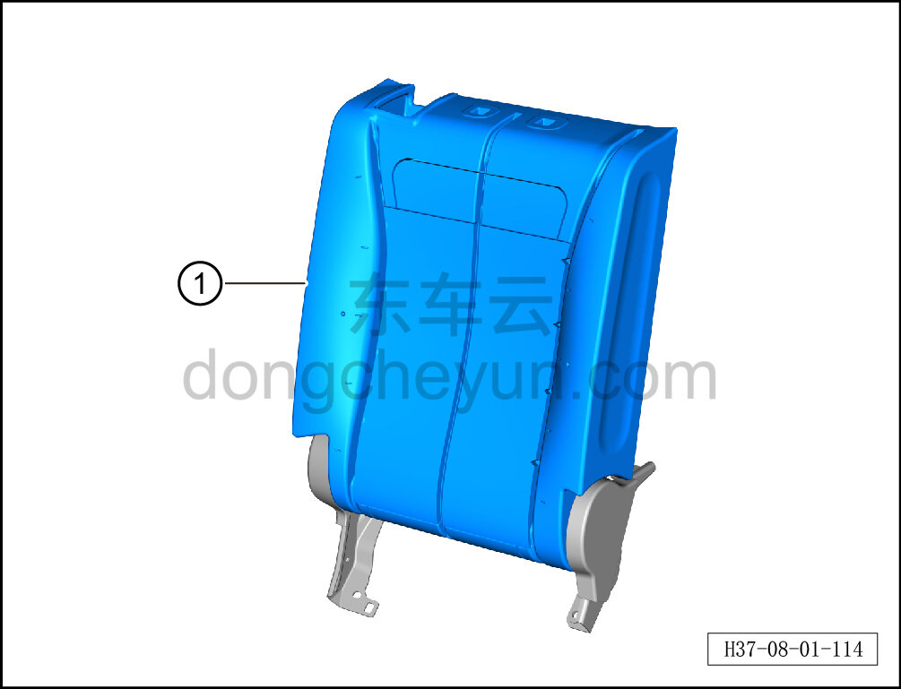

# Снятие и установка пенонаполнителя спинки секции 40% в сборе

> Внутренняя и внешняя отделка › Сиденья › Снятие и установка заднего сиденья  
> Оригинал: `拆卸与安装四分靠背发泡总成` · [dongcheyun 56746](https://dongcheyun.com/p/56746), страница `df97349c464e44f7b4f8c6ec20f251d9` · [оглавление](../README.md)

**Порядок снятия**

1. Выключите все электроприборы, отключите питание.

2. Выполните обесточивание автомобиля для ремонта. См. [3.1.4.1 Обесточивание автомобиля](../03-техническое-обслуживание/005-обесточивание-автомобиля.md)

3. Снимите правую спинку заднего сиденья. См. [8.1.5.7 Снятие и установка правой спинки заднего сиденья](035-снятие-и-установка-правой-спинки-заднего-сиденья.md)

4. Снимите обивку правой спинки заднего сиденья. См. [8.1.5.5 Снятие и установка обивки правой спинки заднего сиденья](033-снятие-и-установка-обивки-правой-спинки-заднего-сиденья.md)

5. Снимите пенонаполнитель спинки секции 40% в сборе.

a. Извлеките пенонаполнитель спинки секции 40% в сборе ①.

**Порядок установки**

Установка выполняется в обратном порядке.

**Внимание:**

**-После завершения установки проверьте нормальность работы переключателя замка спинки.**
