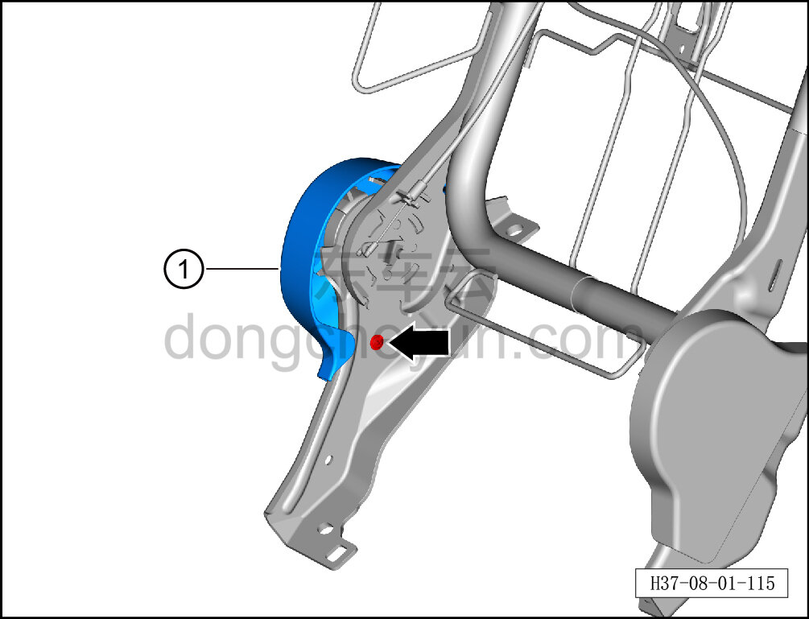
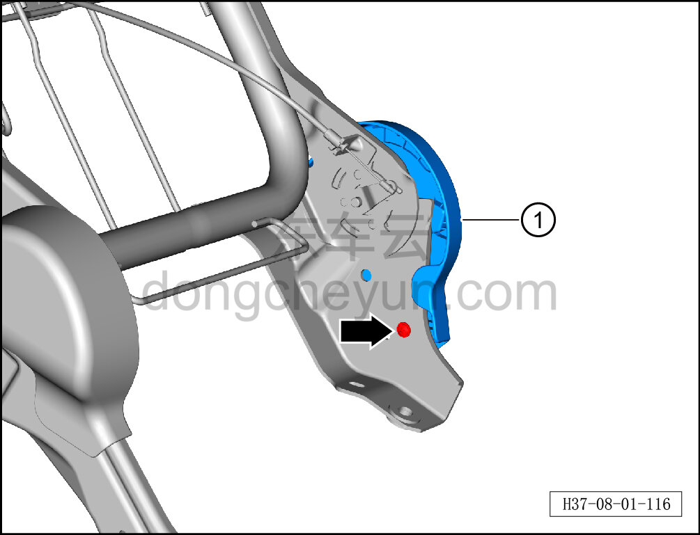
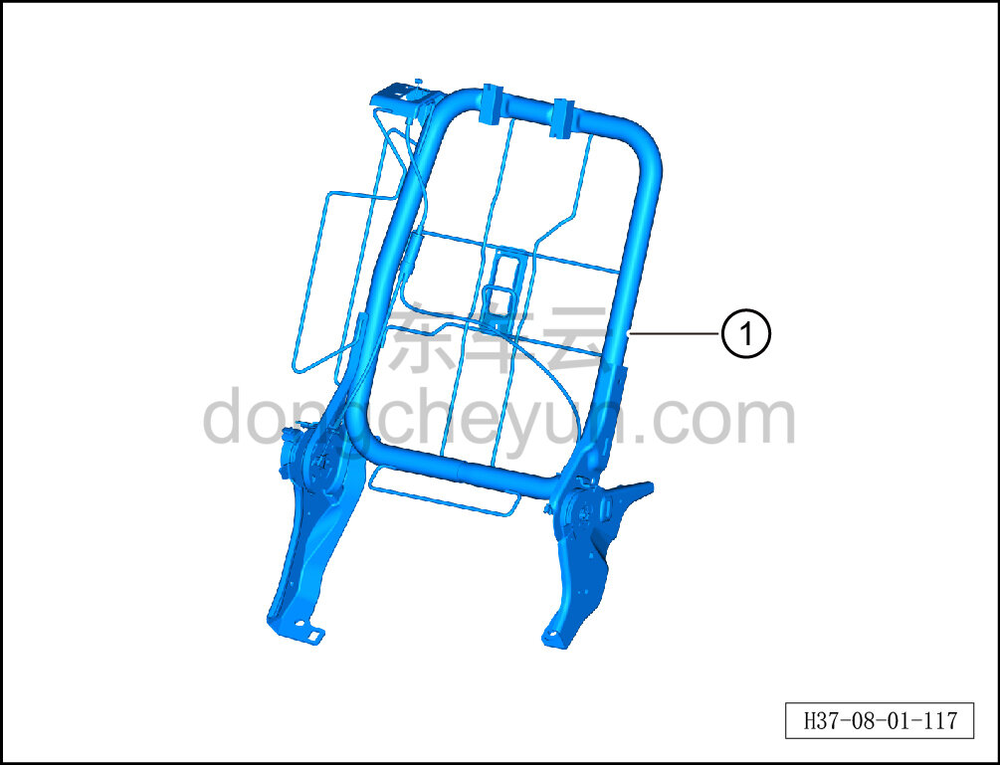

# Снятие и установка каркаса спинки секции 40% заднего сиденья в сборе

> Внутренняя и внешняя отделка › Сиденья › Снятие и установка заднего сиденья  
> Оригинал: `拆卸与安装后排四分靠背骨架总成` · [dongcheyun 56746](https://dongcheyun.com/p/56746), страница `f922c9681cd640fea58c0a21f4fb1a63` · [оглавление](../README.md)

**Порядок снятия**

1. Выключите все электроприборы, отключите питание.

2. Выполните обесточивание автомобиля для ремонта. См. [3.1.4.1 Обесточивание автомобиля](../03-техническое-обслуживание/005-обесточивание-автомобиля.md)

3. Снимите правую спинку заднего сиденья. См. [8.1.5.7 Снятие и установка правой спинки заднего сиденья](035-снятие-и-установка-правой-спинки-заднего-сиденья.md)

4. Снимите обивку правой спинки заднего сиденья. См. [8.1.5.5 Снятие и установка обивки правой спинки заднего сиденья](033-снятие-и-установка-обивки-правой-спинки-заднего-сиденья.md)

5. Снимите заднюю накладку спинки правого сиденья. См. [8.1.5.20 Снятие и установка задней накладки спинки правого сиденья](048-снятие-и-установка-задней-накладки-спинки-правого.md)

6. Снимите пенонаполнитель спинки секции 40% в сборе. См. [8.1.5.21 Снятие и установка пенонаполнителя спинки секции 40% в сборе](049-снятие-и-установка-пенонаполнителя-спинки-секции-40-в.md)

7. Снимите каркас спинки секции 40% заднего сиденья в сборе.

a. С помощью крестовой отвёртки выверните крепёжный винт правой наружной накладки заднего сиденья, извлеките правую наружную накладку заднего сиденья ①.

b. С помощью крестовой отвёртки выверните крепёжный винт правой внутренней накладки заднего сиденья, извлеките правую внутреннюю накладку заднего сиденья ①.

c. Снимите каркас спинки секции 40% заднего сиденья в сборе ①.

**Порядок установки**

Установка выполняется в обратном порядке.

**Внимание:**

**-После завершения установки проверьте нормальность работы переключателя замка спинки.**
