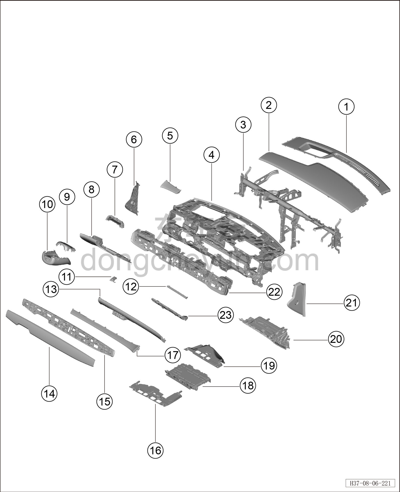
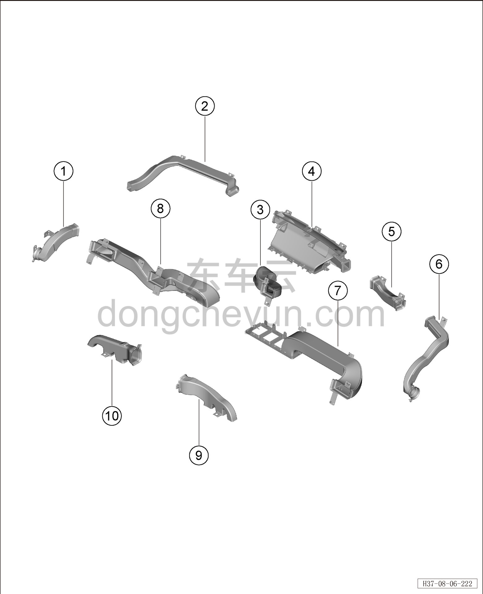

# Покомпонентный вид (деталировка)

> Внутренняя и внешняя отделка › Панель приборов  
> Оригинал: `结构分解图` · [dongcheyun 56746](https://dongcheyun.com/p/56746), страница `0d21ae3168954cb98020b0336d32bd1f` · [оглавление](../README.md)

| № | Наименование детали | Кол-во на автомобиль | Примечание |
|---|---|---|---|
| 1 | Передняя накладка дефростера | 1 | - |
| 2 | Верхняя крышка панели приборов | 1 | - |
| 3 | Поперечная балка панели приборов | 1 | - |
| 4 | Каркас панели приборов | 1 | - |
| 5 | Левая декоративная накладка | 1 | - |
| 6 | Левая торцевая крышка панели приборов | 1 | - |
| 7 | Панель шторки | 1 | - |
| 8 | Нижняя левая защитная накладка в сборе | 1 | - |
| 9 | Верхний кожух рулевой колонки | 1 | - |
| 10 | Нижний кожух рулевой колонки | 1 | - |
| 11 | Ручка капота | 1 | - |
| 12 | Направляющая заслонка правого воздуховыпускного отверстия | 1 | - |
| 13 | Средняя правая накладка | 1 | - |
| 14 | Центральная декоративная панель | 1 | - |
| 15 | Основание центральной декоративной панели | 1 | - |
| 16 | Левая нижняя панель панели приборов | 1 | - |
| 17 | Правая декоративная накладка | 1 | - |
| 18 | Мобильный офисный столик | 1 | - |
| 19 | Правая нижняя панель панели приборов | 1 | - |
| 20 | Перчаточный ящик | 1 | - |
| 21 | Правая торцевая крышка панели приборов | 1 | - |
| 22 | Воздуховыпускное отверстие | 1 | - |
| 23 | Монтажная панель перчаточного ящика | 1 | - |

| № | Наименование детали | Кол-во на автомобиль | Примечание |
|---|---|---|---|
| 1 | Внутренняя часть левого воздуховода дефростера | 1 | - |
| 2 | Левый воздуховод дефростера | 1 | - |
| 3 | Центральный воздуховод обдува лица | 1 | - |
| 4 | Передний воздуховод дефростера | 1 | - |
| 5 | Правый воздуховод дефростера | 1 | - |
| 6 | Внутренняя часть правого воздуховода дефростера | 1 | - |
| 7 | Правый воздуховод обдува лица | 1 | - |
| 8 | Левый воздуховод обдува лица | 1 | - |
| 9 | Правый воздуховод обдува ног | 1 | - |
| 10 | Левый воздуховод обдува ног | 1 | - |
