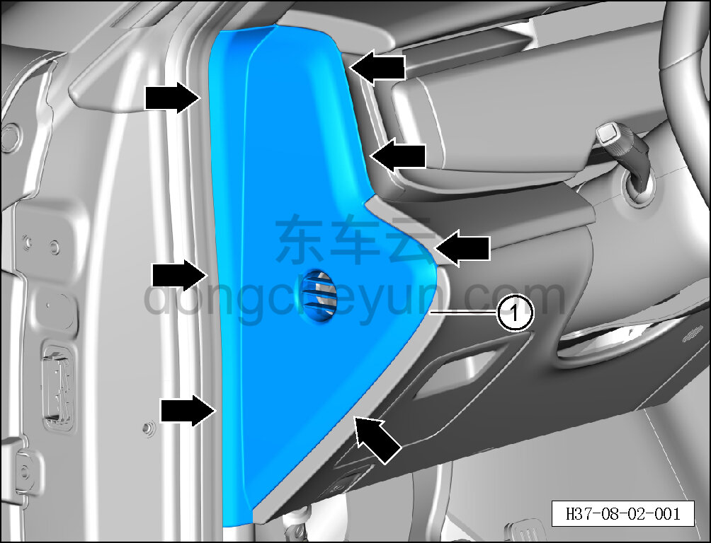

# Снятие и установка левой торцевой крышки панели приборов

> Внутренняя и внешняя отделка › Панель приборов › Снятие и установка панели приборов  
> Оригинал: `拆卸与安装仪表板左端盖` · [dongcheyun 56746](https://dongcheyun.com/p/56746), страница `87f110e0f60643c09658e57fa1eeee4a` · [оглавление](../README.md)

**Порядок снятия**

**Примечание:**

** - Далее описано снятие и установка левой торцевой крышки панели приборов, правая сторона выполняется по аналогии с левой. **

1. Снимите левую торцевую крышку панели приборов.

a. С помощью инструмента для снятия внутренней облицовки отсоедините 7 крепёжных зажимов левой торцевой крышки панели приборов, извлеките левую торцевую крышку панели приборов ①.

**Внимание:**

**-При отжимании торцевой крышки инструментом для внутренней облицовки можно подложить под инструмент нетканый материал, чтобы избежать царапин на окружающей внутренней облицовке в процессе снятия.**

**Порядок установки **

Установка выполняется в обратном порядке.

**Внимание:**

**-Проверьте крепёжные клипсы на отсутствие повреждений, при необходимости замените.**

**-После завершения установки проверьте, чтобы левая торцевая крышка панели приборов была установлена ровно, без вздутий.**
