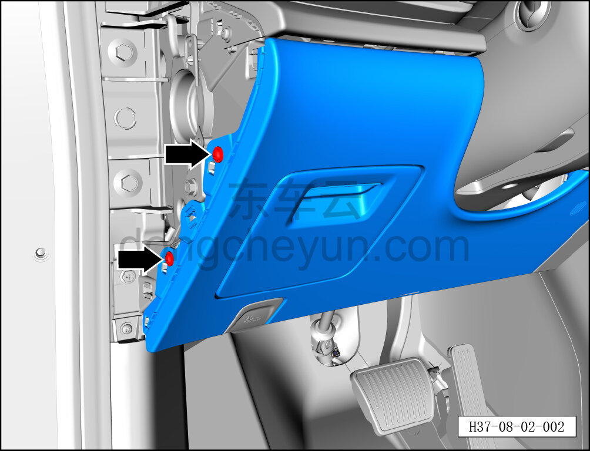
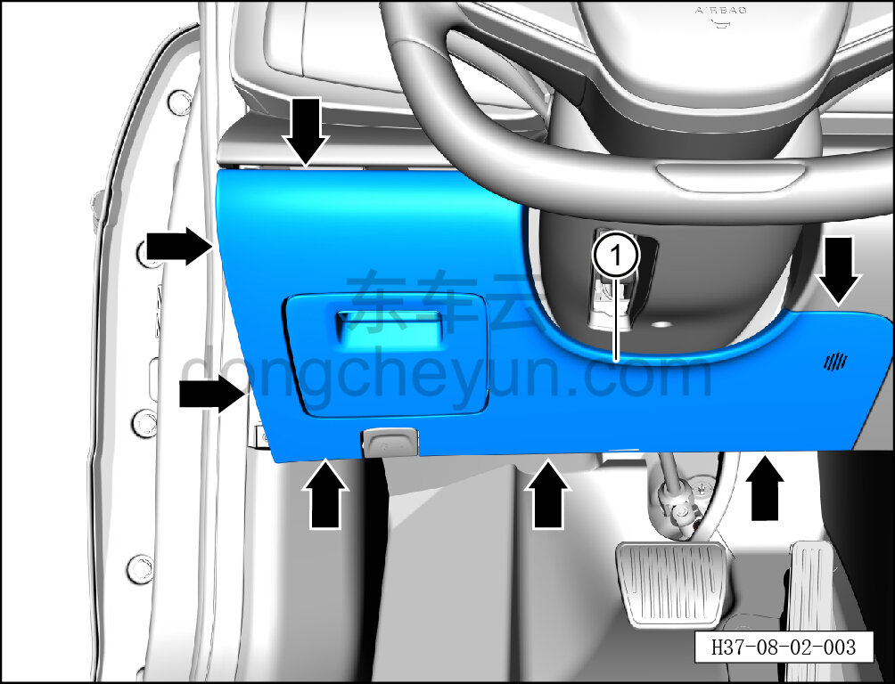

# Снятие и установка нижней левой защитной накладки в сборе

> Внутренняя и внешняя отделка › Панель приборов › Снятие и установка панели приборов  
> Оригинал: `拆卸与安装左下护板总成` · [dongcheyun 56746](https://dongcheyun.com/p/56746), страница `2c02daf1e81146b0bba136cf20ddaccf` · [оглавление](../README.md)

**Порядок снятия**

1. Снимите левую торцевую крышку в сборе. См. [8.2.4.1 Снятие и установка левой торцевой крышки панели приборов](054-снятие-и-установка-левой-торцевой-крышки-панели.md)

2. Снимите нижнюю левую защитную накладку в сборе.

a. С помощью биты T25 выверните 2 крепёжных винта нижней левой защитной накладки в сборе.

Момент затяжки винта: 1.5±0.5 Н·м

b. С помощью инструмента для снятия внутренней облицовки отожмите 7 крепёжных зажимов нижней левой защитной накладки в сборе, извлеките нижнюю левую защитную накладку в сборе ①.

**Внимание:**

**-При отжимании накладки инструментом для внутренней облицовки можно подложить под инструмент нетканый материал, чтобы избежать царапин на окружающей внутренней облицовке в процессе снятия.**

**Порядок установки **

Установка выполняется в обратном порядке.

**Внимание:**

**-Проверьте крепёжные клипсы на отсутствие повреждений, при необходимости замените.**

**-После завершения установки проверьте, чтобы нижняя левая защитная накладка была установлена ровно, без вздутий.**
