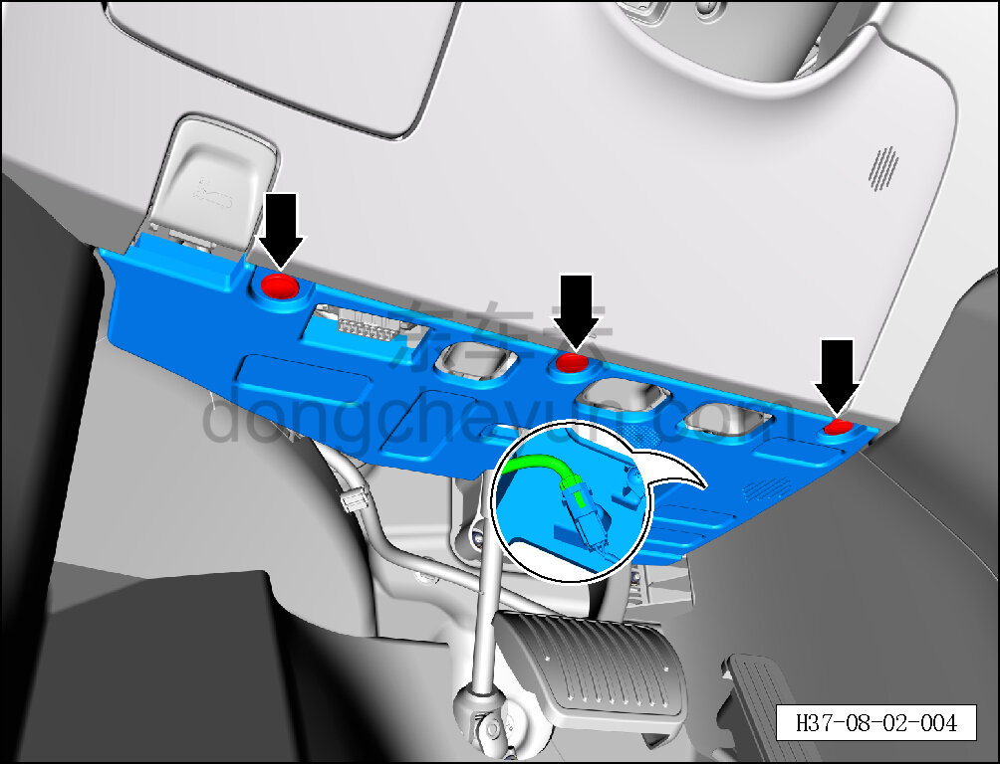
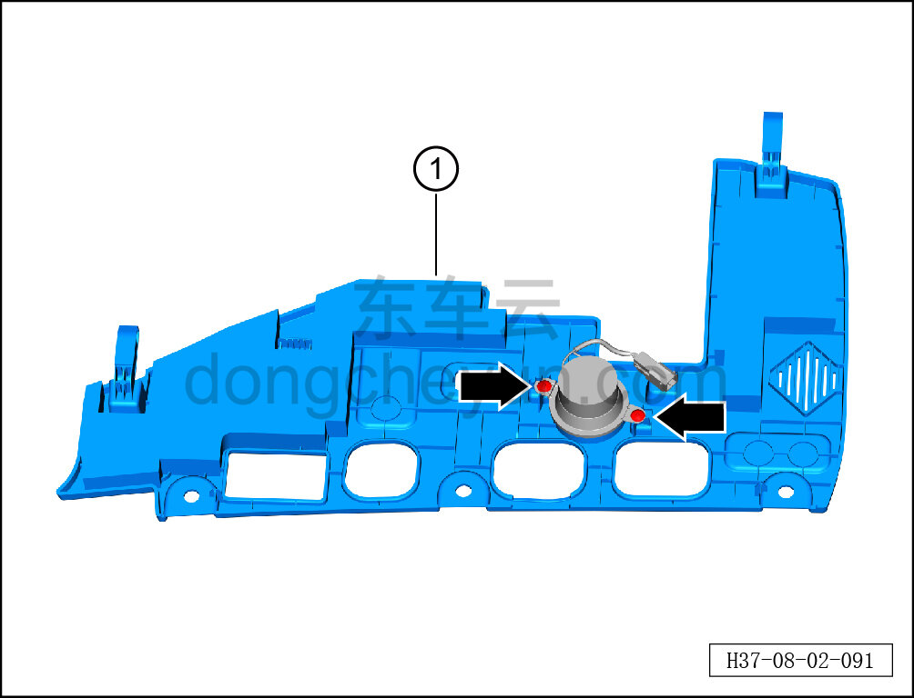

# Снятие и установка левой нижней панели панели приборов

> Внутренняя и внешняя отделка › Панель приборов › Снятие и установка панели приборов  
> Оригинал: `拆卸与安装仪表板左下底板` · [dongcheyun 56746](https://dongcheyun.com/p/56746), страница `ab81776b92f544349da2235ae6550846` · [оглавление](../README.md)

**Порядок снятия**

1. Выключите все электроприборы, отключите питание.

2. Выполните операцию обесточивания автомобиля для ремонта. См. [3.1.4.1 Обесточивание автомобиля](../03-техническое-обслуживание/005-обесточивание-автомобиля.md)

3. Снимите точечный источник света. См. [9.9.7.3 Снятие и установка точечного источника света](../09-электрическая-и-электронная-система/086-снятие-и-установка-точечного-источника-света.md)

4. Снимите левую нижнюю панель панели приборов.

**Внимание:**

**-На задней стороне левой нижней панели панели приборов имеется соединение жгута проводов, после отсоединения клипс не тяните за неё, чтобы не повредить жгут.**

a. С помощью инструмента для снятия внутренней облицовки отсоедините 3 крепёжные клипсы левой нижней панели панели приборов.

b. Отведите часть левой нижней панели панели приборов, нажмите на фиксатор разъёма, отсоедините разъём жгута динамика ECALL, снимите левую нижнюю панель панели приборов вместе с динамиком в сборе.

c. С помощью крестовой отвёртки выверните 2 крепёжных винта динамика ECALL.

Момент затяжки винта: 1.5±0.5 Н·м

d. Снимите левую нижнюю панель панели приборов ①.

**Порядок установки **

Установка выполняется в обратном порядке.

**Внимание:**

**-Проверьте крепёжные клипсы на отсутствие повреждений, при необходимости замените.**

**-После завершения установки проверьте, чтобы левая нижняя панель панели приборов была установлена ровно, без вздутий.**

**-Проверьте нормальность функции динамика ECALL.**
