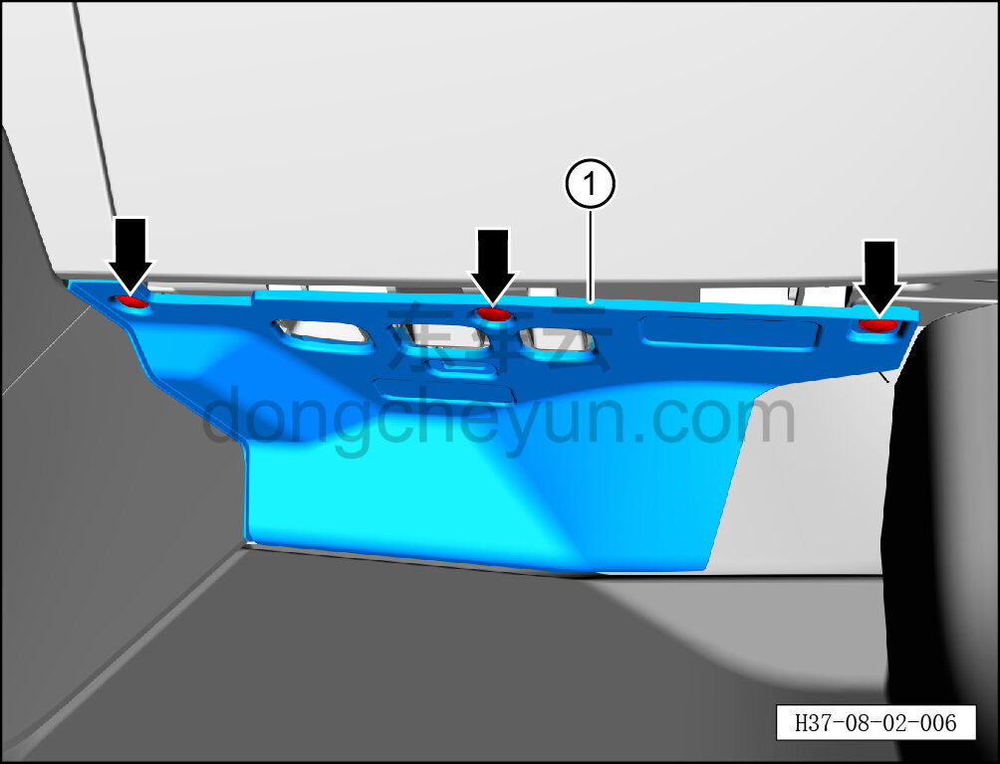

# Снятие и установка правой нижней панели панели приборов

> Внутренняя и внешняя отделка › Панель приборов › Снятие и установка панели приборов  
> Оригинал: `拆卸与安装仪表板右下底板` · [dongcheyun 56746](https://dongcheyun.com/p/56746), страница `a36a26c58ab2464d9ff4d648d21d8e86` · [оглавление](../README.md)

**Порядок снятия**

1. Выключите все электроприборы, отключите питание.

2. Выполните операцию обесточивания автомобиля для ремонта. См. [3.1.4.1 Обесточивание автомобиля](../03-техническое-обслуживание/005-обесточивание-автомобиля.md)

3. Снимите точечный источник света. См. [9.9.7.3 Снятие и установка точечного источника света](../09-электрическая-и-электронная-система/086-снятие-и-установка-точечного-источника-света.md)

4. Снимите нижнюю правую защитную накладку в сборе.

a. С помощью инструмента для снятия внутренней облицовки отсоедините 3 крепёжные клипсы нижней правой накладки, извлеките нижнюю правую накладку ①.

**Внимание:**

**-При отжимании панели приборов инструментом для внутренней облицовки можно подложить под инструмент нетканый материал, чтобы избежать царапин на окружающей внутренней облицовке в процессе снятия.**

**Порядок установки **

Установка выполняется в обратном порядке.

**Внимание:**

**-Проверьте крепёжные клипсы на отсутствие повреждений, при необходимости замените.**

**-После завершения установки проверьте, чтобы правая нижняя панель панели приборов была установлена ровно, без вздутий.**
