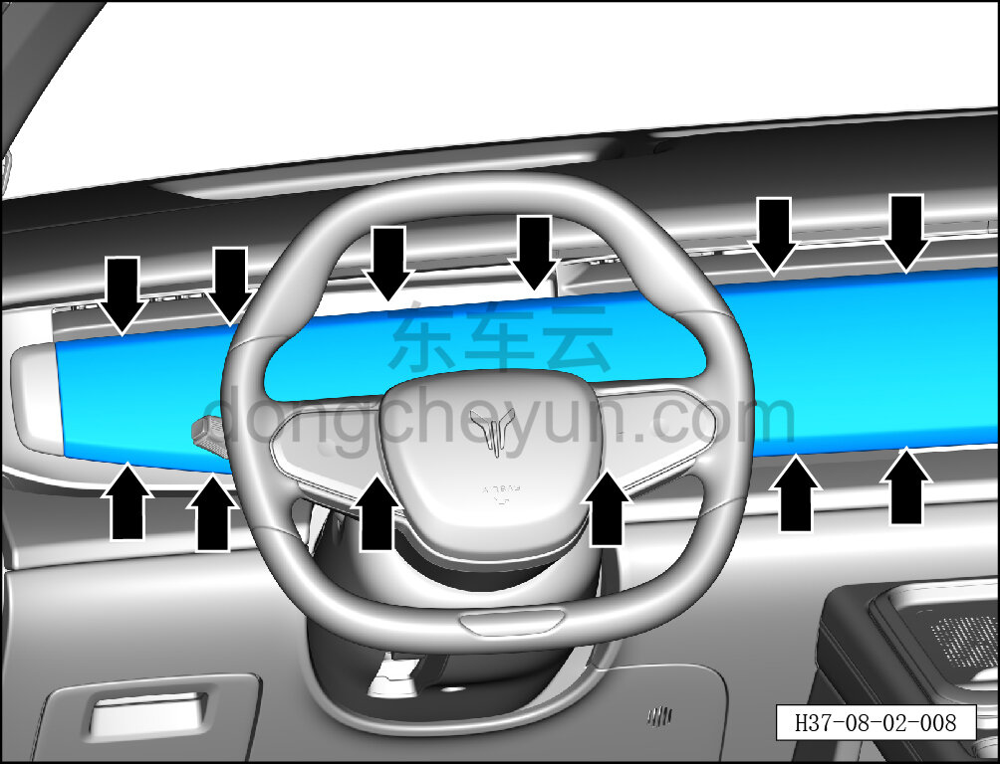
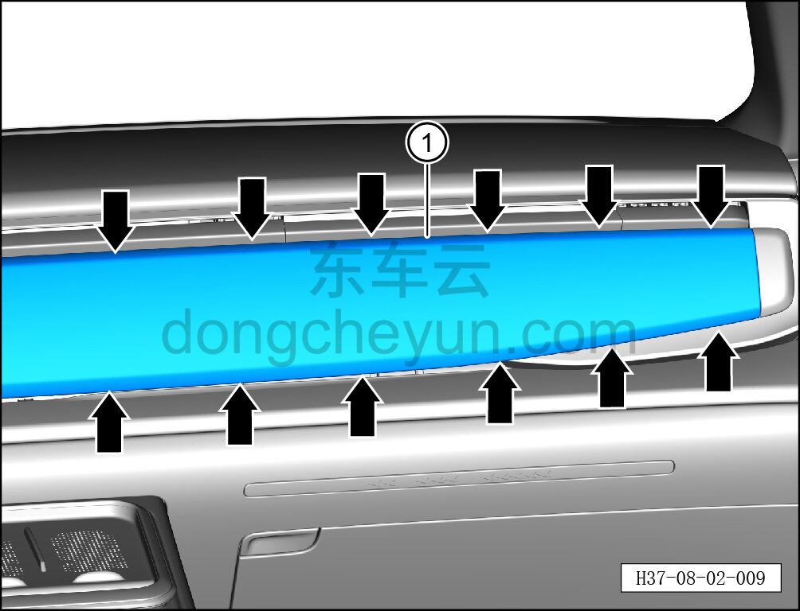

# Снятие и установка центральной декоративной панели

> Внутренняя и внешняя отделка › Панель приборов › Снятие и установка панели приборов  
> Оригинал: `拆卸与安装中央装饰面板` · [dongcheyun 56746](https://dongcheyun.com/p/56746), страница `bbbed45eeb6c41d7b0deb40be0b19930` · [оглавление](../README.md)

Порядок снятия

1. Выключите все электроприборы, отключите питание.

2. Выполните операцию обесточивания автомобиля для ремонта. См. [3.1.4.1 Обесточивание автомобиля](../03-техническое-обслуживание/005-обесточивание-автомобиля.md)

3. Снимите мультимедийный дисплей. См. [9.1.3.1 Снятие и установка мультимедийного дисплея](../09-электрическая-и-электронная-система/003-снятие-и-установка-мультимедийного-дисплея.md)

4. Снимите центральную декоративную панель.

a. С помощью инструмента для снятия внутренней облицовки отсоедините 12 крепёжных клипс с левой стороны центральной декоративной панели.

**Внимание:**

**-При отжимании декоративной панели инструментом для внутренней облицовки можно подложить под инструмент нетканый материал, чтобы избежать царапин на окружающей внутренней облицовке в процессе снятия.**

b. С помощью инструмента для снятия внутренней облицовки отсоедините 12 крепёжных клипс с правой стороны центральной декоративной панели.

c. Извлеките центральную декоративную панель ①.

**Порядок установки **

Установка выполняется в обратном порядке.

**Внимание:**

**-Проверьте крепёжные клипсы на отсутствие повреждений, при необходимости замените.**

**-После завершения установки проверьте, чтобы центральная декоративная панель была установлена ровно, без вздутий.**

**-Проверьте нормальность работы всех функций мультифункционального дисплея.**
