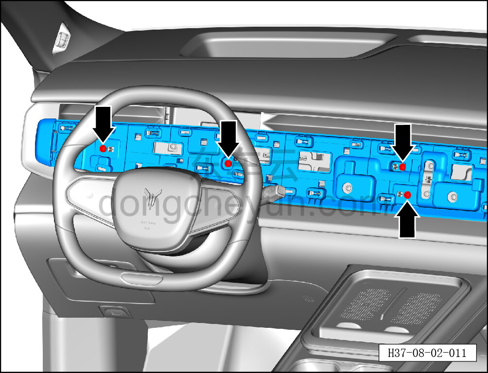
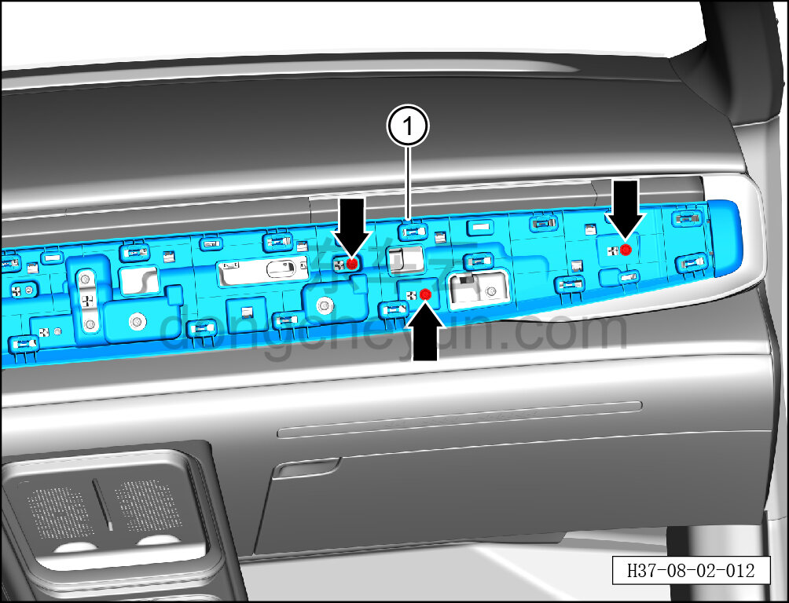

# Снятие и установка основания центральной декоративной панели

> Внутренняя и внешняя отделка › Панель приборов › Снятие и установка панели приборов  
> Оригинал: `拆卸与安装中央装饰面板底板` · [dongcheyun 56746](https://dongcheyun.com/p/56746), страница `a56fc890a98149a5bcb3fd802feb8df8` · [оглавление](../README.md)

**Порядок снятия**

1. Выключите все электроприборы, отключите питание.

2. Выполните операцию обесточивания автомобиля для ремонта. См. [3.1.4.1 Обесточивание автомобиля](../03-техническое-обслуживание/005-обесточивание-автомобиля.md)

3. Снимите мультимедийный дисплей. См. [9.1.3.1 Снятие и установка мультимедийного дисплея](../09-электрическая-и-электронная-система/003-снятие-и-установка-мультимедийного-дисплея.md)

4. Снимите центральную декоративную панель. См. [8.2.4.5 Снятие и установка центральной декоративной панели](058-снятие-и-установка-центральной-декоративной-панели.md)

5. Снимите основание центральной декоративной панели.

a. С помощью биты T25 выверните 4 крепёжных винта с левой стороны основания центральной декоративной панели.

Момент затяжки винта: 1.5±0.5 Н·м

b. С помощью биты T25 выверните 3 крепёжных винта с правой стороны основания центральной декоративной панели.

Момент затяжки винта: 1.5±0.5 Н·м

c. С помощью специального инструмента для внутренней облицовки отожмите основание центральной декоративной панели ①.

**Внимание:**

**-При отжимании основания декоративной панели инструментом для внутренней облицовки можно подложить под инструмент нетканый материал, чтобы избежать царапин на окружающей внутренней облицовке в процессе снятия.**

**Порядок установки **

Установка выполняется в обратном порядке.

**Внимание:**

**-Проверьте крепёжные клипсы на отсутствие повреждений, при необходимости замените.**

**-После завершения установки проверьте, чтобы центральная декоративная панель была установлена ровно, без вздутий.**

**-Проверьте нормальность работы всех функций мультифункционального дисплея.**
