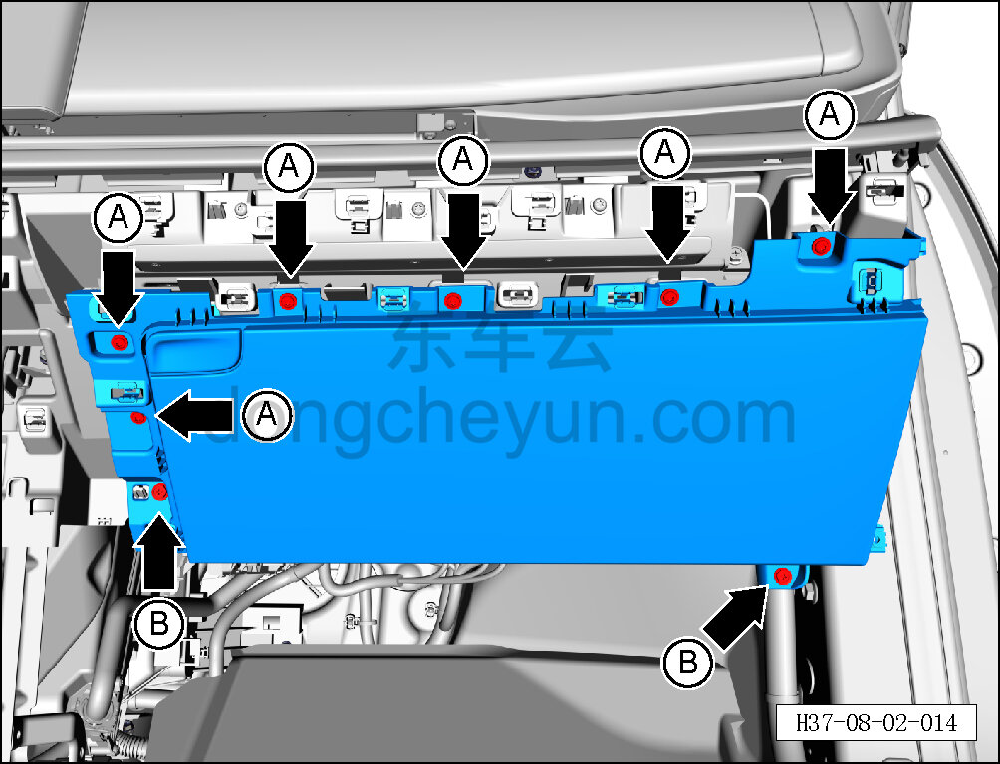
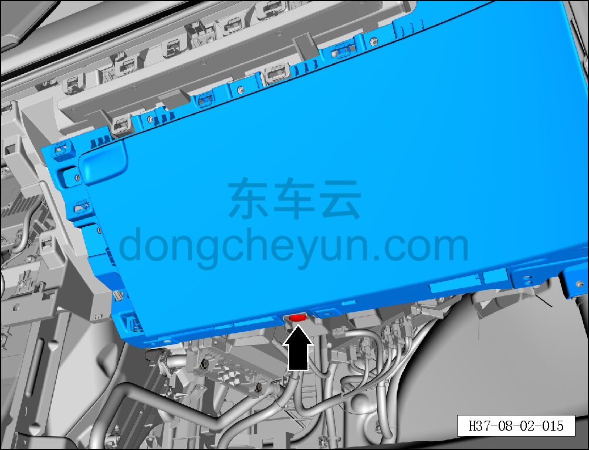
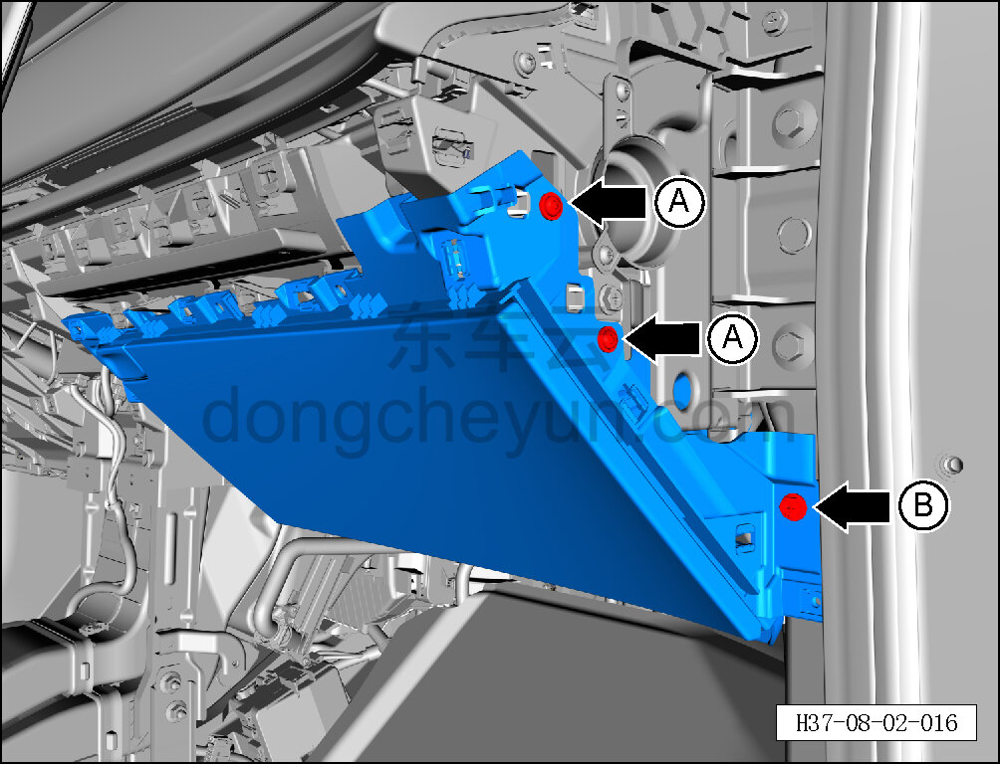
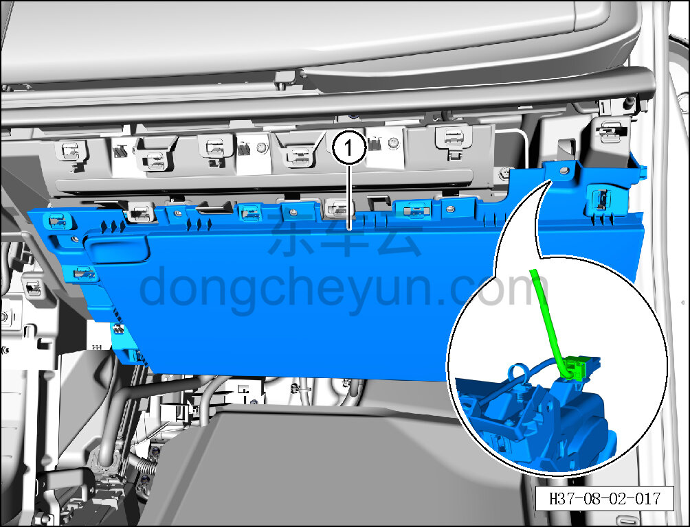

# Снятие и установка перчаточного ящика

> Внутренняя и внешняя отделка › Панель приборов › Снятие и установка панели приборов  
> Оригинал: `拆卸与安装手套箱` · [dongcheyun 56746](https://dongcheyun.com/p/56746), страница `851aeb23937a4a60af0128610333b264` · [оглавление](../README.md)

**Порядок снятия**

1. Выключите все электроприборы, отключите питание.

2. Выполните операцию обесточивания автомобиля для ремонта. См. [3.1.4.1 Обесточивание автомобиля](../03-техническое-обслуживание/005-обесточивание-автомобиля.md)

3. Снимите правую декоративную накладку порога передней двери. См. [8.5.7.1 Снятие и установка левой декоративной накладки порога передней двери](143-снятие-и-установка-левой-накладки-переднего-порога.md)

4. Снимите среднюю правую накладку. См. [8.2.4.21 Снятие и установка средней правой накладки](074-снятие-и-установка-центрально-правой-накладки.md)

5. Снимите перчаточный ящик.

a. С помощью биты T25 выверните 6 крепёжных винтов A перчаточного ящика.

Момент затяжки винта: 1.5±0.5 Н·м

b. С помощью торцевой головки 10 мм выверните 2 крепёжных болта B под перчаточным ящиком.

Момент затяжки болта: 4±1 Н·м

c. С помощью инструмента для снятия внутренней облицовки отсоедините крепёжную клипсу, соединяющую перчаточный ящик с правым воздуховодом обдува ног.

d. С помощью биты T25 выверните 2 крепёжных винта A перчаточного ящика.

Момент затяжки винта: 1.5±0.5 Н·м

e. С помощью торцевой головки 10 мм выверните крепёжный болт B перчаточного ящика.

Момент затяжки болта: 4±1 Н·м

**Внимание:**

**-На задней стороне перчаточного ящика имеется соединение жгута проводов, после снятия перчаточного ящика не тяните за него, чтобы не повредить жгут.**

f. Отведите часть перчаточного ящика, удерживая фиксатор разъёма, отсоедините разъём жгута приборов, снимите перчаточный ящик ①.

**Порядок установки **

Установка выполняется в обратном порядке.

**Внимание:**

**-Проверьте крепёжные клипсы на отсутствие повреждений, при необходимости замените.**

**-После завершения установки проверьте, чтобы перчаточный ящик был установлен ровно, без вздутий.**

**-Проверьте нормальность функций открытия и закрытия перчаточного ящика.**
