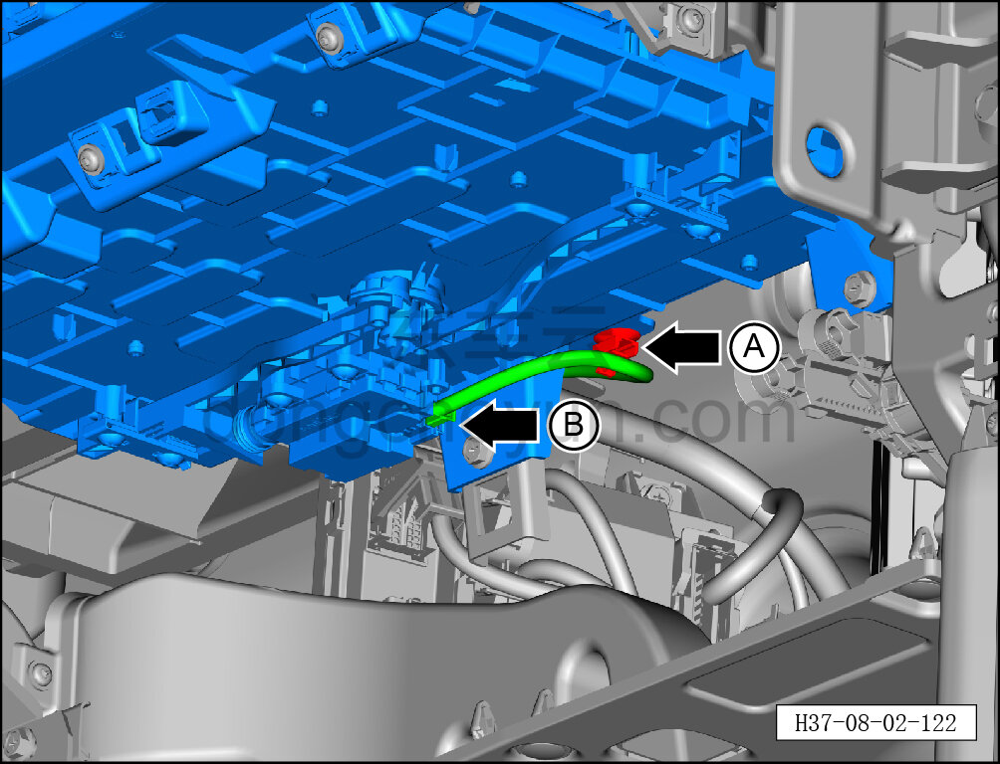
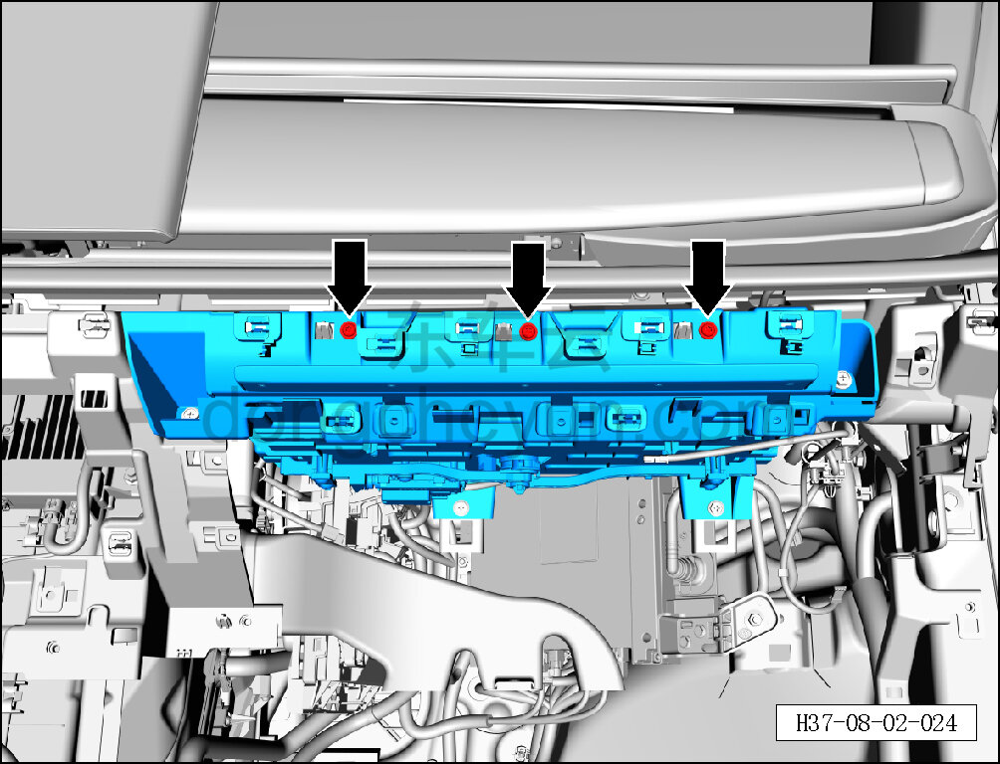
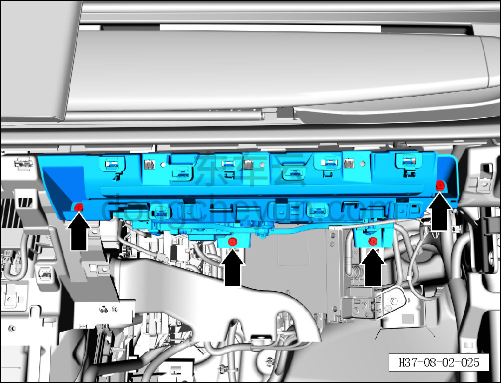
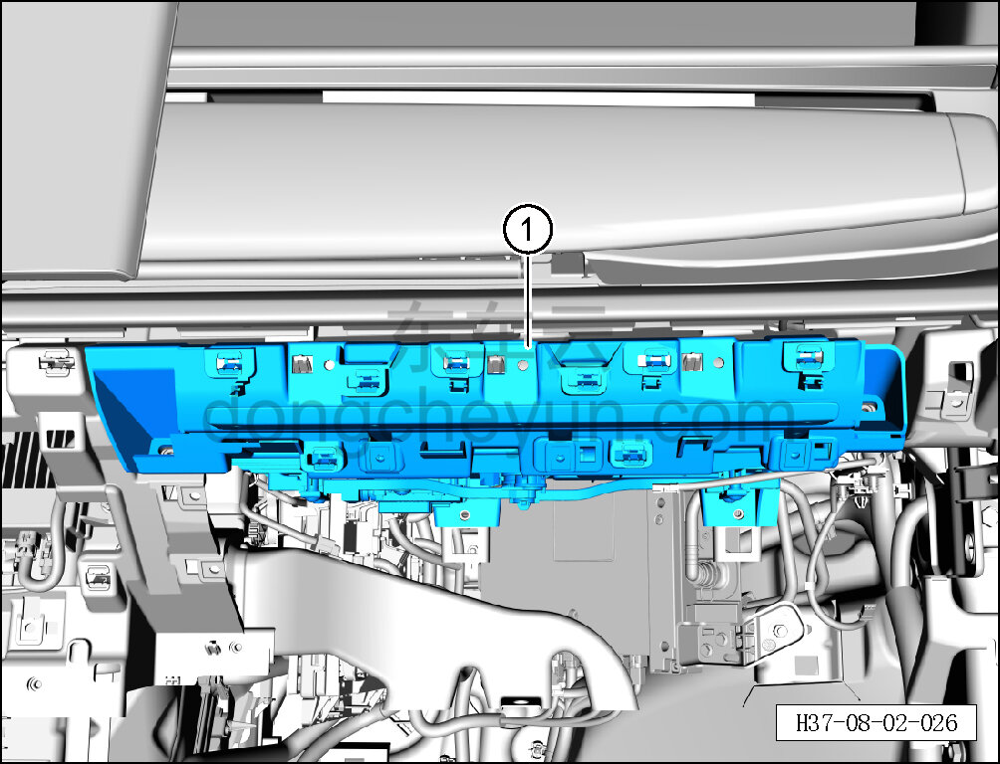

# Снятие и установка мобильного офисного столика

> Внутренняя и внешняя отделка › Панель приборов › Снятие и установка панели приборов  
> Оригинал: `拆卸与安装移动商务桌` · [dongcheyun 56746](https://dongcheyun.com/p/56746), страница `cbd9047709904e5d8920d8e33e0bdaf4` · [оглавление](../README.md)

**Порядок снятия**

1. Выключите все электроприборы, отключите питание.

2. Выполните операцию обесточивания автомобиля для ремонта. См. [3.1.4.1 Обесточивание автомобиля](../03-техническое-обслуживание/005-обесточивание-автомобиля.md)

3. Снимите перчаточный ящик. См. [8.2.4.7 Снятие и установка перчаточного ящика](060-снятие-и-установка-перчаточного-ящика.md)

4. Снимите мобильный офисный столик.

a. С помощью специального инструмента для внутренней облицовки отсоедините крепёжную клипсу A мобильного офисного столика.

b. Нажмите на фиксатор разъёма и отсоедините разъём B жгута проводов выдвижного столика.

c. Головкой T25 выверните 3 крепёжных винта выдвижного столика.

Момент затяжки винта: 1.5±0.5 Н·м

d. Торцевой головкой на 10 мм выверните 4 крепёжных болта выдвижного столика.

Момент затяжки болта: 4±1 Н·м

e. Отсоедините выдвижной столик от каркаса панели приборов и снимите выдвижной столик ①.

**Порядок установки**

Установка выполняется в обратном порядке.

**Внимание:**

**-Проверьте крепёжные клипсы на отсутствие повреждений, при необходимости замените.**

**- После завершения установки проверьте, что деталь установлена без перекоса.**
