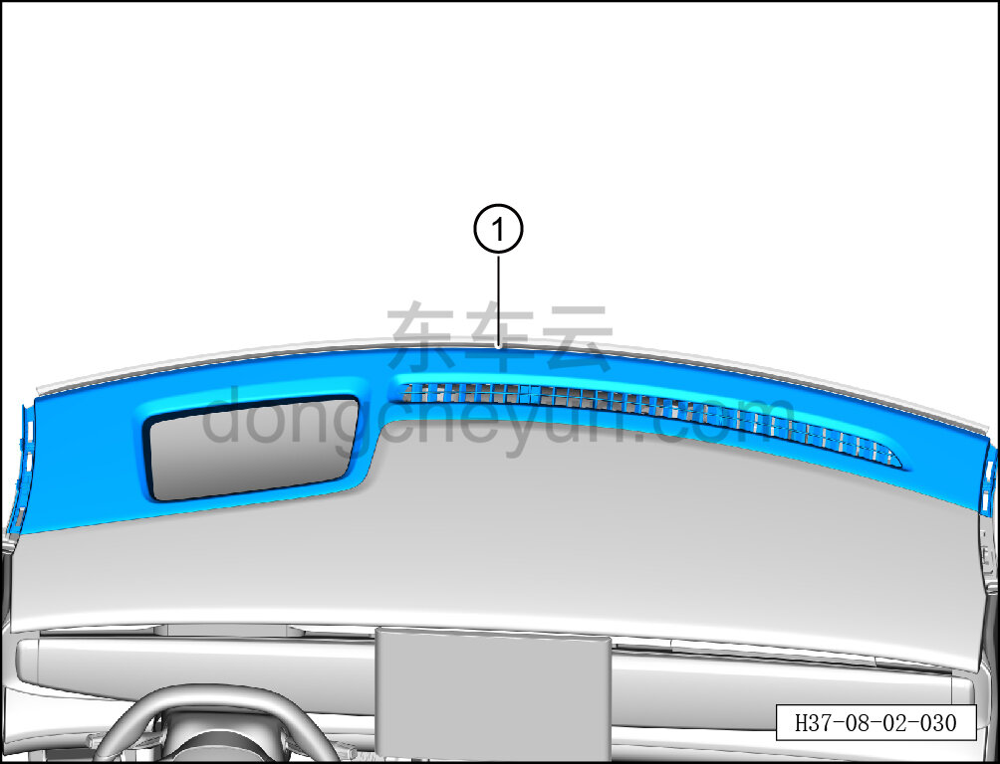
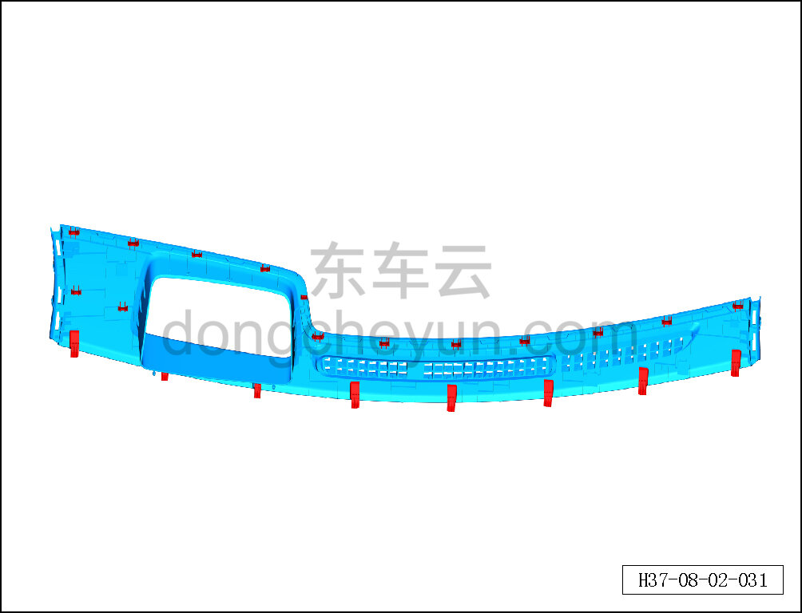

# Снятие и установка передней крышки воздуховода обдува лобового стекла

> Внутренняя и внешняя отделка › Панель приборов › Снятие и установка панели приборов  
> Оригинал: `拆卸与安装前除霜盖板` · [dongcheyun 56746](https://dongcheyun.com/p/56746), страница `60221efafc694392acd07c2f30eb6bf8` · [оглавление](../README.md)

**Порядок снятия**

1. Выключите все электроприборы, отключите питание.

2. Выполните операцию обесточивания автомобиля для ремонта. См. [3.1.4.1 Обесточивание автомобиля](../03-техническое-обслуживание/005-обесточивание-автомобиля.md)

3. Снимите левую и правую верхние накладки стойки A. См. [8.5.5.1 Снятие и установка левой верхней накладки стойки A](131-снятие-и-установка-левой-верхней-накладки-стойки-a.md)

4. Снимите переднюю крышку воздуховода обдува лобового стекла.

a. Съёмником обивки отсоедините крепёжные защёлки передней крышки воздуховода обдува лобового стекла и снимите переднюю крышку воздуховода обдува лобового стекла ①.

**Внимание:**

**- При отжиме крышки съёмником обивки подложите под инструмент нетканый материал, чтобы не повредить окружающие элементы отделки в процессе снятия.**

b. Крепёжные защёлки передней крышки воздуховода обдува лобового стекла показаны на рисунке слева.

**Порядок установки**

Установка выполняется в обратном порядке.

**Внимание:**

**-Проверьте крепёжные клипсы на отсутствие повреждений, при необходимости замените.**

**- После завершения установки проверьте, что крышка воздуховода обдува установлена без перекоса и не отходит.**
