# Снятие и установка верхней крышки панели приборов

> Внутренняя и внешняя отделка › Панель приборов › Снятие и установка панели приборов  
> Оригинал: `拆卸与安装仪表板上盖板` · [dongcheyun 56746](https://dongcheyun.com/p/56746), страница `8661f102d3684164a0f2b45f074aa6e1` · [оглавление](../README.md)

**Порядок снятия**

1. Выключите все электроприборы, отключите питание.

2. Выполните обесточивание автомобиля для ремонта. [3.1.4.1 Обесточивание автомобиля](../03-техническое-обслуживание/005-обесточивание-автомобиля.md)

3. Снимите левую и правую торцевые крышки панели приборов. См. [8.2.4.1 Снятие и установка левой торцевой крышки панели приборов](054-снятие-и-установка-левой-торцевой-крышки-панели.md)

4. Снимите переднюю крышку воздуховода обдува лобового стекла. См. [8.2.4.9 Снятие и установка передней крышки воздуховода обдува лобового стекла](062-снятие-и-установка-передней-крышки-воздуховода-обдува.md)

5. Снимите правую направляющую пластину воздуховыпускного отверстия. См. [8.2.4.13 Снятие и установка правой направляющей пластины воздуховыпускного отверстия](066-снятие-и-установка-правой-направляющей-пластины.md)

6. Снимите перчаточный ящик. См. [8.2.4.7 Снятие и установка перчаточного ящика](060-снятие-и-установка-перчаточного-ящика.md)

7. Снимите верхнюю крышку панели приборов.

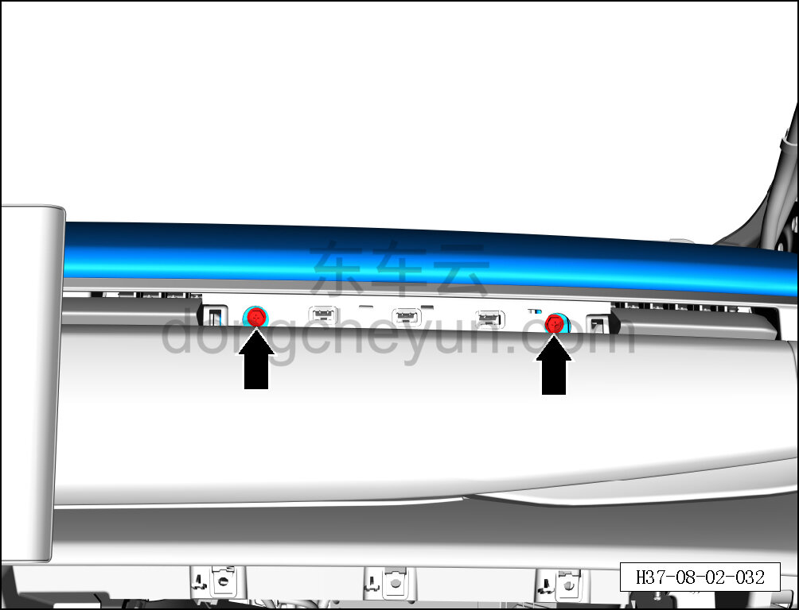

a. Торцевой головкой на 10 мм выверните 2 крепёжных болта верхней крышки панели приборов.

Момент затяжки болта: 4±1 Н·м

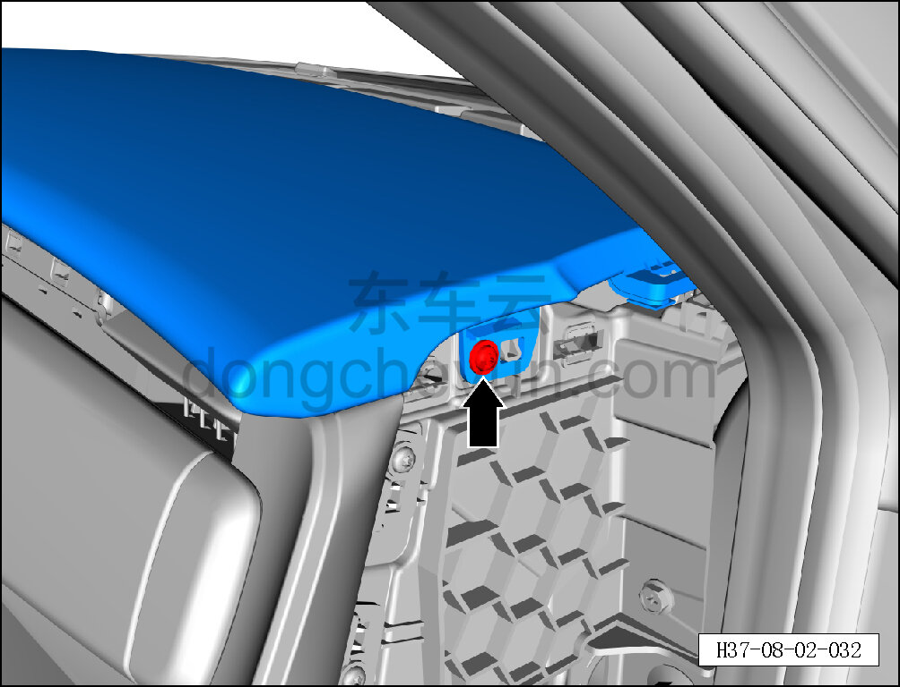

b. Головкой T25 выверните крепёжный винт с правой стороны верхней крышки панели приборов.

Момент затяжки винта: 1.5±0.5 Н·м

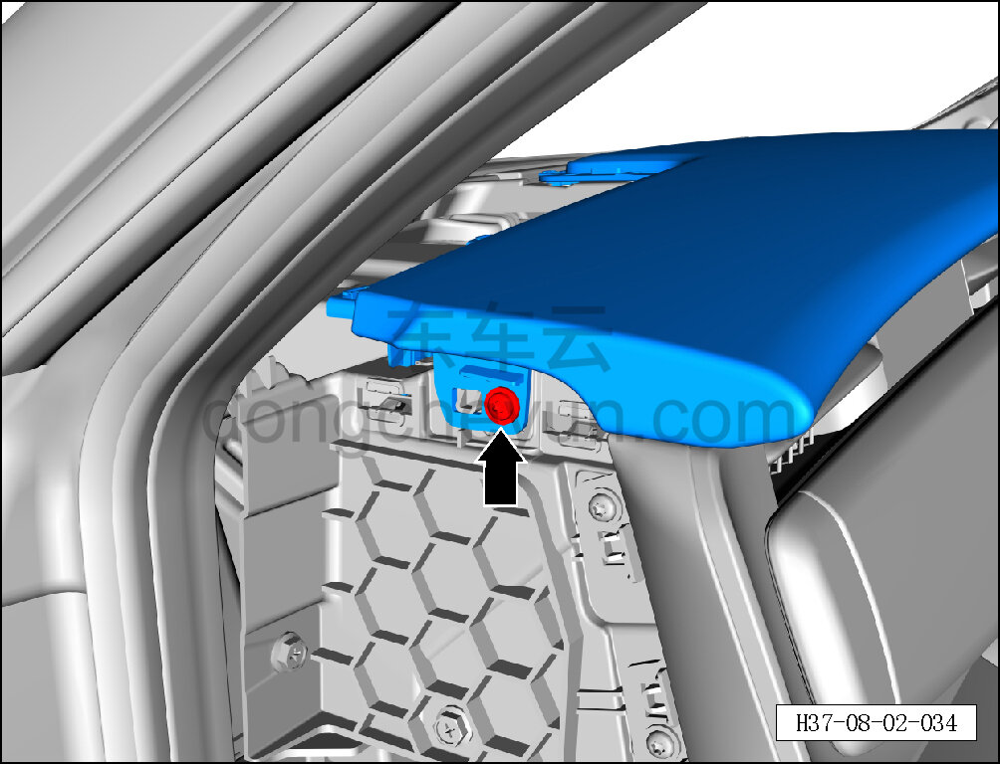

c. Головкой T25 выверните крепёжный винт с левой стороны верхней крышки панели приборов.

Момент затяжки винта: 1.5±0.5 Н·м

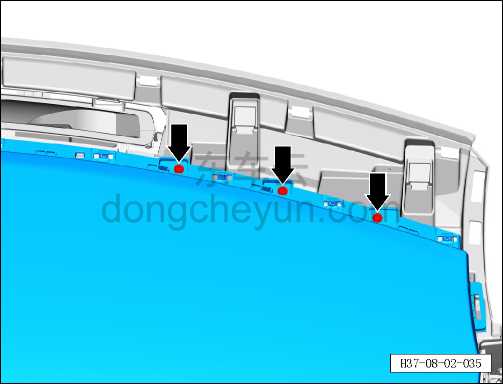

d. Головкой T25 выверните 3 крепёжных винта в передней правой части верхней крышки панели приборов.

Момент затяжки винта: 1.5±0.5 Н·м

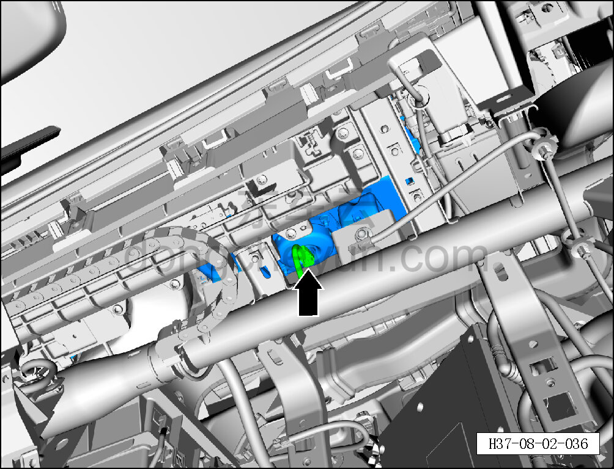

e. Удерживая фиксатор разъёма, отсоедините разъём модуля подушки безопасности переднего пассажира.

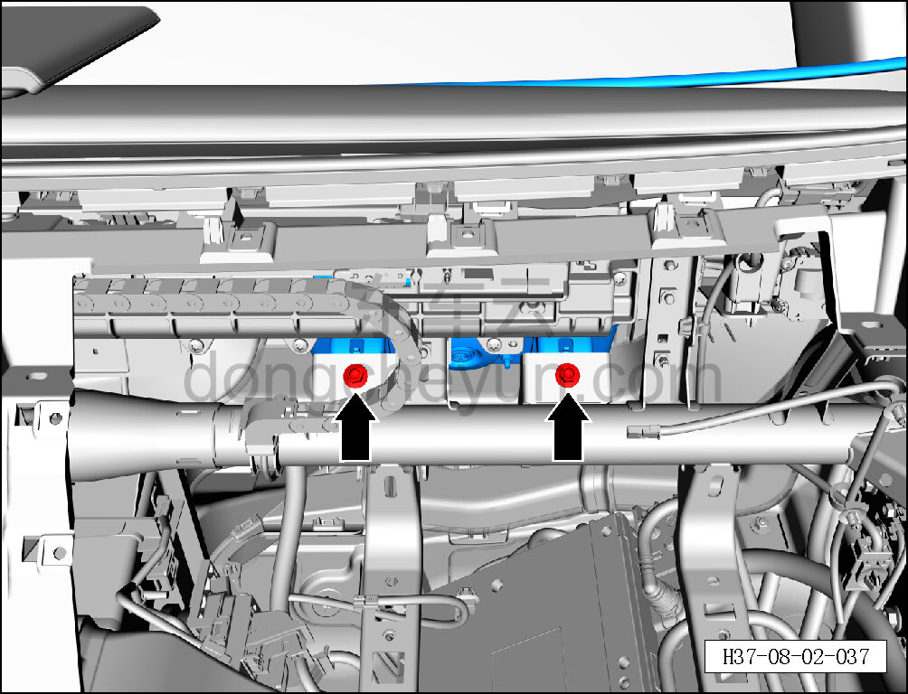

f. Торцевой головкой на 10 мм выверните 2 крепёжных болта модуля подушки безопасности переднего пассажира.

Момент затяжки болта: 20±5 Н·м

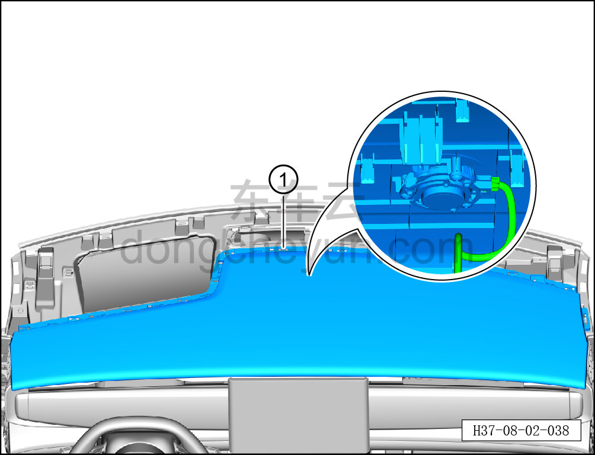

**Внимание:**

**- К задней стороне верхней крышки панели приборов подключён жгут проводов; после отсоединения защёлок не тяните крышку резко, чтобы не повредить жгут.**

g. Съёмником обивки отсоедините крепёжные защёлки верхней крышки панели приборов.

h. Отсоедините разъём жгута проводов среднечастотного излучателя (эксайтера) и снимите верхнюю крышку панели приборов в сборе с модулем подушки безопасности переднего пассажира и среднечастотным излучателем ①.

**Внимание:**

**- При отжиме крышки съёмником обивки подложите под инструмент нетканый материал, чтобы не повредить окружающие элементы отделки в процессе снятия.**

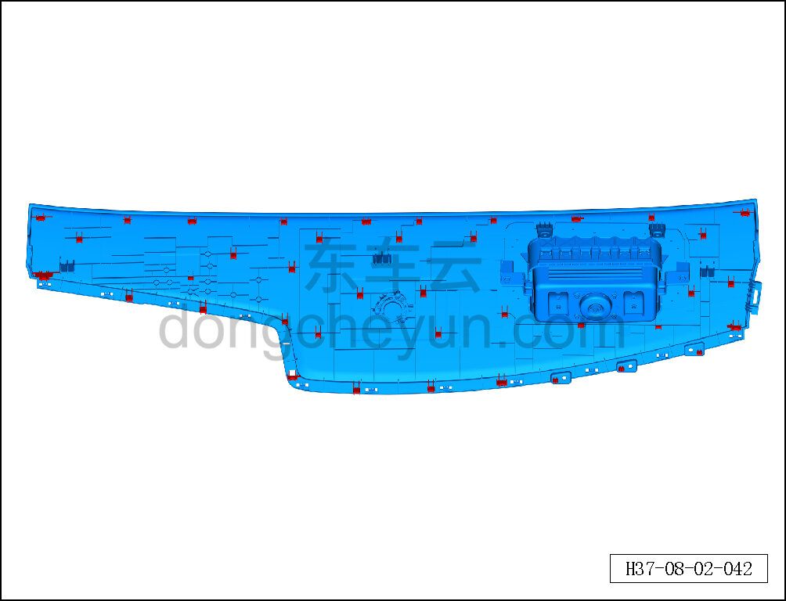

i. Крепёжные защёлки верхней крышки панели приборов показаны на рисунке слева.

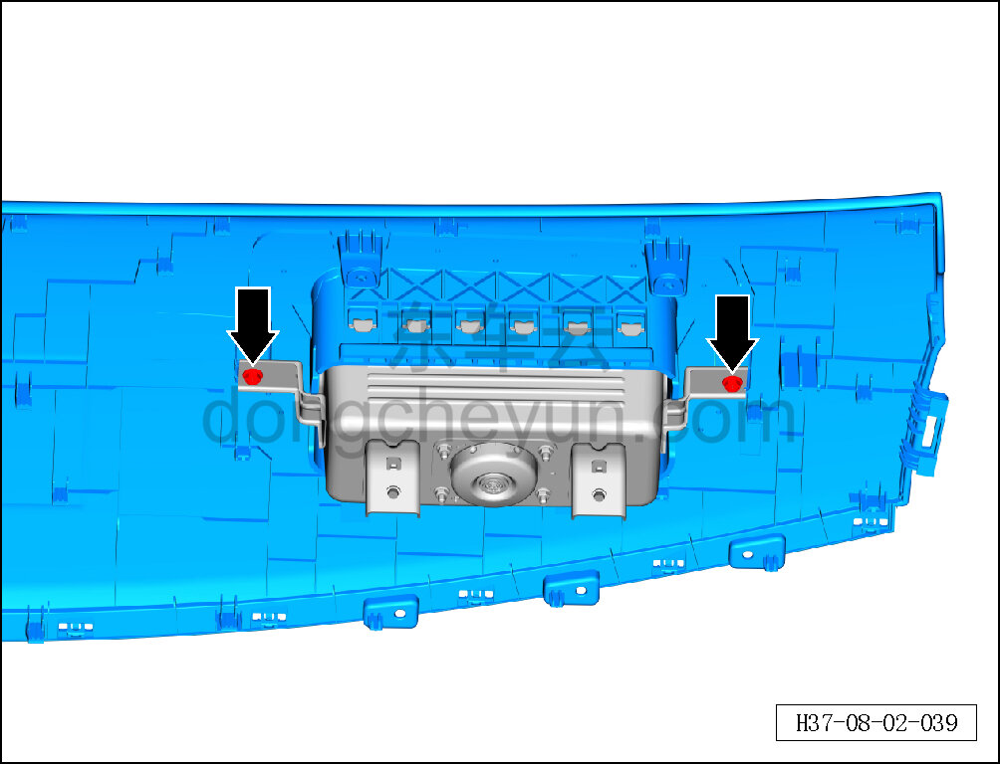

j. Торцевой головкой на 10 мм выверните 2 крепёжных болта модуля подушки безопасности переднего пассажира.

Момент затяжки болта: 6±1 Н·м

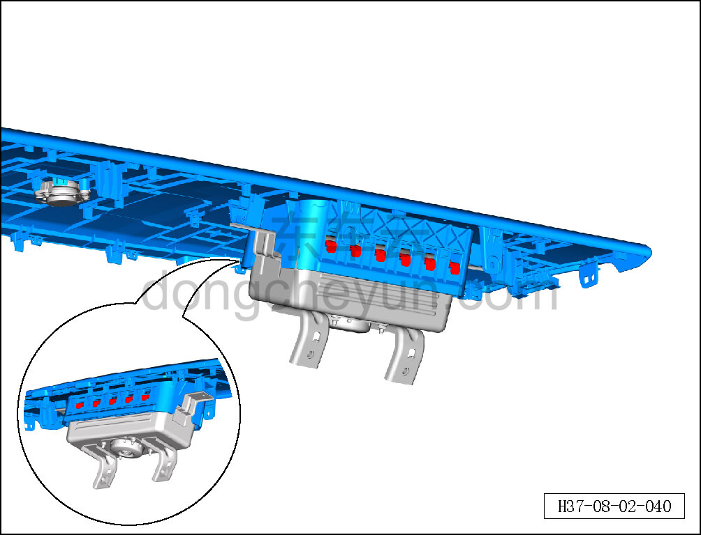

k. Съёмником обивки отсоедините 11 крепёжных защёлок модуля подушки безопасности переднего пассажира и снимите верхнюю крышку панели приборов.

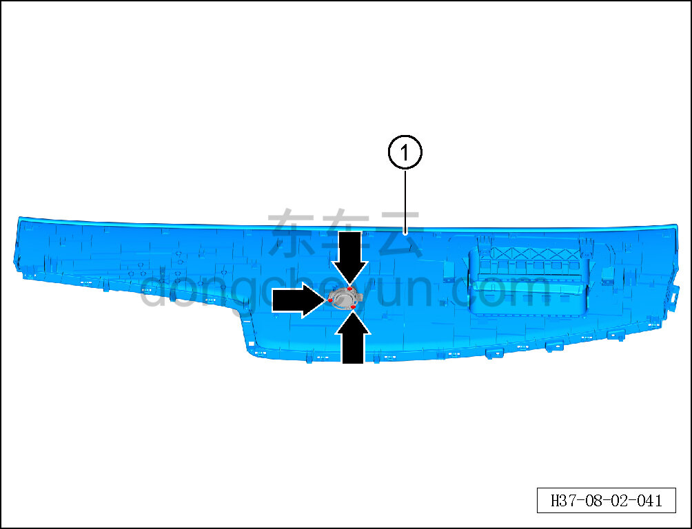

l. Крестовой отвёрткой выверните 3 крепёжных винта среднечастотного излучателя и снимите верхнюю крышку панели приборов ①.

Момент затяжки винта: 1.5±0.5 Н·м

**Порядок установки **

Установка выполняется в обратном порядке.

**Внимание:**

**-Проверьте крепёжные клипсы на отсутствие повреждений, при необходимости замените.**

**- После завершения установки проверьте, что крышка воздуховода обдува установлена без перекоса и не отходит.**

**- Проверьте исправность работы модуля подушки безопасности переднего пассажира и среднечастотного излучателя.**
