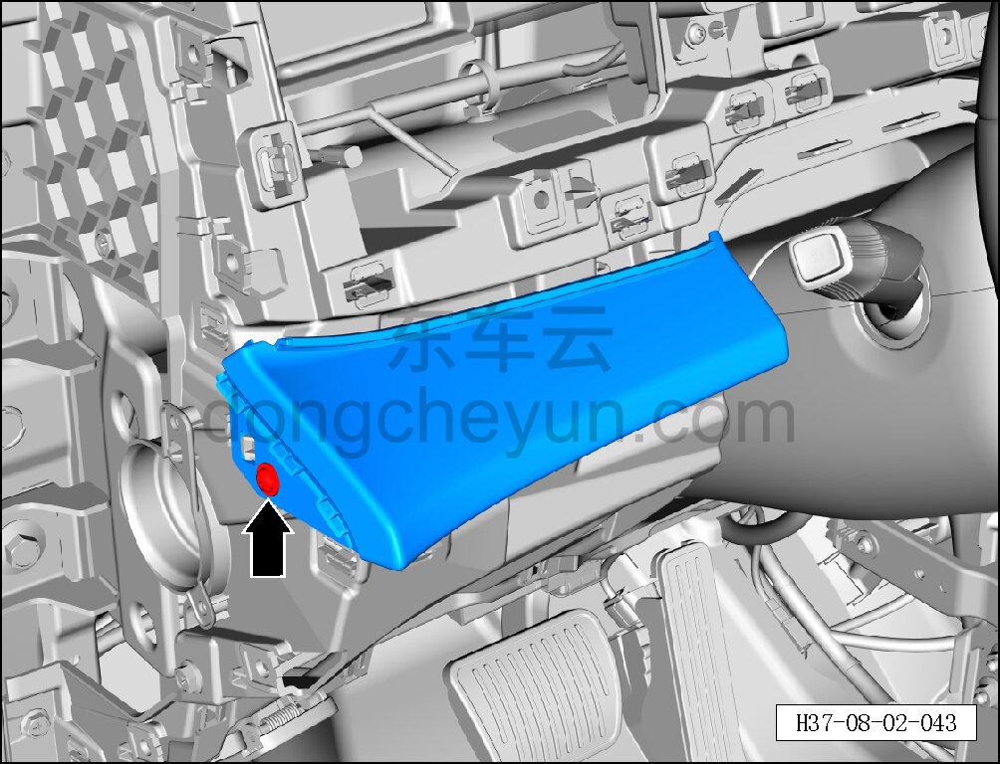
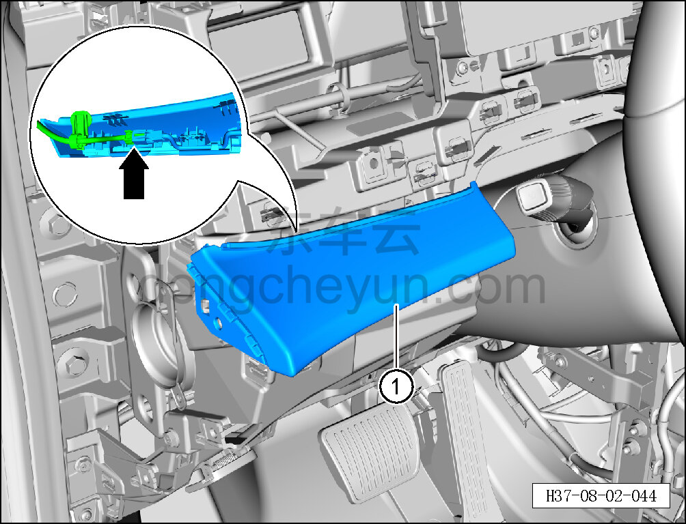

# Снятие и установка левой декоративной накладки

> Внутренняя и внешняя отделка › Панель приборов › Снятие и установка панели приборов  
> Оригинал: `拆卸与安装左侧装饰面板` · [dongcheyun 56746](https://dongcheyun.com/p/56746), страница `2c6486f1a8c843e38b199864a73f0dc3` · [оглавление](../README.md)

**Порядок снятия**

1. Выключите все электроприборы, отключите питание.

2. Выполните операцию обесточивания автомобиля для ремонта. См. [3.1.4.1 Обесточивание автомобиля](../03-техническое-обслуживание/005-обесточивание-автомобиля.md)

3. Снимите воздуховыпускное отверстие. См. [8.2.4.12 Снятие и установка воздуховыпускного отверстия](065-снятие-и-установка-воздуховыпускного-отверстия.md)

4. Снимите левую декоративную накладку.

a. Головкой T25 выверните крепёжный винт левой декоративной накладки.

Момент затяжки винта: 1.5±0.5 Н·м

**Внимание:**

**- К задней стороне левой декоративной накладки подключён жгут проводов; после отсоединения защёлок не тяните накладку резко, чтобы не повредить жгут.**

b. Частично отсоедините левую декоративную накладку, удерживая фиксатор разъёма, отсоедините разъём левой подсветки салона (ambient).

c. Снимите левую декоративную накладку ①.

**Порядок установки **

Установка выполняется в обратном порядке.

**Внимание:**

**-Проверьте крепёжные клипсы на отсутствие повреждений, при необходимости замените.**

**- После завершения установки проверьте, что левая декоративная накладка установлена без перекоса и не отходит.**

**- Проверьте исправность работы подсветки салона (ambient).**
