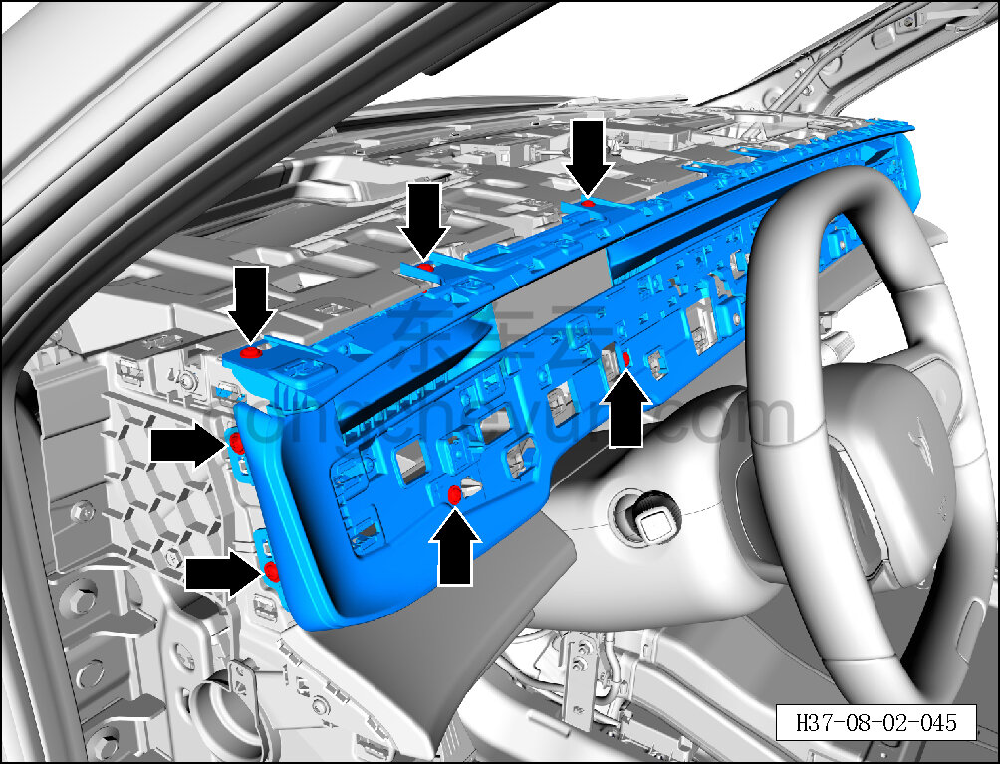
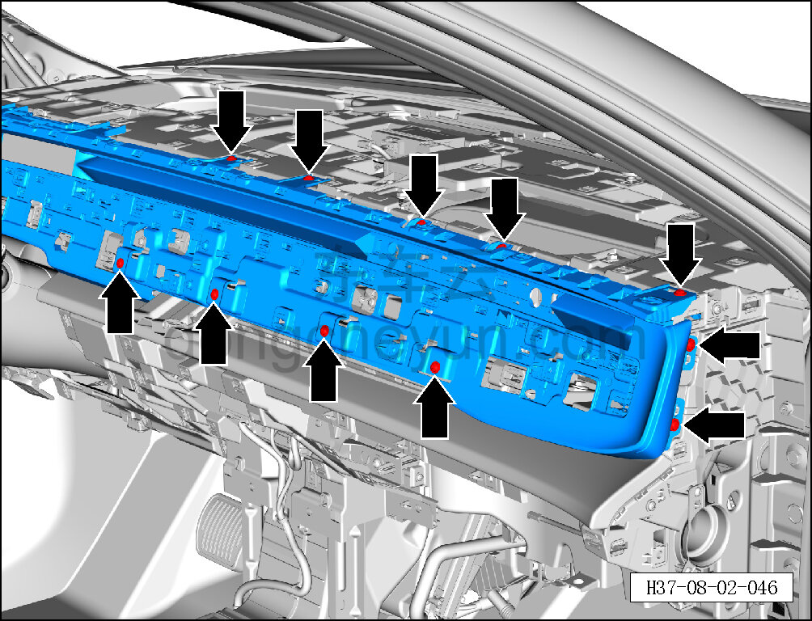
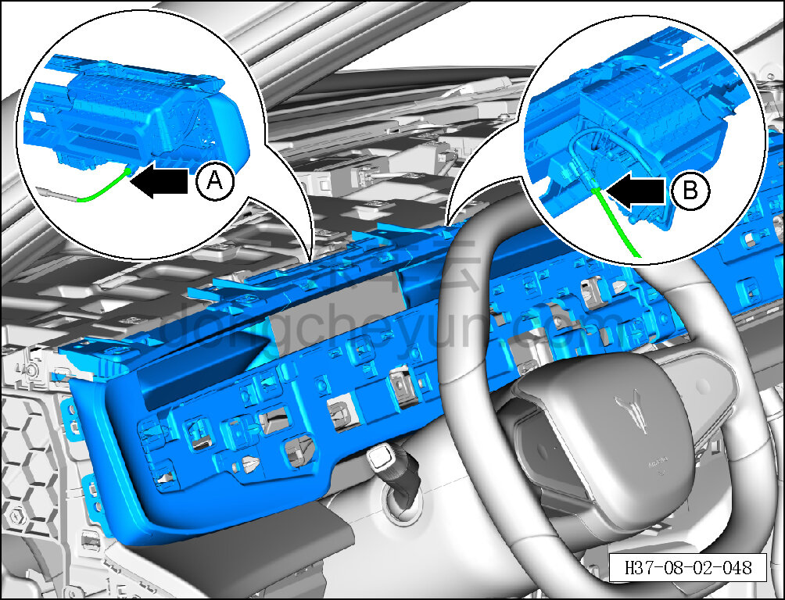
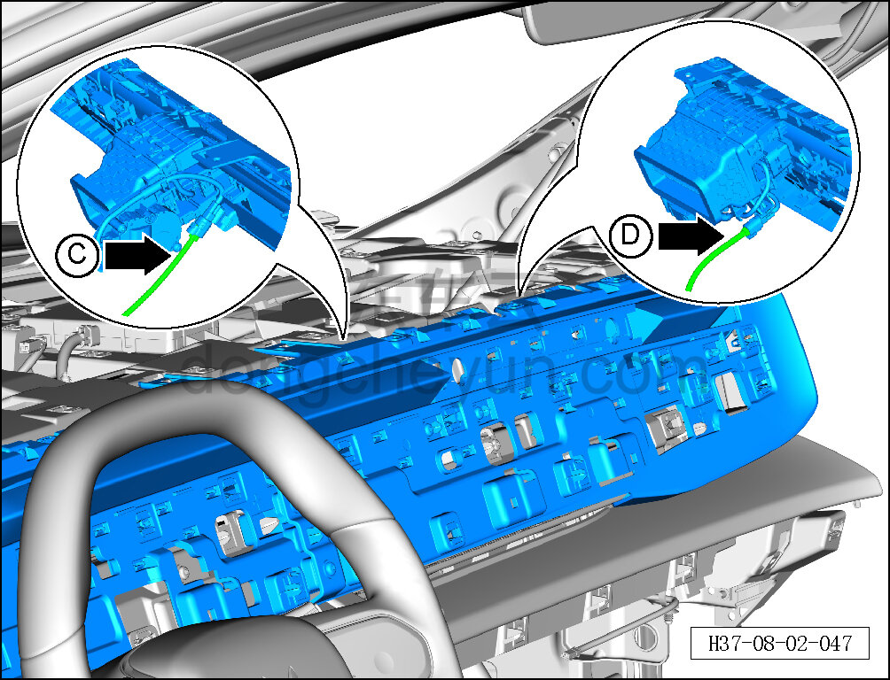
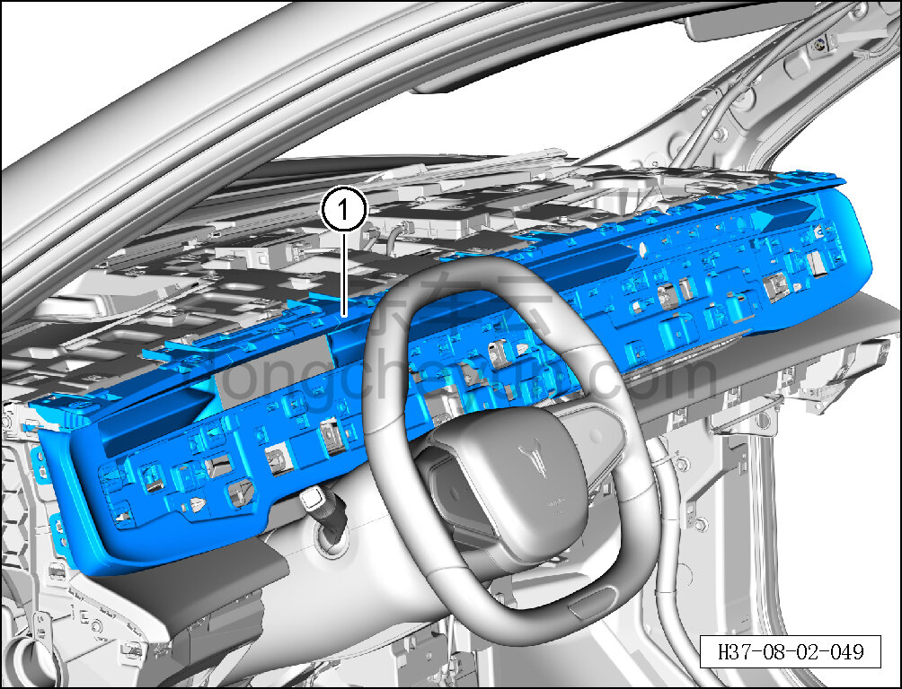

# Снятие и установка воздуховыпускного отверстия

> Внутренняя и внешняя отделка › Панель приборов › Снятие и установка панели приборов  
> Оригинал: `拆卸与安装出风口` · [dongcheyun 56746](https://dongcheyun.com/p/56746), страница `68fc79db7cf74f44b9b9096506b7786a` · [оглавление](../README.md)

**Порядок снятия**

1. Выключите все электроприборы, отключите питание.

2. Выполните операцию обесточивания автомобиля для ремонта. См. [3.1.4.1 Обесточивание автомобиля](../03-техническое-обслуживание/005-обесточивание-автомобиля.md)

3. Снимите левую и правую торцевые крышки панели приборов. См. [8.2.4.1 Снятие и установка левой торцевой крышки панели приборов](054-снятие-и-установка-левой-торцевой-крышки-панели.md)

4. Снимите верхнюю крышку панели приборов. См. [8.2.4.10 Снятие и установка верхней крышки панели приборов](063-снятие-и-установка-верхней-крышки-панели-приборов.md)

5. Снимите нижнюю панель центральной декоративной накладки. См. [8.2.4.6 Снятие и установка нижней панели центральной декоративной накладки](059-снятие-и-установка-основания-центральной-декоративной.md)

6. Снимите воздуховыпускное отверстие.

a. Головкой T25 выверните 7 крепёжных винтов с левой стороны воздуховыпускного отверстия.

Момент затяжки винта: 1.5±0.5 Н·м

b. Головкой T25 выверните 11 крепёжных винтов с правой стороны воздуховыпускного отверстия.

Момент затяжки винта: 1.5±0.5 Н·м

**Внимание:**

**- К задней стороне воздуховыпускного отверстия подключён жгут проводов; после отсоединения защёлок не тяните его резко, чтобы не повредить жгут.**

c. Частично отсоедините воздуховыпускное отверстие, удерживая фиксатор разъёма, отсоедините разъём A и разъём B с левой стороны воздуховыпускного отверстия.

**Внимание:**

**- К задней стороне воздуховыпускного отверстия подключён жгут проводов; после отсоединения защёлок не тяните его резко, чтобы не повредить жгут.**

d. Частично отсоедините воздуховыпускное отверстие, удерживая фиксатор разъёма, отсоедините разъём C и разъём D с правой стороны воздуховыпускного отверстия.

e. Съёмником обивки отожмите и извлеките воздуховыпускное отверстие ①.

**Внимание:**

**- При отжиме воздуховыпускного отверстия съёмником обивки подложите под инструмент нетканый материал, чтобы не повредить окружающие элементы отделки в процессе снятия.**

**Порядок установки **

Установка выполняется в обратном порядке.

**Внимание:**

**- После завершения установки проверьте, что воздуховыпускное отверстие установлено без перекоса и не отходит.**
