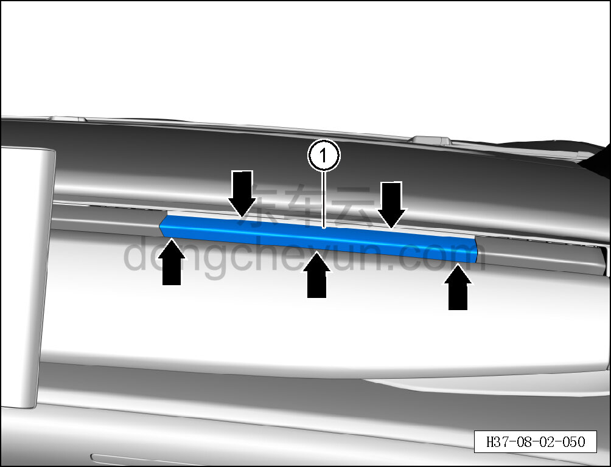

# Снятие и установка правой направляющей пластины воздуховыпускного отверстия

> Внутренняя и внешняя отделка › Панель приборов › Снятие и установка панели приборов  
> Оригинал: `拆卸与安装右侧出风口导风板` · [dongcheyun 56746](https://dongcheyun.com/p/56746), страница `13e5f6ecdf0947d98df7acd15e534019` · [оглавление](../README.md)

**Порядок снятия**

1. Выключите все электроприборы, отключите питание.

2. Снимите правую направляющую пластину воздуховыпускного отверстия.

a. Съёмником обивки отсоедините 5 крепёжных защёлок правой направляющей пластины воздуховыпускного отверстия и снимите правую направляющую пластину воздуховыпускного отверстия ①.

**Внимание:**

**- При отжиме направляющей пластины съёмником обивки подложите под инструмент нетканый материал, чтобы не повредить окружающие элементы отделки в процессе снятия.**

**Порядок установки**

Установка выполняется в обратном порядке.

**Внимание:**

**-Проверьте крепёжные клипсы на отсутствие повреждений, при необходимости замените.**

**- После завершения установки проверьте, что направляющая пластина воздуховыпускного отверстия установлена без перекоса и не отходит.**
