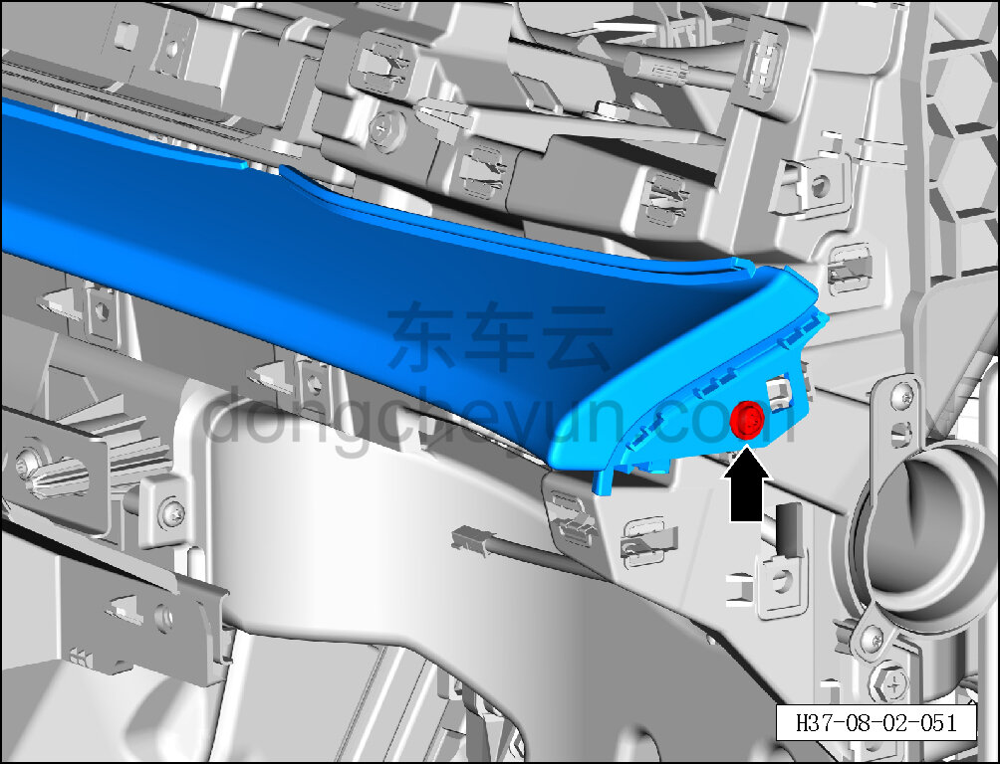
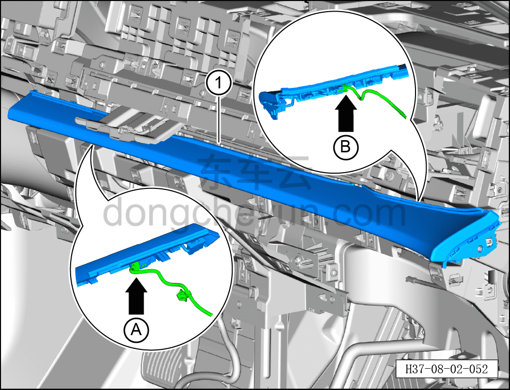

# Снятие и установка правой декоративной накладки

> Внутренняя и внешняя отделка › Панель приборов › Снятие и установка панели приборов  
> Оригинал: `拆卸与安装右侧装饰面板` · [dongcheyun 56746](https://dongcheyun.com/p/56746), страница `cc974fee85ba4ff5ac2196463f006692` · [оглавление](../README.md)

**Порядок снятия**

1. Выключите все электроприборы, отключите питание.

2. Выполните операцию обесточивания автомобиля для ремонта. См. [3.1.4.1 Обесточивание автомобиля](../03-техническое-обслуживание/005-обесточивание-автомобиля.md)

3. Снимите воздуховыпускное отверстие. См. [8.2.4.12 Снятие и установка воздуховыпускного отверстия](065-снятие-и-установка-воздуховыпускного-отверстия.md)

4. Снимите правую декоративную накладку.

a. Головкой T25 выверните крепёжный винт правой декоративной накладки.

Момент затяжки винта: 1.5±0.5 Н·м

**Внимание:**

**- К задней стороне правой декоративной накладки подключён жгут проводов; после отсоединения защёлок не тяните накладку резко, чтобы не повредить жгут.**

b. Частично отсоедините правую декоративную накладку, удерживая фиксатор разъёма, отсоедините разъём A и разъём B жгута проводов панели приборов.

c. Съёмником обивки отсоедините правую декоративную накладку ①.

**Внимание:**

**- При отжиме накладки съёмником обивки подложите под инструмент нетканый материал, чтобы не повредить окружающие элементы отделки в процессе снятия.**

**Порядок установки**

Установка выполняется в обратном порядке.

**Внимание:**

**- После завершения установки проверьте, что правая декоративная накладка установлена без перекоса и не отходит.**
