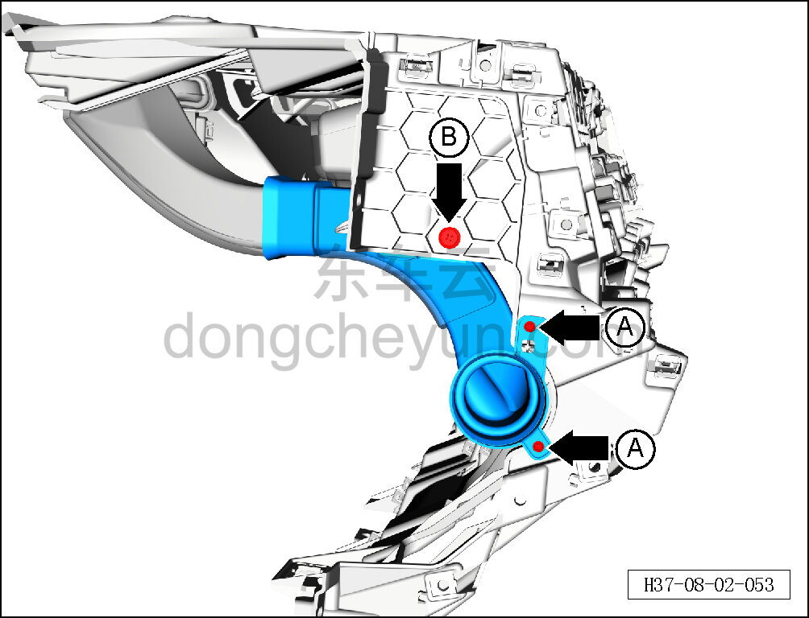
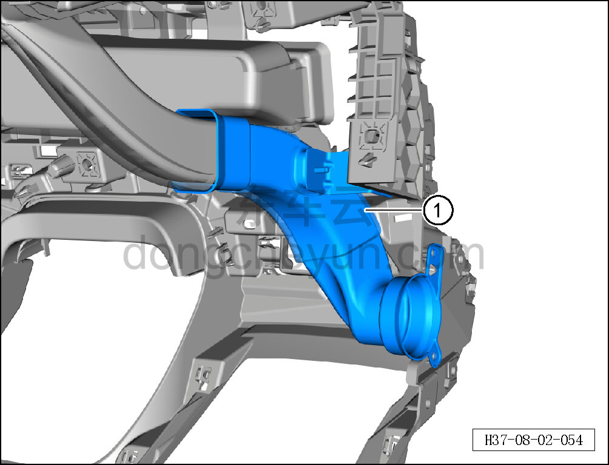

# Снятие и установка внутренней части левого воздуховода обдува лобового стекла

> Внутренняя и внешняя отделка › Панель приборов › Снятие и установка панели приборов  
> Оригинал: `拆卸与安装左除霜风管内侧` · [dongcheyun 56746](https://dongcheyun.com/p/56746), страница `6a35614c7dbe45979ffdce274ea0e222` · [оглавление](../README.md)

**Порядок снятия**

1. Выключите все электроприборы, отключите питание.

2. Выполните операцию обесточивания автомобиля для ремонта. См. [3.1.4.1 Обесточивание автомобиля](../03-техническое-обслуживание/005-обесточивание-автомобиля.md)

3. Снимите панель приборов в сборе. См. [8.2.4.27 Снятие и установка панели приборов в сборе](080-снятие-и-установка-панели-приборов-в-сборе.md)

4. Снимите внутреннюю часть левого воздуховода обдува лобового стекла.

a. Головкой T25 выверните 2 крепёжных винта A внутренней части левого воздуховода обдува лобового стекла.

Момент затяжки винта A: 1,5±0,5 Н·м

b. Торцевой головкой на 10 мм выверните крепёжный болт B внутренней части левого воздуховода обдува лобового стекла.

Момент затяжки болта B: 4±1 Н·м

c. Отсоедините внутреннюю часть левого воздуховода обдува лобового стекла от левого воздуховода обдува лобового стекла и снимите внутреннюю часть левого воздуховода обдува лобового стекла ①.

**Порядок установки **

Установка выполняется в обратном порядке.

**Внимание:**

**- После завершения установки проверьте нормальность обдува воздухом системы кондиционирования.**

**- Требуется провести дорожное испытание для проверки отсутствия посторонних шумов от панели приборов.**
