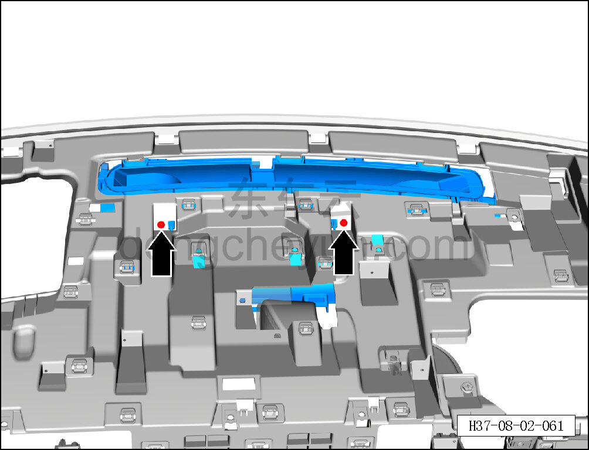
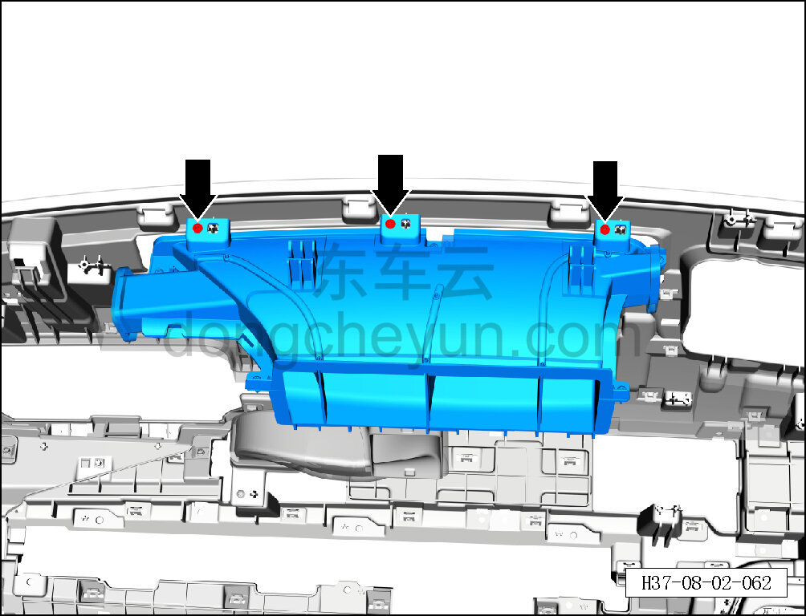
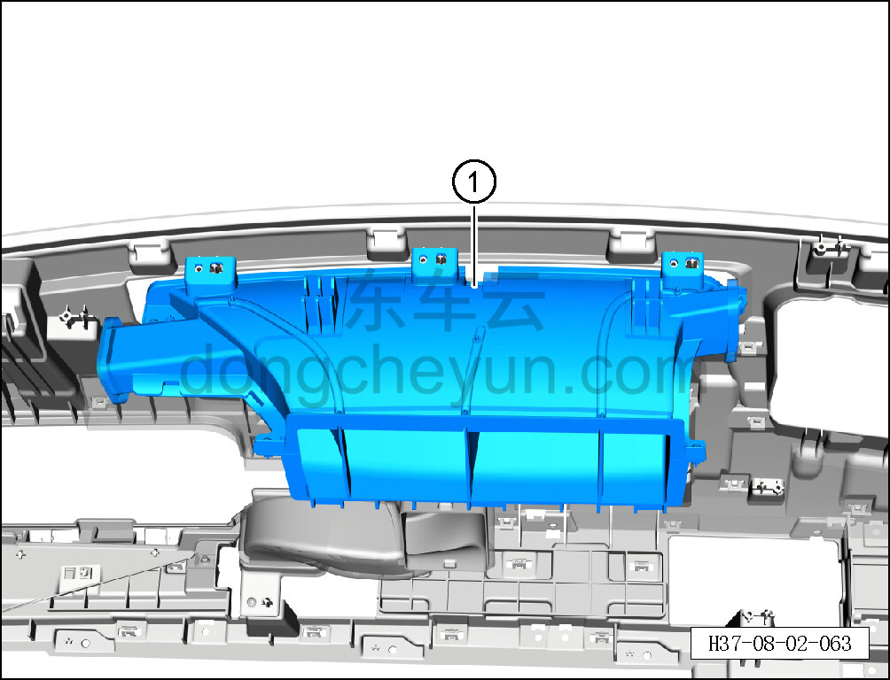

# Снятие и установка переднего воздуховода обдува лобового стекла

> Внутренняя и внешняя отделка › Панель приборов › Снятие и установка панели приборов  
> Оригинал: `拆卸与安装前除霜风道` · [dongcheyun 56746](https://dongcheyun.com/p/56746), страница `7254dc04a3884e9182cf43700dd6b480` · [оглавление](../README.md)

**Порядок снятия**

1. Выключите все электроприборы, отключите питание.

2. Выполните операцию обесточивания автомобиля для ремонта. См. [3.1.4.1 Обесточивание автомобиля](../03-техническое-обслуживание/005-обесточивание-автомобиля.md)

3. Снимите панель приборов в сборе. См. [8.2.4.27 Снятие и установка панели приборов в сборе](080-снятие-и-установка-панели-приборов-в-сборе.md)

4. Снимите левый воздуховод обдува лобового стекла. См. [8.2.4.16 Снятие и установка левого воздуховода обдува лобового стекла](069-снятие-и-установка-левого-воздуховода-обдува-лобового.md)

5. Снимите правый воздуховод обдува лобового стекла. См. [8.2.4.18 Снятие и установка правого воздуховода обдува лобового стекла](071-снятие-и-установка-правого-воздуховода-обдува-лобового.md)

6. Снимите правый воздуховод вентиляции в лицо. См. [8.2.4.30 Снятие и установка правого воздуховода вентиляции в лицо](083-снятие-и-установка-правого-воздуховода-вентиляции-в.md)

7. Снимите передний воздуховод обдува лобового стекла.

a. Головкой T25 выверните 2 крепёжных винта переднего воздуховода обдува лобового стекла.

Момент затяжки винта: 1.5±0.5 Н·м

b. Головкой T25 выверните 3 крепёжных винта переднего воздуховода обдува лобового стекла.

Момент затяжки винта: 1.5±0.5 Н·м

c. Снимите передний воздуховод обдува лобового стекла ①.

**Порядок установки**

Установка выполняется в обратном порядке.

**Внимание:**

**- После завершения установки проверьте нормальность обдува воздухом системы кондиционирования.**

**- Требуется провести дорожное испытание для проверки отсутствия посторонних шумов от панели приборов.**
