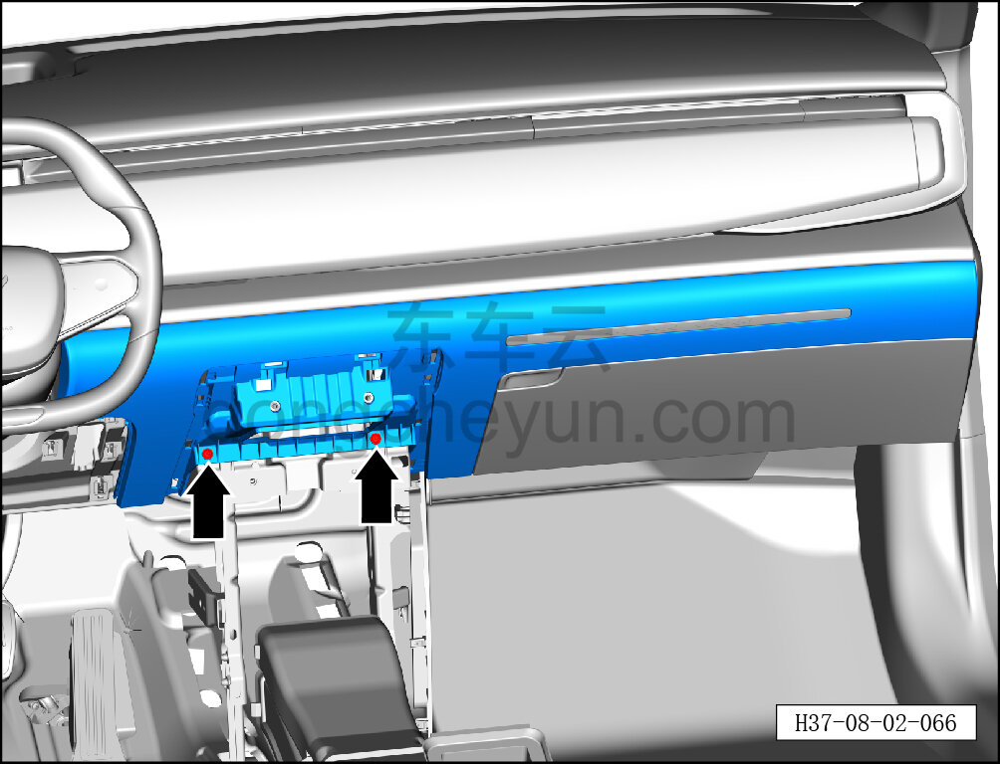
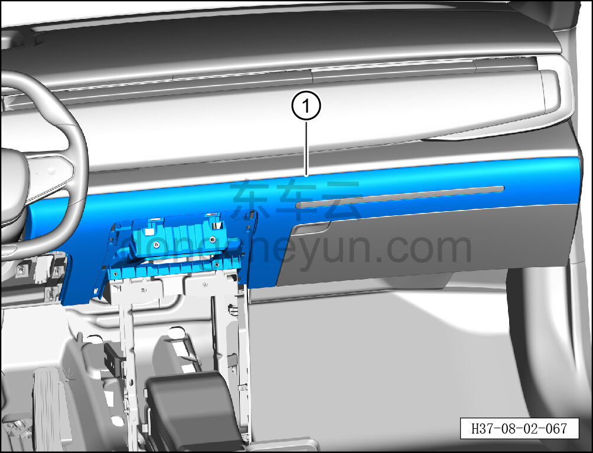
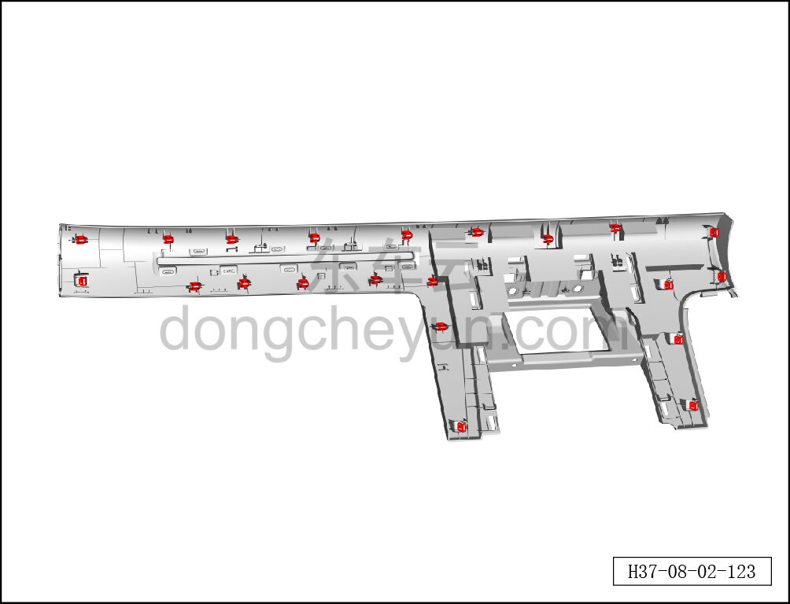

# Снятие и установка центрально-правой накладки

> Внутренняя и внешняя отделка › Панель приборов › Снятие и установка панели приборов  
> Оригинал: `拆卸与安装中右护板` · [dongcheyun 56746](https://dongcheyun.com/p/56746), страница `2b97d1c8c85845799c752c399ffefcad` · [оглавление](../README.md)

**Порядок снятия**

1. Выключите все электроприборы, отключите питание.

2. Выполните операцию обесточивания автомобиля для ремонта. См. [3.1.4.1 Обесточивание автомобиля](../03-техническое-обслуживание/005-обесточивание-автомобиля.md)

3. Снимите центральную консоль в сборе. См. [8.3.4.8 Снятие и установка центральной консоли в сборе](098-снятие-и-установка-центральной-консоли-в-сборе.md)

4. Снимите правую нижнюю накладку в сборе. См. [8.2.4.2 Снятие и установка левой нижней накладки в сборе](055-снятие-и-установка-нижней-левой-защитной-накладки-в.md)

5. Снимите правую торцевую крышку панели приборов. См. [8.2.4.1 Снятие и установка левой торцевой крышки панели приборов](054-снятие-и-установка-левой-торцевой-крышки-панели.md)

6. Снимите центрально-правую накладку.

a. Головкой T25 выверните 2 крепёжных винта центрально-правой накладки.

Момент затяжки винта: 1.5±0.5 Н·м

b. Съёмником обивки отсоедините крепёжные защёлки центрально-правой накладки и снимите центрально-правую накладку ①.

**Внимание:**

**-При отжимании накладки инструментом для внутренней облицовки можно подложить под инструмент нетканый материал, чтобы избежать царапин на окружающей внутренней облицовке в процессе снятия.**

c. Крепёжные защёлки центрально-правой накладки показаны на рисунке слева.

**Порядок установки**

Установка выполняется в обратном порядке.

**Внимание:**

**-Проверьте крепёжные клипсы на отсутствие повреждений, при необходимости замените.**

**- После завершения установки проверьте, что центрально-правая накладка установлена без перекоса и не отходит.**
