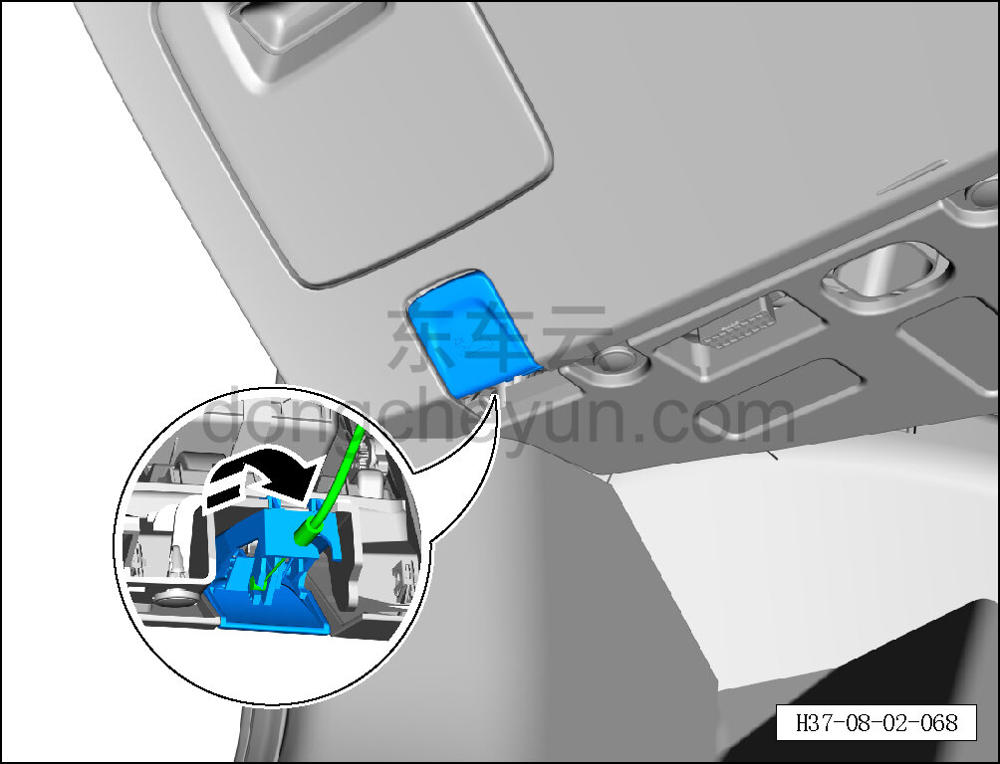
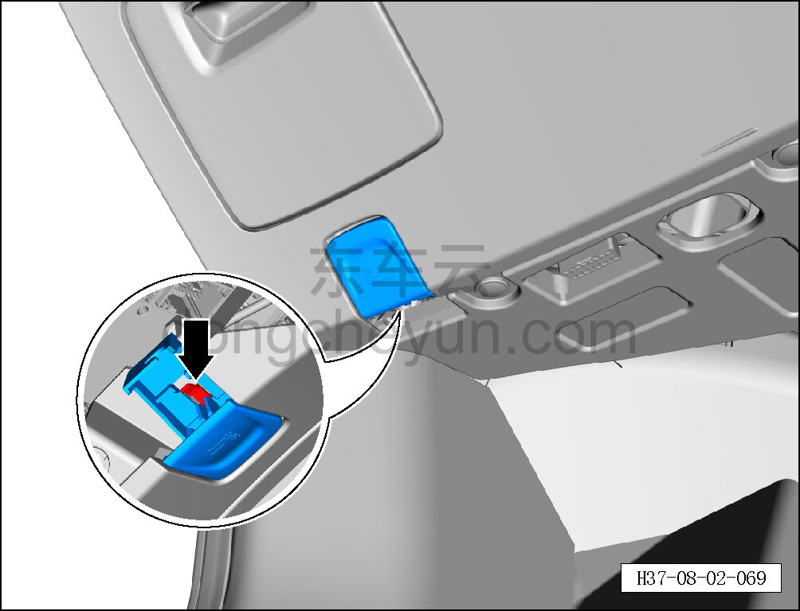
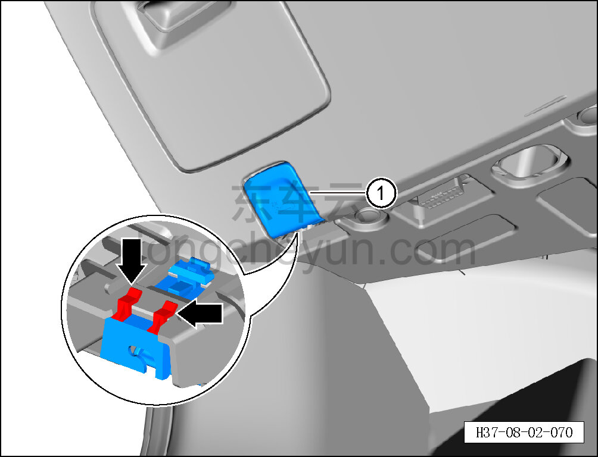

# Снятие и установка рукоятки открывания капота

> Внутренняя и внешняя отделка › Панель приборов › Снятие и установка панели приборов  
> Оригинал: `拆卸与安装前机盖拉手` · [dongcheyun 56746](https://dongcheyun.com/p/56746), страница `a3400f41efa4432cbd0b8a806da700ba` · [оглавление](../README.md)

**Порядок снятия**

1. Снимите рукоятку открывания капота.

a. По направлению стрелки отсоедините трос замка капота от рукоятки открывания капота.

b. Оттяните вниз фиксатор рукоятки открывания капота.

c. Сдвиньте рукоятку открывания капота в направлении передней части автомобиля, отсоедините 2 точки соединения рукоятки с каркасом панели приборов и снимите рукоятку открывания капота ①.

**Порядок установки**

Установка выполняется в обратном порядке.

**Внимание:**

**- После завершения установки проверьте, что капот открывается нормально.**
