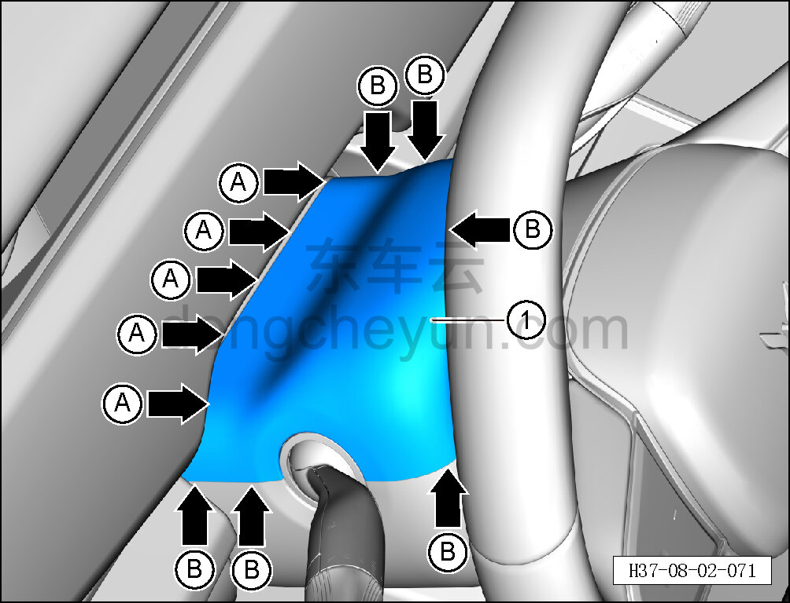

# Снятие и установка верхнего кожуха рулевой колонки

> Внутренняя и внешняя отделка › Панель приборов › Снятие и установка панели приборов  
> Оригинал: `拆卸与安装转向柱上护罩` · [dongcheyun 56746](https://dongcheyun.com/p/56746), страница `547ef8fd14234db6b8be2bb749a6e1e8` · [оглавление](../README.md)

**Порядок снятия**

1. Снимите верхний кожух рулевой колонки.

a. Съёмником обивки отсоедините 5 крепёжных защёлок A между верхним кожухом рулевой колонки и панелью защитной шторки, отсоедините 6 крепёжных защёлок B верхнего кожуха рулевой колонки и снимите верхний кожух рулевой колонки ①.

**Порядок установки**

Установка выполняется в обратном порядке.

**Внимание:**

**-Проверьте крепёжные клипсы на отсутствие повреждений, при необходимости замените.**

**- После завершения установки проверьте, что верхний кожух рулевой колонки установлен без перекоса и не отходит.**
