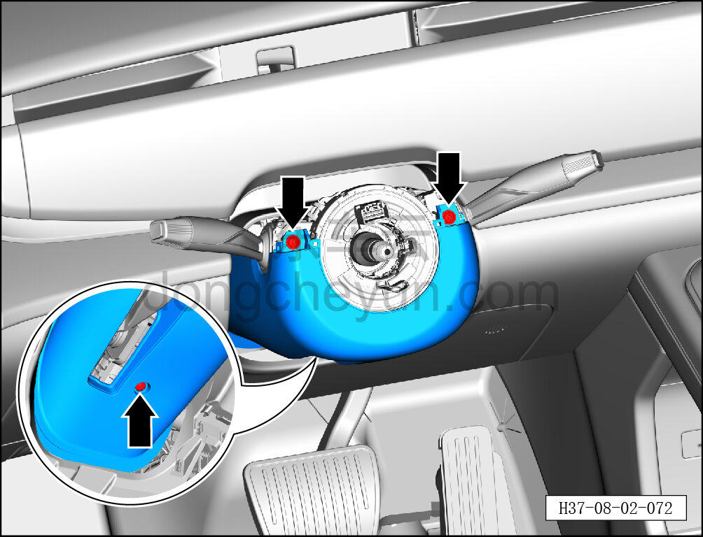
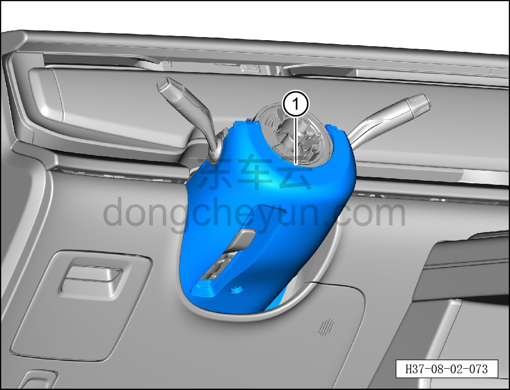

# Снятие и установка нижнего кожуха рулевой колонки

> Внутренняя и внешняя отделка › Панель приборов › Снятие и установка панели приборов  
> Оригинал: `拆卸与安装转向柱下护罩` · [dongcheyun 56746](https://dongcheyun.com/p/56746), страница `17e833c65b914d30b5bc71c896a671ec` · [оглавление](../README.md)

**Порядок снятия**

1. Выключите все электроприборы, отключите питание.

2. Выполните операцию обесточивания автомобиля для ремонта. См. [3.1.4.1 Обесточивание автомобиля](../03-техническое-обслуживание/005-обесточивание-автомобиля.md)

3. Снимите верхний кожух рулевой колонки. См. [8.2.4.23 Снятие и установка верхнего кожуха рулевой колонки](076-снятие-и-установка-верхнего-кожуха-рулевой-колонки.md)

4. Снимите рулевое колесо. См. [11.1.4.1 Снятие и установка рулевого колеса](../11-система-безопасности/004-снятие-и-установка-рулевого-колеса.md)

5. Снимите левую нижнюю накладку в сборе. См. [8.2.4.2 Снятие и установка левой нижней накладки в сборе](055-снятие-и-установка-нижней-левой-защитной-накладки-в.md)

6. Снимите нижний кожух рулевой колонки.

a. Головкой T25 выверните 3 крепёжных винта нижнего кожуха рулевой колонки.

Момент затяжки винта: 1.5±0.5 Н·м

b. Снимите нижний кожух рулевой колонки ①.

**Порядок установки**

Установка выполняется в обратном порядке.

**Внимание:**

**-Проверьте крепёжные клипсы на отсутствие повреждений, при необходимости замените.**

**- После завершения установки проверьте, что нижний кожух рулевой колонки установлен без перекоса и не отходит.**
