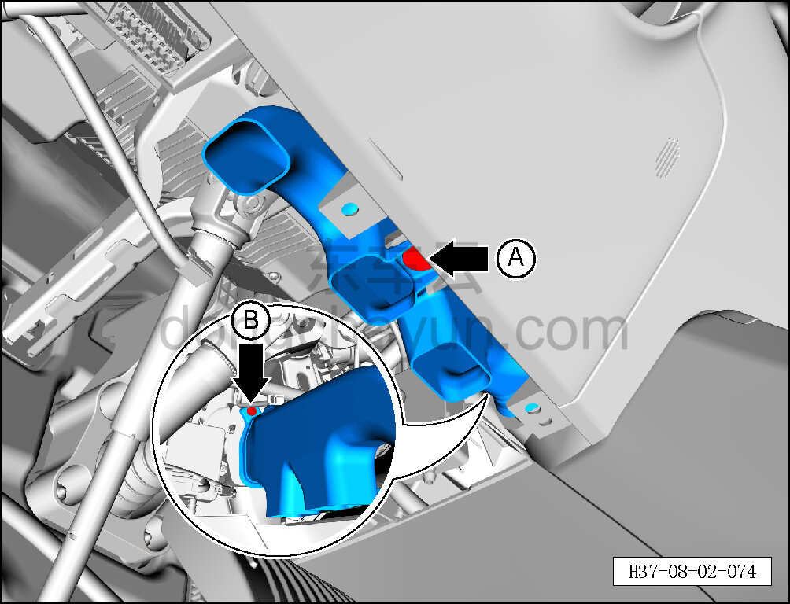
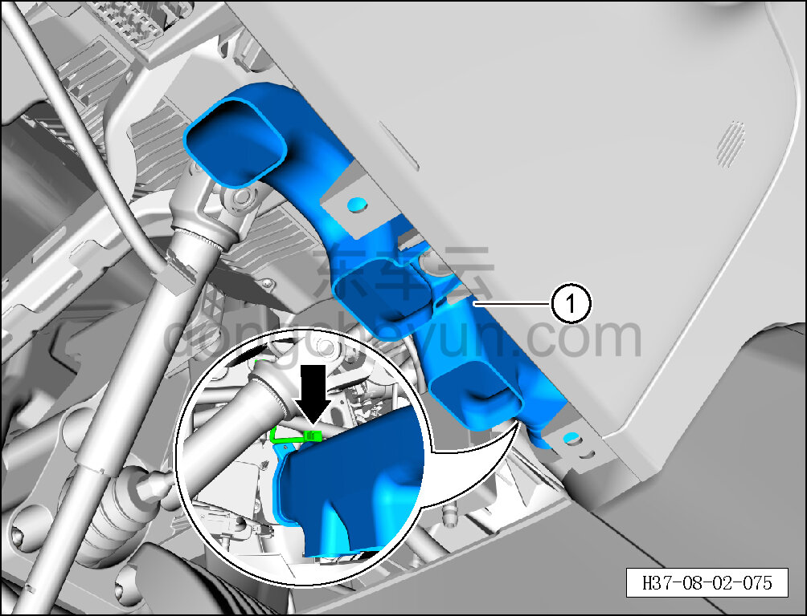

# Снятие и установка левого воздуховода обдува ног

> Внутренняя и внешняя отделка › Панель приборов › Снятие и установка панели приборов  
> Оригинал: `拆卸与安装左侧吹脚风管` · [dongcheyun 56746](https://dongcheyun.com/p/56746), страница `bad0b96678334f01a0c84f1e5b40f29e` · [оглавление](../README.md)

**Порядок снятия**

1. Выключите все электроприборы, отключите питание.

2. Выполните операцию обесточивания автомобиля для ремонта. См. [3.1.4.1 Обесточивание автомобиля](../03-техническое-обслуживание/005-обесточивание-автомобиля.md)

3. Снимите левую нижнюю панель панели приборов. См. [8.2.4.3 Снятие и установка левой нижней панели панели приборов](056-снятие-и-установка-левой-нижней-панели-панели-приборов.md)

4. Снимите левый воздуховод обдува ног в сборе.

a. Съёмником обивки отсоедините крепёжную защёлку A левого воздуховода обдува ног в сборе.

b. Головкой T25 выверните крепёжный винт B левого воздуховода обдува ног в сборе.

Момент затяжки винта: 1.5±0.5 Н·м

c. Съёмником обивки отсоедините датчик от левого воздуховода обдува ног в сборе и снимите левый воздуховод обдува ног в сборе ①.

**Порядок установки**

Установка выполняется в обратном порядке.

**Внимание:**

**- После завершения установки проверьте нормальность обдува воздухом системы кондиционирования.**

**- Требуется провести дорожное испытание для проверки отсутствия посторонних шумов от панели приборов.**
