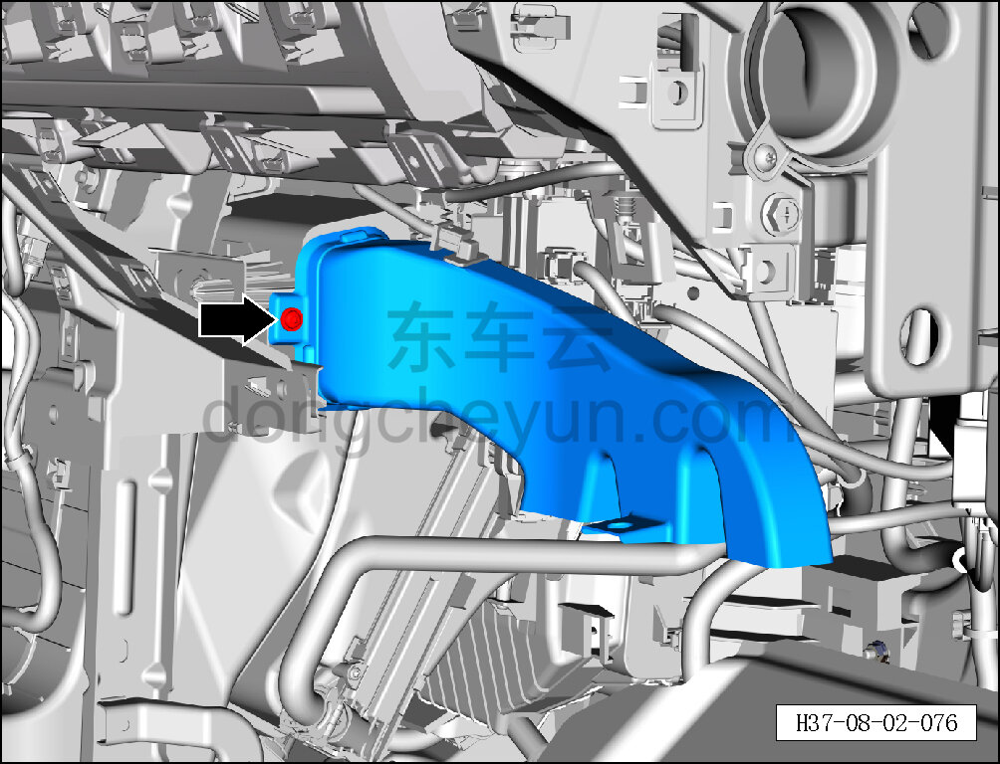
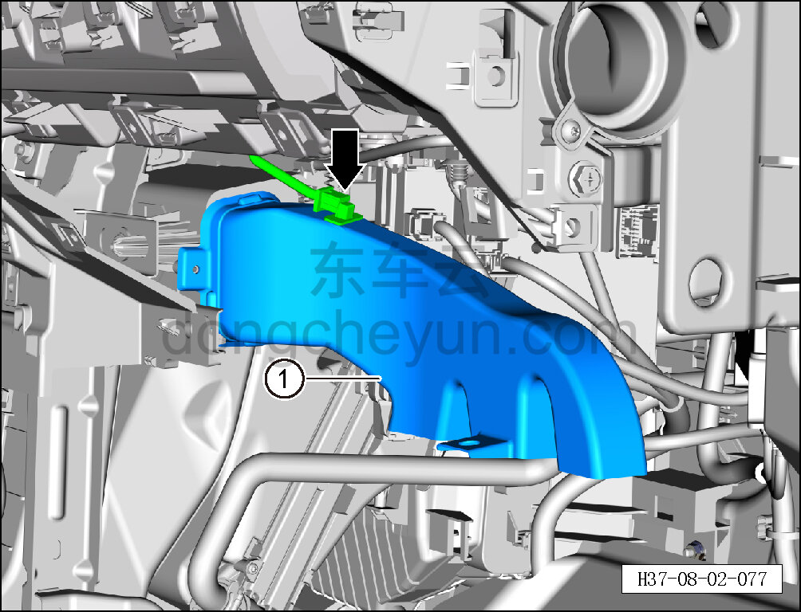

# Снятие и установка правого воздуховода обдува ног

> Внутренняя и внешняя отделка › Панель приборов › Снятие и установка панели приборов  
> Оригинал: `拆卸与安装右侧吹脚风管` · [dongcheyun 56746](https://dongcheyun.com/p/56746), страница `912e5715da19436d95855451a284a366` · [оглавление](../README.md)

**Порядок снятия**

1. Выключите все электроприборы, отключите питание.

2. Выполните операцию обесточивания автомобиля для ремонта. См. [3.1.4.1 Обесточивание автомобиля](../03-техническое-обслуживание/005-обесточивание-автомобиля.md)

3. Снимите перчаточный ящик. См. [8.2.4.7 Снятие и установка перчаточного ящика](060-снятие-и-установка-перчаточного-ящика.md)

4. Снимите правый воздуховод обдува ног в сборе.

a. Головкой T25 выверните крепёжный винт правого воздуховода обдува ног в сборе.

Момент затяжки винта: 1.5±0.5 Н·м

b. Съёмником обивки отсоедините датчик от правого воздуховода обдува ног в сборе и снимите правый воздуховод обдува ног в сборе ①.

**Порядок установки**

Установка выполняется в обратном порядке.

**Внимание:**

**- После завершения установки проверьте нормальность обдува воздухом системы кондиционирования.**

**- Требуется провести дорожное испытание для проверки отсутствия посторонних шумов от панели приборов.**
