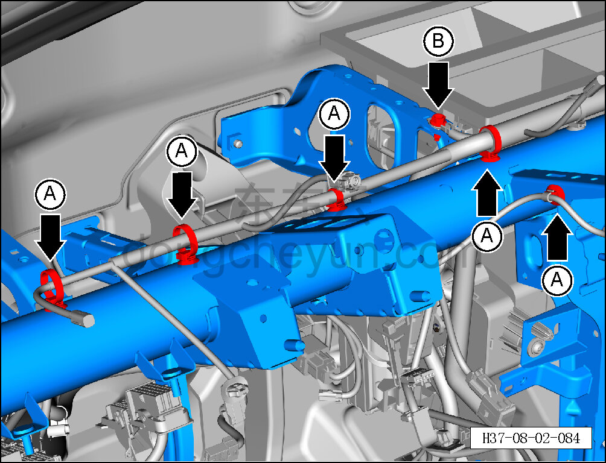
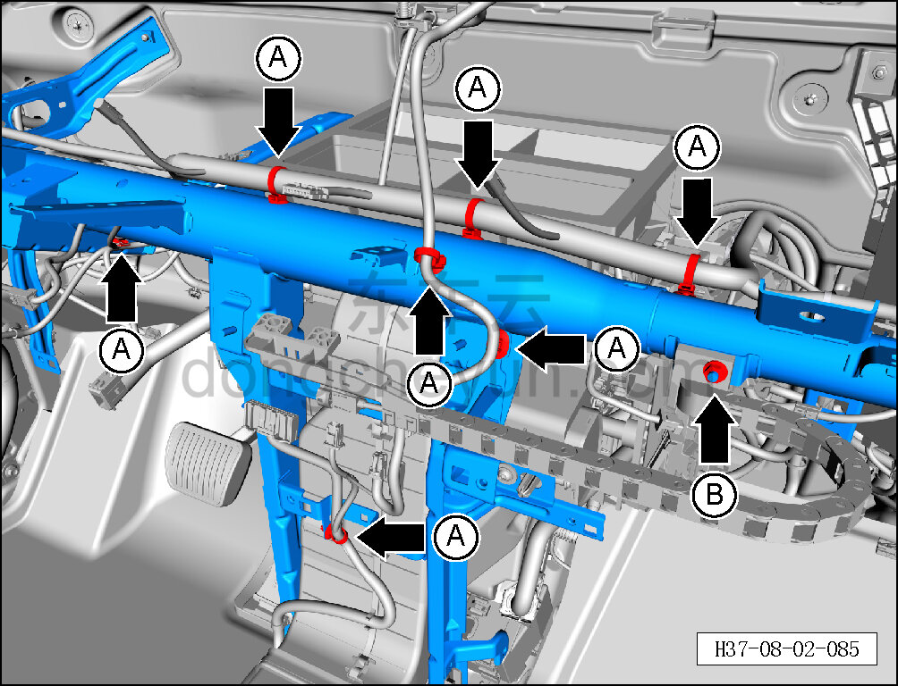
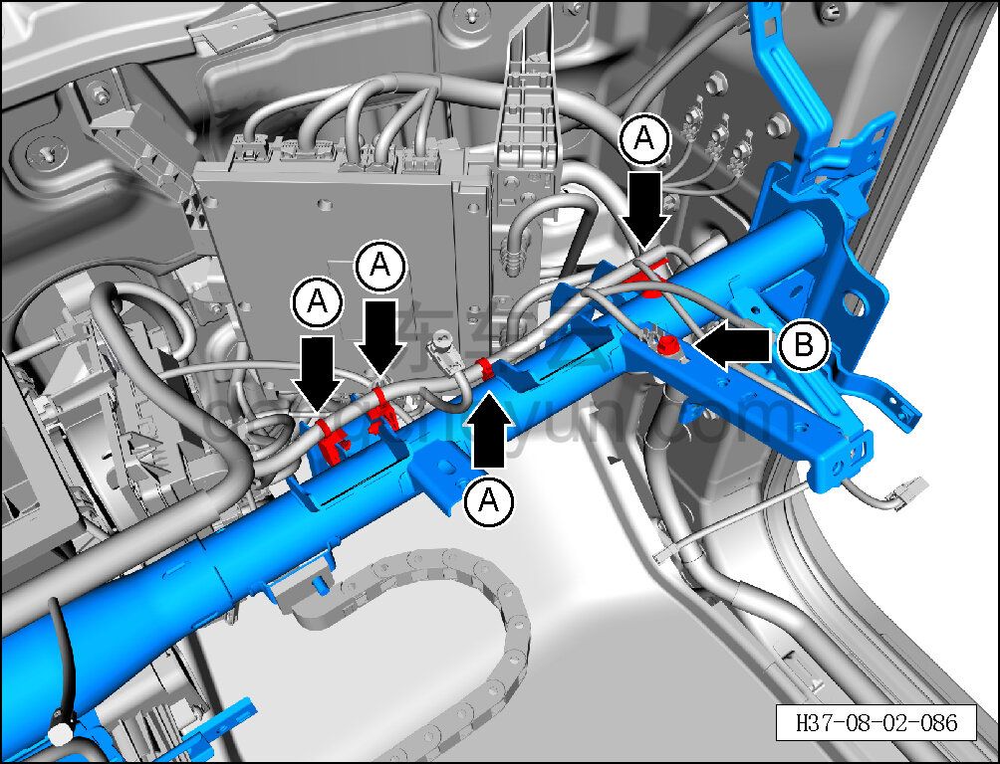
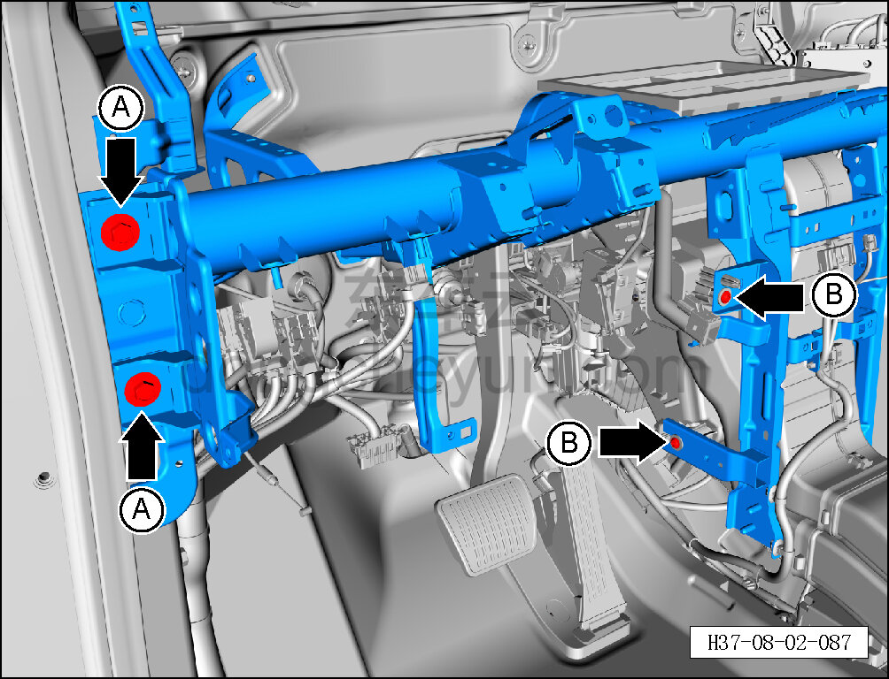
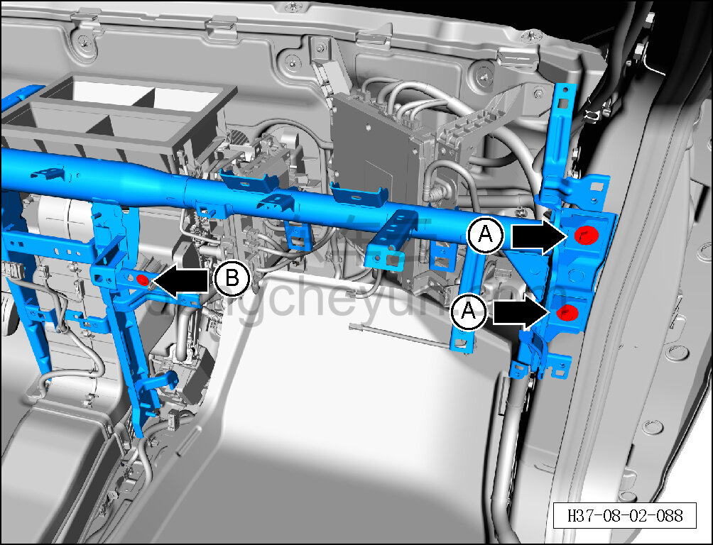
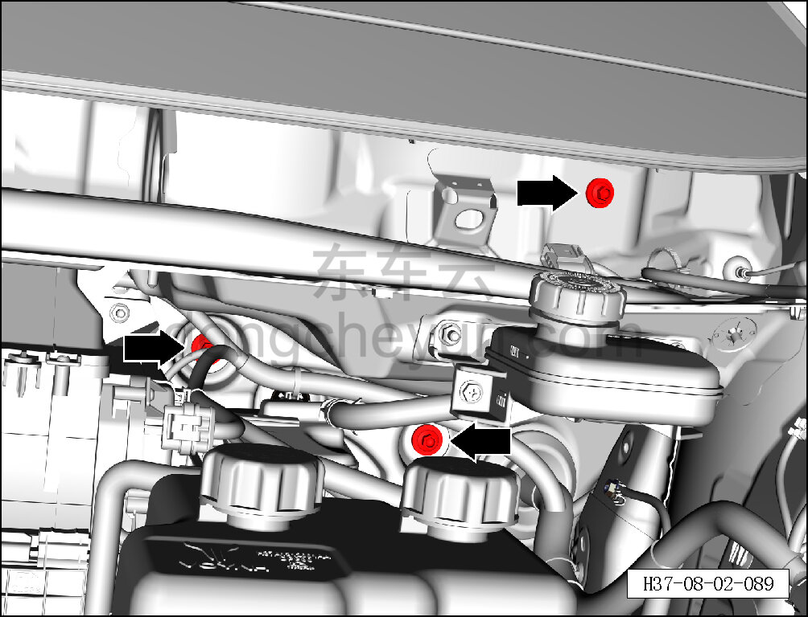
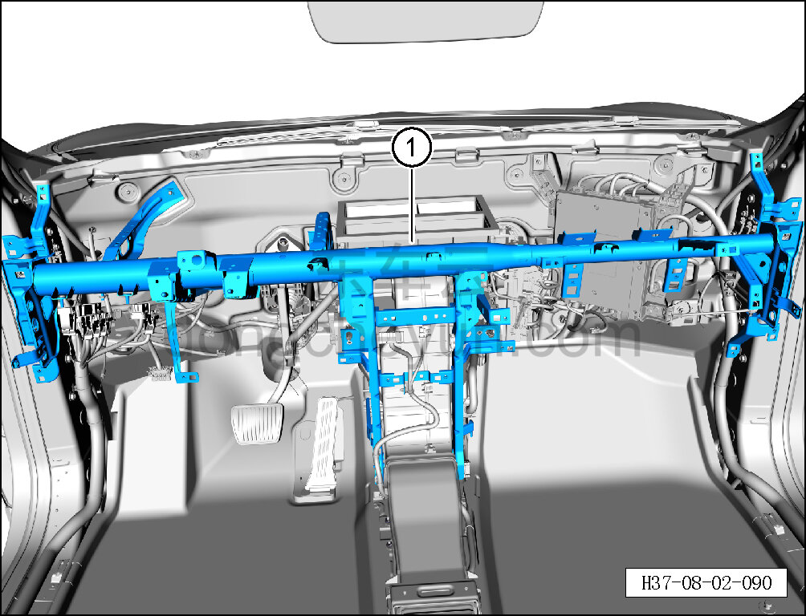

# Снятие и установка поперечной балки панели приборов

> Внутренняя и внешняя отделка › Панель приборов › Снятие и установка панели приборов  
> Оригинал: `拆卸与安装仪表横梁` · [dongcheyun 56746](https://dongcheyun.com/p/56746), страница `280ac2d07f99436f93015ad2e1ff141e` · [оглавление](../README.md)

**Порядок снятия**

1. Выключите все электроприборы, отключите питание.

2. Выполните операцию обесточивания автомобиля для ремонта. См. [3.1.4.1 Обесточивание автомобиля](../03-техническое-обслуживание/005-обесточивание-автомобиля.md)

3. Снимите панель приборов в сборе. См. [8.2.4.27 Снятие и установка панели приборов в сборе](080-снятие-и-установка-панели-приборов-в-сборе.md)

4. Снимите T-BOX. См. [9.2.4.1 Снятие и установка T-BOX](../09-электрическая-и-электронная-система/020-снятие-и-установка-t-box.md)

5. Снимите контроллер проекционного дисплея (HUD). См. [9.8.4.4 Снятие и установка контроллера проекционного дисплея (HUD)](../09-электрическая-и-электронная-система/074-снятие-и-установка-контроллера-проекционного-дисплея.md)

6. Выверните болты соединения рулевой колонки в сборе с каркасом. См. [6.1.7.1 Снятие и установка рулевой колонки с промежуточным валом в сборе](../06-система-шасси/012-снятие-и-установка-рулевой-колонки-с-промежуточным.md)

7. Снимите крышку стеклоочистителя в сборе (левую). См. [8.6.7.7 Снятие и установка крышки стеклоочистителя в сборе (левой)](244-снятие-и-установка-крышки-стеклоочистителя-в-сборе.md)

8. Снимите механизм привода переднего стеклоочистителя. См. [8.6.7.11 Снятие и установка механизма привода переднего стеклоочистителя](248-снятие-и-установка-привода-переднего-стеклоочистителя.md)

9. Снимите поперечную балку панели приборов.

a. Съёмником обивки отсоедините 5 крепёжных защёлок A поперечной балки панели приборов.

b. Торцевой головкой на 10 мм выверните крепёжный болт B провода заземления.

Момент затяжки болта B: 8±1 Н·м

c. Съёмником обивки отсоедините 7 крепёжных защёлок A поперечной балки панели приборов.

d. Торцевой головкой на 10 мм выверните крепёжную гайку B поперечной балки панели приборов.

Момент затяжки гайки B: 21±3,2 Н·м

e. Съёмником обивки отсоедините 4 крепёжные защёлки A поперечной балки панели приборов.

f. Торцевой головкой на 10 мм выверните крепёжный болт B провода заземления.

Момент затяжки болта B: 8±1 Н·м

g. Торцевой головкой на 10 мм выверните 2 крепёжных болта A панели приборов в сборе.

Момент затяжки болта A: 21±1 Н·м

h. Головкой T25 выверните 2 крепёжных винта B панели приборов в сборе.

Момент затяжки винта B: 1,5±0,5 Н·м

i. Торцевой головкой на 10 мм выверните 2 крепёжных болта A панели приборов в сборе.

Момент затяжки болта A: 21±1 Н·м

j. Головкой T25 выверните крепёжный винт B панели приборов в сборе.

Момент затяжки винта B: 1,5±0,5 Н·м

k. Торцевой головкой на 10 мм выверните 3 крепёжных болта панели приборов в сборе.

Момент затяжки болта: 21±3,2 Н·м

l. Вдвоём снимите поперечную балку панели приборов ①.

**Внимание:**

**- При снятии поперечной балки панели приборов проверьте отсутствие прочих помех вокруг, чтобы не повредить жгуты проводов и детали.**

**Порядок установки**

Установка выполняется в обратном порядке.

**Внимание:**

**- Перед снятием обратите внимание на трассировку жгута проводов панели приборов, чтобы избежать взаимных помех и облегчить последующую установку.**

**-Проверьте крепёжные клипсы на отсутствие повреждений, при необходимости замените.**

**- После завершения установки проверьте исправность всех функций комбинации приборов.**

**- Требуется провести дорожное испытание для проверки отсутствия посторонних шумов от панели приборов и очистить коды неисправностей.**
