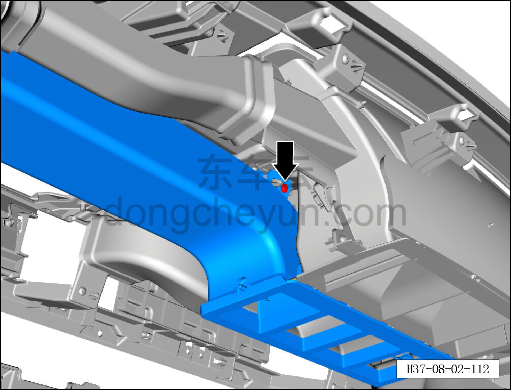
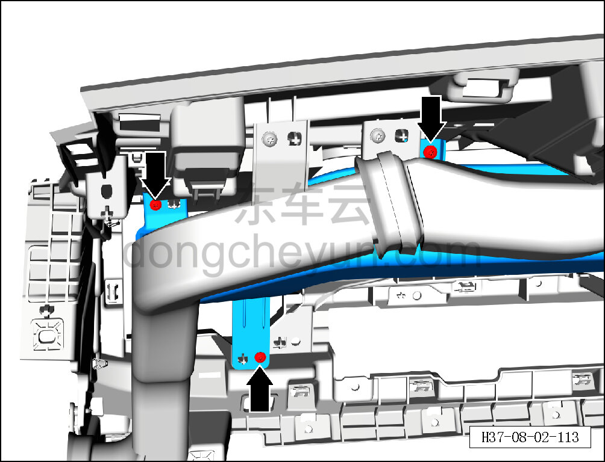
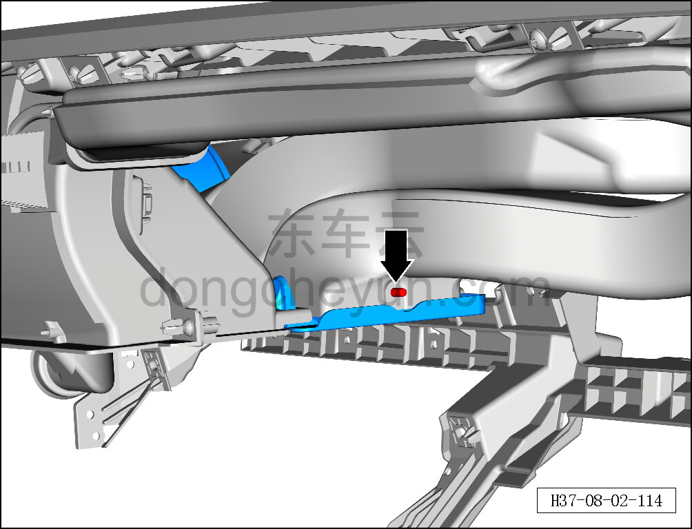
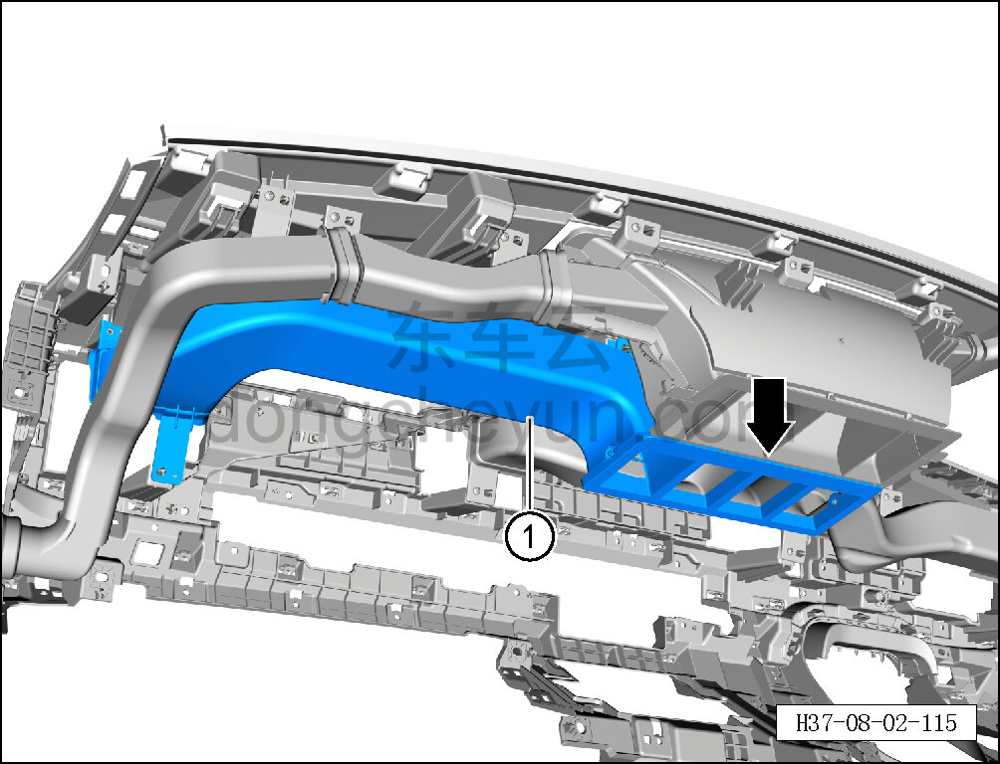

# Снятие и установка правого воздуховода вентиляции в лицо

> Внутренняя и внешняя отделка › Панель приборов › Снятие и установка панели приборов  
> Оригинал: `拆卸与安装右吹面风道` · [dongcheyun 56746](https://dongcheyun.com/p/56746), страница `8467f78a1fa945c0b634068914afaa78` · [оглавление](../README.md)

**Порядок снятия**

1. Выключите все электроприборы, отключите питание.

2. Выполните операцию обесточивания автомобиля для ремонта. См. [3.1.4.1 Обесточивание автомобиля](../03-техническое-обслуживание/005-обесточивание-автомобиля.md)

3. Снимите панель приборов в сборе. См. [8.2.4.27 Снятие и установка панели приборов в сборе](080-снятие-и-установка-панели-приборов-в-сборе.md)

4. Снимите правый воздуховод вентиляции в лицо.

a. Головкой T25 выверните крепёжный винт правого воздуховода вентиляции в лицо.

Момент затяжки винта: 1.5±0.5 Н·м

b. Головкой T25 выверните 3 крепёжных винта правого воздуховода вентиляции в лицо.

Момент затяжки винта: 1.5±0.5 Н·м

c. Удалите крепёжную заклёпку правого воздуховода вентиляции в лицо.

d. Снимите правый воздуховод вентиляции в лицо ①.

**Порядок установки**

Установка выполняется в обратном порядке.

**Внимание:**

**- После завершения установки проверьте нормальность обдува воздухом системы кондиционирования.**

**- Требуется провести дорожное испытание для проверки отсутствия посторонних шумов от панели приборов.**
