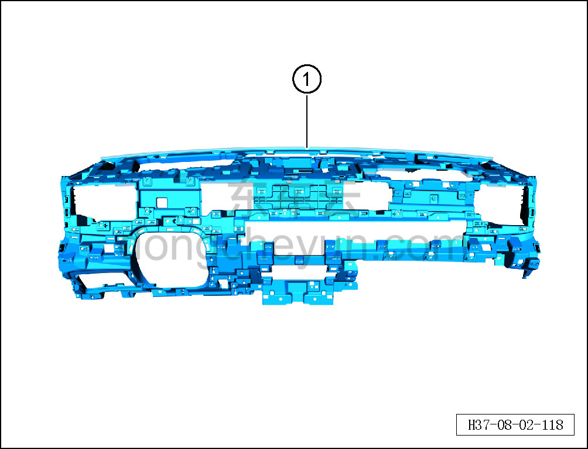

# Снятие и установка каркаса панели приборов

> Внутренняя и внешняя отделка › Панель приборов › Снятие и установка панели приборов  
> Оригинал: `拆卸与安装仪表骨架` · [dongcheyun 56746](https://dongcheyun.com/p/56746), страница `2d60e72d68eb4d7691edb17b003cce6f` · [оглавление](../README.md)

**Порядок снятия**

1. Выключите все электроприборы, отключите питание.

2. Отсоедините минусовую клемму АКБ. См. [3.1.4.1 Обесточивание автомобиля](../03-техническое-обслуживание/005-обесточивание-автомобиля.md)

3. Снимите панель приборов в сборе. См. [8.2.4.27 Снятие и установка панели приборов в сборе](080-снятие-и-установка-панели-приборов-в-сборе.md)

4. Снимите правый воздуховод вентиляции в лицо. См. [8.2.4.30 Снятие и установка правого воздуховода вентиляции в лицо](083-снятие-и-установка-правого-воздуховода-вентиляции-в.md)

5. Снимите левый воздуховод вентиляции в лицо. См. [8.2.4.29 Снятие и установка левого воздуховода вентиляции в лицо](082-снятие-и-установка-левого-воздуховода-вентиляции-в-лицо.md)

6. Снимите центральный воздуховод вентиляции в лицо. См. [8.2.4.20 Снятие и установка центрального воздуховода вентиляции в лицо](073-снятие-и-установка-центрального-воздуховода-вентиляции.md)

7. Снимите передний воздуховод обдува лобового стекла. См. [8.2.4.19 Снятие и установка переднего воздуховода обдува лобового стекла](072-снятие-и-установка-переднего-воздуховода-обдува.md)

8. Снимите каркас панели приборов.

a. Снимите каркас панели приборов ①.

**Внимание:**

**- При снятии каркаса панели приборов не допускайте повреждения лакокрасочного покрытия и элементов отделки.**

**- После снятия положите каркас панели приборов на мягкую подставку и накройте защитным чехлом, чтобы избежать царапин.**

**Порядок установки**

Установка выполняется в обратном порядке.

**Внимание:**

**- После завершения установки проверьте исправность всех функций панели приборов.**

**- Требуется провести дорожное испытание для проверки отсутствия посторонних шумов от панели приборов и очистить коды неисправностей.**
