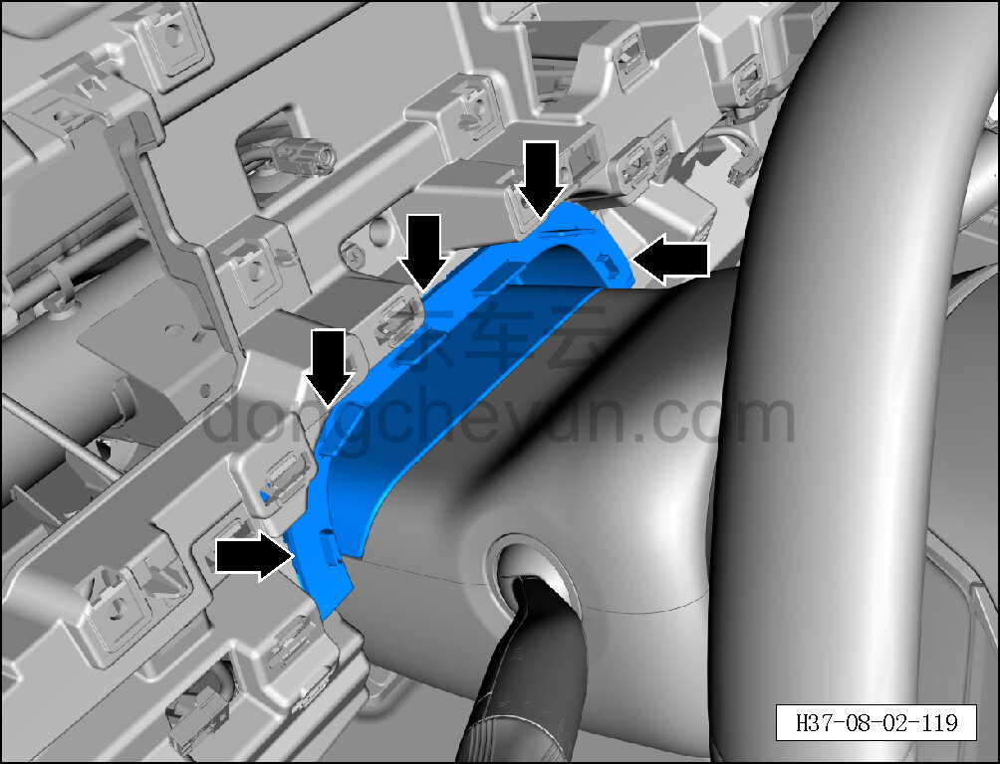
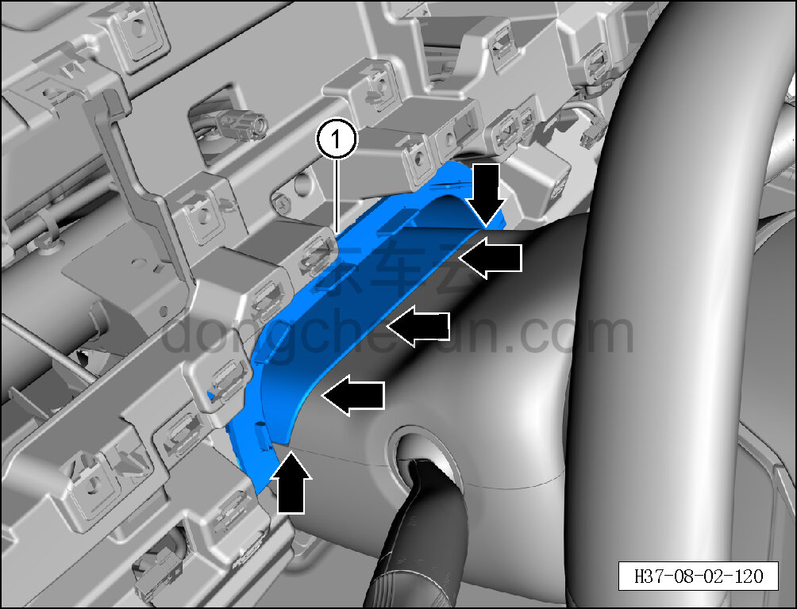

# Снятие и установка панели защитной шторки

> Внутренняя и внешняя отделка › Панель приборов › Снятие и установка панели приборов  
> Оригинал: `拆卸与安装遮蔽帘面板` · [dongcheyun 56746](https://dongcheyun.com/p/56746), страница `2e8f68e1a2c84d419bcb052dd3210f5a` · [оглавление](../README.md)

**Порядок снятия**

1. Выключите все электроприборы, отключите питание.

2. Отсоедините минусовую клемму АКБ. См. [3.1.4.1 Обесточивание автомобиля](../03-техническое-обслуживание/005-обесточивание-автомобиля.md)

3. Снимите левую декоративную накладку. См. [8.2.4.11 Снятие и установка левой декоративной накладки](064-снятие-и-установка-левой-декоративной-накладки.md)

4. Снимите правую декоративную накладку. См. [8.2.4.14 Снятие и установка правой декоративной накладки](067-снятие-и-установка-правой-декоративной-накладки.md)

5. Снимите панель защитной шторки.

a. Съёмником обивки отсоедините 5 крепёжных защёлок соединения панели защитной шторки с каркасом панели приборов.

**Внимание:**

**- При отжиме панели защитной шторки съёмником обивки подложите под инструмент нетканый материал, чтобы не повредить окружающие элементы отделки в процессе снятия.**

b. Съёмником обивки отсоедините 5 крепёжных защёлок соединения панели защитной шторки с верхним кожухом рулевой колонки и снимите панель защитной шторки ①.

**Порядок установки**

Установка выполняется в обратном порядке.

**Внимание:**

**-Проверьте крепёжные клипсы на отсутствие повреждений, при необходимости замените.**

**- После завершения установки проверьте, что панель защитной шторки установлена без перекоса и не отходит.**

**- Проверьте исправность работы панели приборов.**
