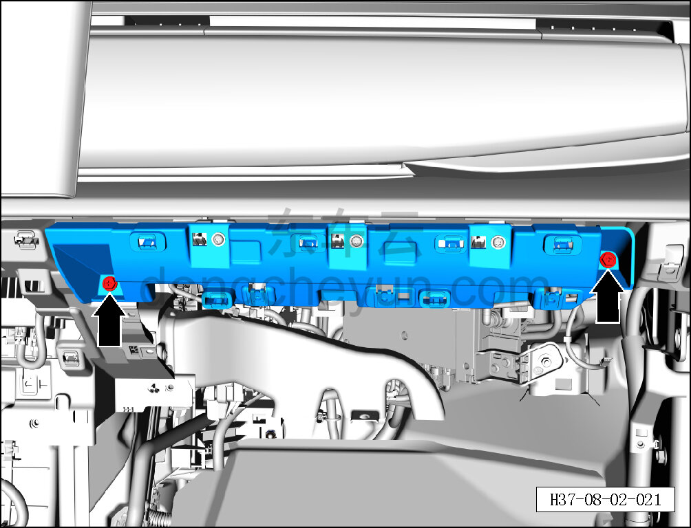
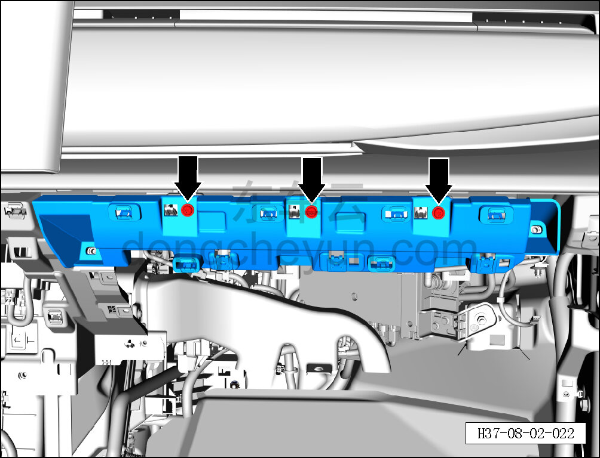
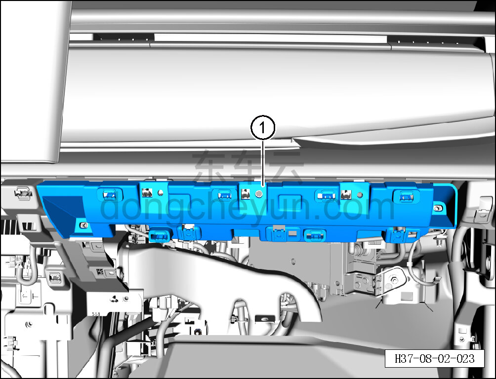

# Снятие и установка монтажной панели перчаточного ящика

> Внутренняя и внешняя отделка › Панель приборов › Снятие и установка панели приборов  
> Оригинал: `拆卸与安装手套箱安装板` · [dongcheyun 56746](https://dongcheyun.com/p/56746), страница `b53b7ce7200248338cc7602597f05aa3` · [оглавление](../README.md)

**Порядок снятия**

1. Выключите все электропотребители и обесточьте автомобиль.

2. Отсоедините минусовую клемму АКБ. См. [3.1.4.1 Обесточивание автомобиля](../03-техническое-обслуживание/005-обесточивание-автомобиля.md)

3. Снимите перчаточный ящик. См. [8.2.4.7 Снятие и установка перчаточного ящика](060-снятие-и-установка-перчаточного-ящика.md)

4. Снимите монтажную панель перчаточного ящика.

a. Торцевой головкой на 10 мм выверните 2 крепёжных болта монтажной панели перчаточного ящика.

Момент затяжки болта: 4±1 Н·м

b. Головкой T25 выверните 3 крепёжных винта монтажной панели перчаточного ящика.

Момент затяжки винта: 1.5±0.5 Н·м

c. Отсоедините монтажную панель перчаточного ящика от каркаса панели приборов и снимите монтажную панель перчаточного ящика ①.

**Порядок установки**

Установка выполняется в обратном порядке.

**Внимание:**

**-Проверьте крепёжные клипсы на отсутствие повреждений, при необходимости замените.**

**-После завершения установки проверьте, чтобы перчаточный ящик был установлен ровно, без вздутий.**

**-Проверьте нормальность функций открытия и закрытия перчаточного ящика.**
