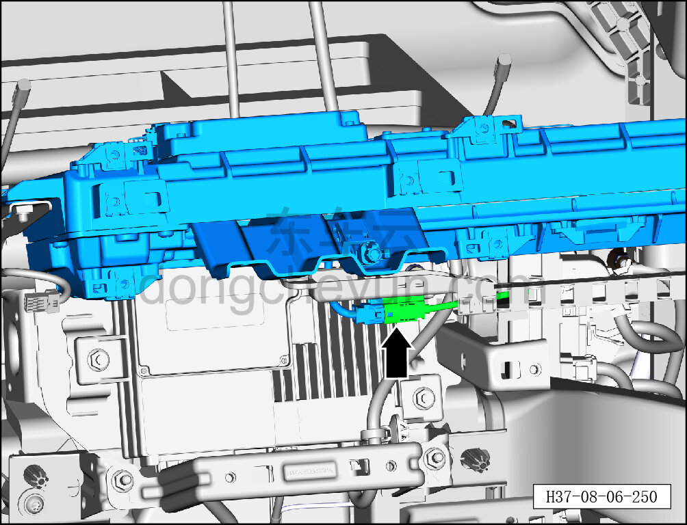
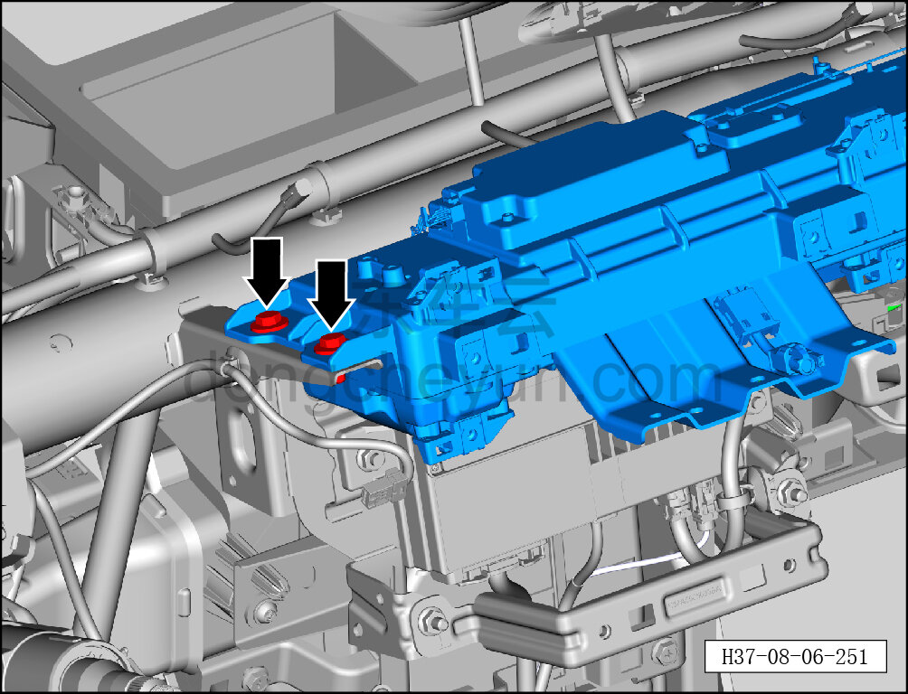
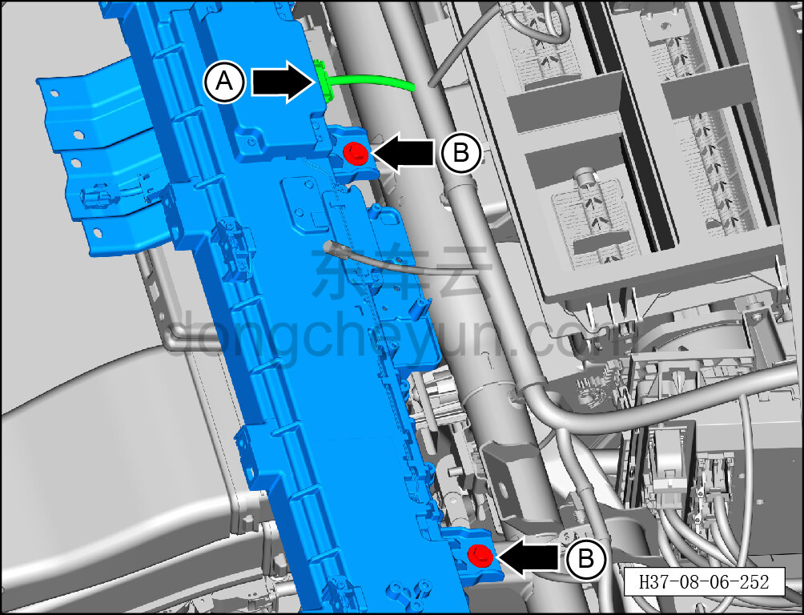
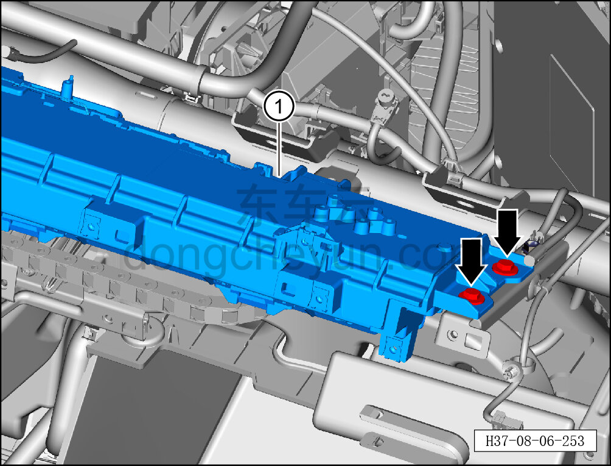

# Снятие и установка механизма выдвижения большого экрана в сборе

> Внутренняя и внешняя отделка › Панель приборов › Снятие и установка панели приборов  
> Оригинал: `拆卸与安装大屏滑动机构总成` · [dongcheyun 56746](https://dongcheyun.com/p/56746), страница `dd7430722a6e4ced8889a5a42bae5bb4` · [оглавление](../README.md)

**Порядок снятия**

1. Выключите все электроприборы, отключите питание.

2. Выполните обесточивание автомобиля для ремонта. См. [3.1.4.1 Обесточивание автомобиля](../03-техническое-обслуживание/005-обесточивание-автомобиля.md)

3. Снимите центральную консоль в сборе. См. [8.3.4.8 Снятие и установка центральной консоли в сборе](098-снятие-и-установка-центральной-консоли-в-сборе.md)

4. Снимите рулевое колесо. См. [11.1.4.1 Снятие и установка рулевого колеса](../11-система-безопасности/004-снятие-и-установка-рулевого-колеса.md)

5. Снимите левую и правую верхние накладки стойки A. См. [8.5.5.1 Снятие и установка левой верхней накладки стойки A](131-снятие-и-установка-левой-верхней-накладки-стойки-a.md)

6. Снимите левую нижнюю накладку в сборе. См. [8.2.4.2 Снятие и установка левой нижней накладки в сборе](055-снятие-и-установка-нижней-левой-защитной-накладки-в.md)

7. Снимите центрально-правую накладку. См. [8.2.4.21 Снятие и установка центрально-правой накладки](074-снятие-и-установка-центрально-правой-накладки.md)

8. Снимите перчаточный ящик. См. [8.2.4.7 Снятие и установка перчаточного ящика](060-снятие-и-установка-перчаточного-ящика.md)

9. Снимите верхнюю крышку панели приборов. См. [8.2.4.10 Снятие и установка верхней крышки панели приборов](063-снятие-и-установка-верхней-крышки-панели-приборов.md)

10. Снимите воздуховыпускное отверстие. См. [8.2.4.16 Снятие и установка левого воздуховода обдува лобового стекла](069-снятие-и-установка-левого-воздуховода-обдува-лобового.md)

11. Снимите левую декоративную накладку. См. [8.2.4.12 Снятие и установка воздуховыпускного отверстия](065-снятие-и-установка-воздуховыпускного-отверстия.md)

12. Снимите правую декоративную накладку. См. [8.2.4.14 Снятие и установка правой декоративной накладки](067-снятие-и-установка-правой-декоративной-накладки.md)

13. Снимите комбинацию приборов. См. [9.1.3.2 Снятие и установка комбинации приборов](../09-электрическая-и-электронная-система/004-снятие-и-установка-комбинации-приборов.md)

14. Снимите основной модуль Bluetooth. См. [9.7.5.3 Снятие и установка основного модуля Bluetooth](../09-электрическая-и-электронная-система/068-снятие-и-установка-основного-модуля-bluetooth.md)

15. Снимите антенну 5G. См. [9.1.6.1 Снятие и установка антенны 5G](../09-электрическая-и-электронная-система/014-снятие-и-установка-антенны-5g.md)

16. Снимите панель приборов в сборе. См. [8.2.4.27 Снятие и установка панели приборов в сборе](080-снятие-и-установка-панели-приборов-в-сборе.md)

17. Снимите механизм выдвижения большого экрана в сборе.

a. Удерживая фиксатор разъёма, отсоедините разъём механизма выдвижения большого экрана в сборе.

b. Торцевой головкой на 10 мм выверните 2 крепёжных болта с левой стороны механизма выдвижения большого экрана в сборе.

Момент затяжки болтов: 10±1 Н·м

c. Удерживая фиксатор разъёма, отсоедините разъём A механизма выдвижения большого экрана в сборе.

d. Торцевой головкой на 10 мм выверните 2 крепёжных болта B в средней части механизма выдвижения большого экрана в сборе.

Момент затяжки болта: 4±1 Н·м

e. Торцевой головкой на 10 мм выверните 2 крепёжных болта с правой стороны механизма выдвижения большого экрана в сборе.

Момент затяжки болтов: 10±1 Н·м

f. Снимите механизм выдвижения большого экрана в сборе ①.

**Порядок установки**

Установка выполняется в обратном порядке.

**Внимание:**

**- После завершения установки проверьте исправность всех функций комбинации приборов.**

**- Требуется провести дорожное испытание для проверки отсутствия посторонних шумов от панели приборов и очистить коды неисправностей.**
