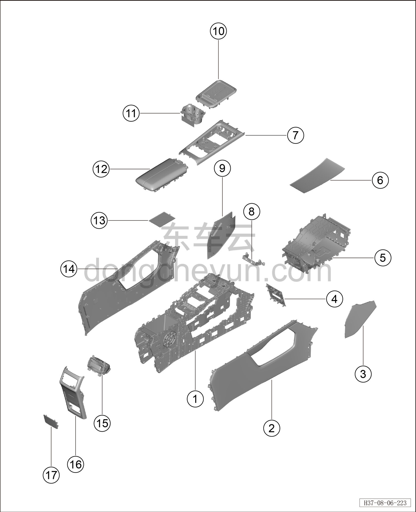
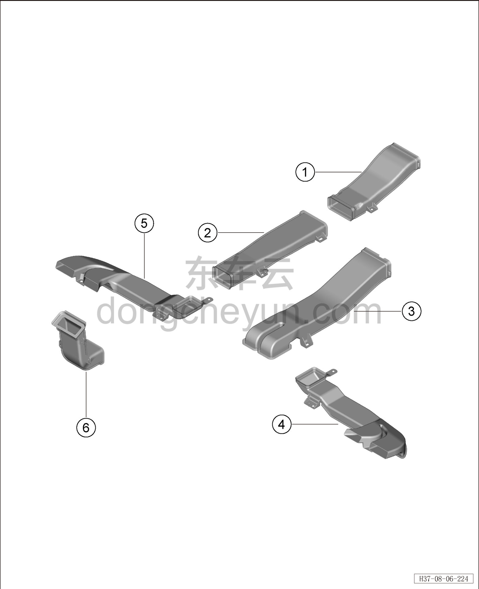

# Покомпонентный вид (деталировка)

> Внутренняя и внешняя отделка › Центральная консоль  
> Оригинал: `结构分解图` · [dongcheyun 56746](https://dongcheyun.com/p/56746), страница `f2cf88a6c83b4d698972f861d6706678` · [оглавление](../README.md)

| № | Наименование детали | Кол-во на автомобиль | Примечание |
|---|---|---|---|
| 1 | Каркас центральной консоли | 1 | - |
| 2 | Правая боковая панель центральной консоли | 1 | - |
| 3 | Правая передняя расширительная панель | 1 | - |
| 4 | Заглушка ароматизатора (передняя) | 1 | - |
| 5 | Тоннельный кожух в сборе | 1 | - |
| 6 | Резиновый коврик вещевого отсека | 1 | - |
| 7 | Панель подстаканников | 1 | - |
| 8 | Передний усилительный кронштейн центральной консоли | 1 | - |
| 9 | Левая передняя расширительная панель | 1 | - |
| 10 | Верхняя панель в сборе | 1 | - |
| 11 | Открытый подстаканник | 1 | - |
| 12 | Подлокотник центральной консоли | 1 | - |
| 13 | Резиновый коврик бокса подлокотника | 1 | - |
| 14 | Левая боковая панель центральной консоли | 1 | - |
| 15 | Задний воздуховыпускной канал |   |   |
| 16 | Задняя крышка |   |   |
| 17 | Заглушка ароматизатора (задняя) |   |   |

| № | Наименование детали | Кол-во на автомобиль | Примечание |
|---|---|---|---|
| 1 | Передний участок заднего воздуховода вентиляции в лицо | 1 | - |
| 2 | Средний участок заднего воздуховода вентиляции в лицо в сборе | 1 | - |
| 3 | Передний участок левого заднего воздуховода обдува ног | 1 | - |
| 4 | Задний участок правого заднего воздуховода обдува ног | 1 | - |
| 5 | Задний участок левого заднего воздуховода обдува ног | 1 | - |
| 6 | Задний участок заднего воздуховода вентиляции в лицо | 1 | - |
