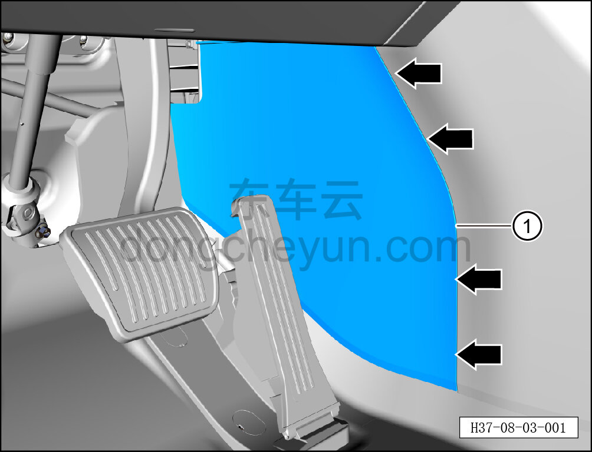

# Снятие и установка левой передней расширительной панели

> Внутренняя и внешняя отделка › Центральная консоль › Снятие и установка центральной консоли  
> Оригинал: `拆卸与安装左前延伸板` · [dongcheyun 56746](https://dongcheyun.com/p/56746), страница `a8cb2ec276194914b5e2cf2d2711e5ab` · [оглавление](../README.md)

**Порядок снятия**

1. Снимите левую переднюю расширительную панель.

a. Съёмником обивки отсоедините 4 крепёжные защёлки левой передней расширительной панели и снимите левую переднюю расширительную панель ①.

**Внимание:**

**- При отжиме расширительной панели съёмником обивки подложите под инструмент нетканый материал, чтобы не повредить окружающие элементы отделки в процессе снятия.**

**Порядок установки**

Установка выполняется в обратном порядке.

**Внимание:**

**-Проверьте крепёжные клипсы на отсутствие повреждений, при необходимости замените.**

**- После завершения установки проверьте, что левая передняя расширительная панель установлена без перекоса и не отходит.**
