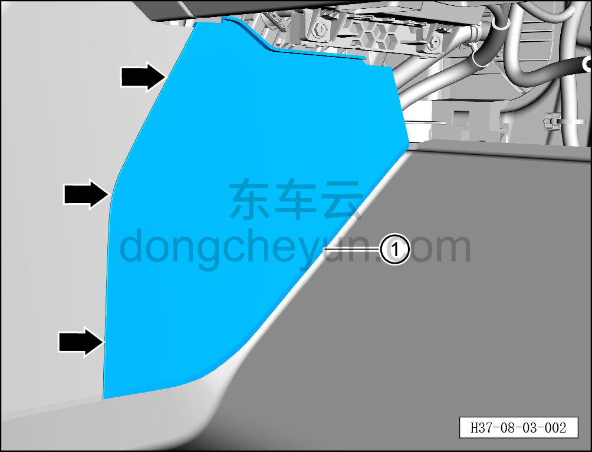

# Снятие и установка правой передней расширительной панели

> Внутренняя и внешняя отделка › Центральная консоль › Снятие и установка центральной консоли  
> Оригинал: `拆卸与安装右前延伸板` · [dongcheyun 56746](https://dongcheyun.com/p/56746), страница `d8f4224aa3cb443fbda31cffa51dcfcb` · [оглавление](../README.md)

**Порядок снятия**

1. Выключите все электроприборы, отключите питание.

2. Снимите правую переднюю расширительную панель.

a. Съёмником обивки отсоедините 3 крепёжные защёлки правой передней расширительной панели и снимите правую переднюю расширительную панель ①.

**Внимание:**

**- При отжиме расширительной панели съёмником обивки подложите под инструмент нетканый материал, чтобы не повредить окружающие элементы отделки в процессе снятия.**

**Порядок установки**

Установка выполняется в обратном порядке.

**Внимание:**

**-Проверьте крепёжные клипсы на отсутствие повреждений, при необходимости замените.**

**- После завершения установки проверьте, что правая передняя расширительная панель установлена без перекоса и не отходит.**
