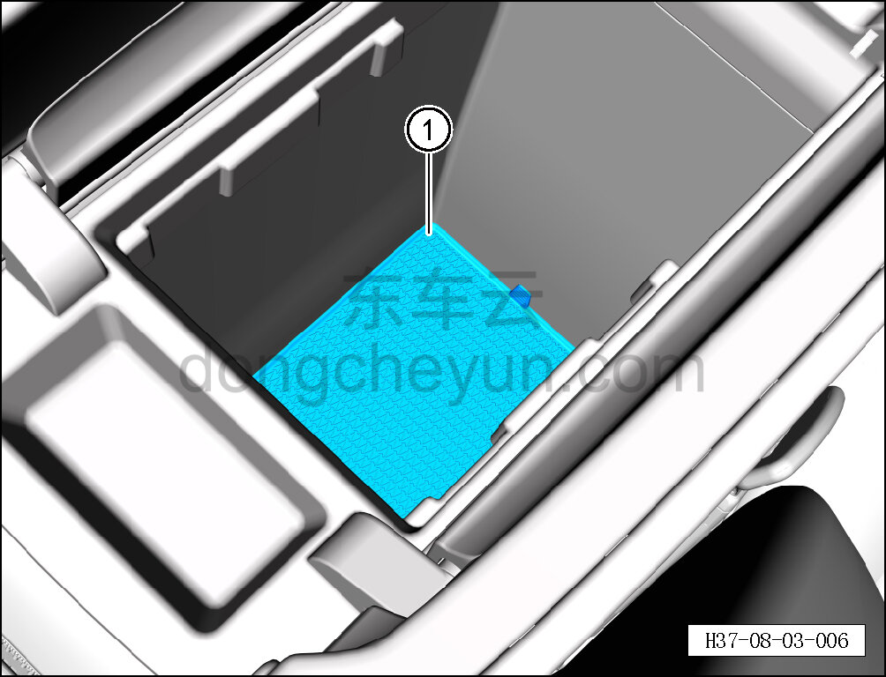

# Снятие и установка резинового коврика бокса подлокотника

> Внутренняя и внешняя отделка › Центральная консоль › Снятие и установка центральной консоли  
> Оригинал: `拆卸与安装扶手箱胶垫` · [dongcheyun 56746](https://dongcheyun.com/p/56746), страница `657fe56797734b2186435f40aaa055f3` · [оглавление](../README.md)

**Порядок снятия**

1. Снимите резиновый коврик бокса подлокотника.

a. Снимите резиновый коврик бокса подлокотника ①.

**Порядок установки**

Установка выполняется в обратном порядке.
