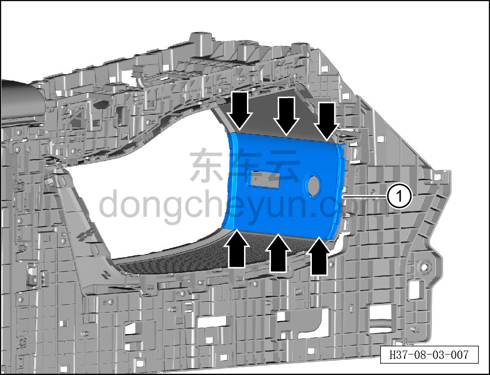

# Снятие и установка крышки USB

> Внутренняя и внешняя отделка › Центральная консоль › Снятие и установка центральной консоли  
> Оригинал: `拆卸与安装 USB 盖板` · [dongcheyun 56746](https://dongcheyun.com/p/56746), страница `18322d3851bd47f4a8b3dabbd6684e96` · [оглавление](../README.md)

**Порядок снятия**

1. Выключите все электроприборы, отключите питание.

2. Выполните операцию обесточивания автомобиля для ремонта. См. [3.1.4.1 Обесточивание автомобиля](../03-техническое-обслуживание/005-обесточивание-автомобиля.md)

3. Снимите центральную консоль в сборе. См. [8.3.4.8 Снятие и установка центральной консоли в сборе](098-снятие-и-установка-центральной-консоли-в-сборе.md)

4. Снимите левую и правую боковые панели центральной консоли. См. [8.3.4.5 Снятие и установка левой боковой панели центральной консоли](095-снятие-и-установка-левой-боковой-панели-центральной.md)

5. Снимите розетку 12 В. См. [9.4.5.1 Снятие и установка розетки 12 В](../09-электрическая-и-электронная-система/031-снятие-и-установка-розетки-питания-12-в.md)

6. Снимите USB-зарядное устройство. См. [9.4.5.2 Снятие и установка USB-зарядного устройства (с передачей данных)](../09-электрическая-и-электронная-система/032-снятие-и-установка-usb-зарядного-устройства-с.md)

7. Снимите крышку USB.

a. Съёмником обивки отсоедините 6 крепёжных защёлок крышки USB.

b. Снимите крышку USB ①.

**Внимание:**

**- При отжиме крышки съёмником обивки подложите под инструмент нетканый материал, чтобы не повредить окружающие элементы отделки в процессе снятия.**

**Порядок установки**

Установка выполняется в обратном порядке.

**Внимание:**

**-Проверьте крепёжные клипсы на отсутствие повреждений, при необходимости замените.**

**- После завершения установки проверьте, что крышка USB установлена без перекоса и не отходит.**

**- Проверьте исправность работы USB-порта и розетки 12 В.**
