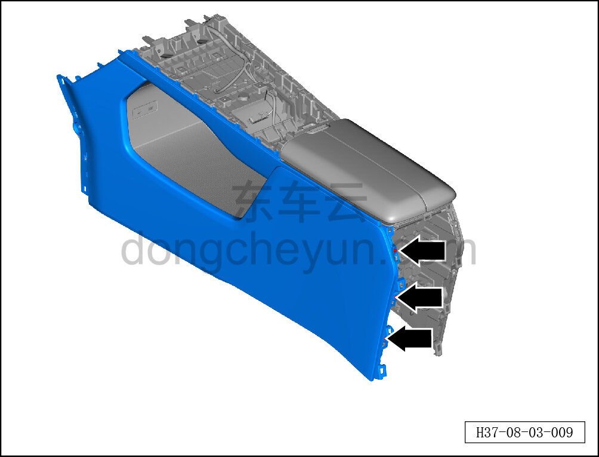
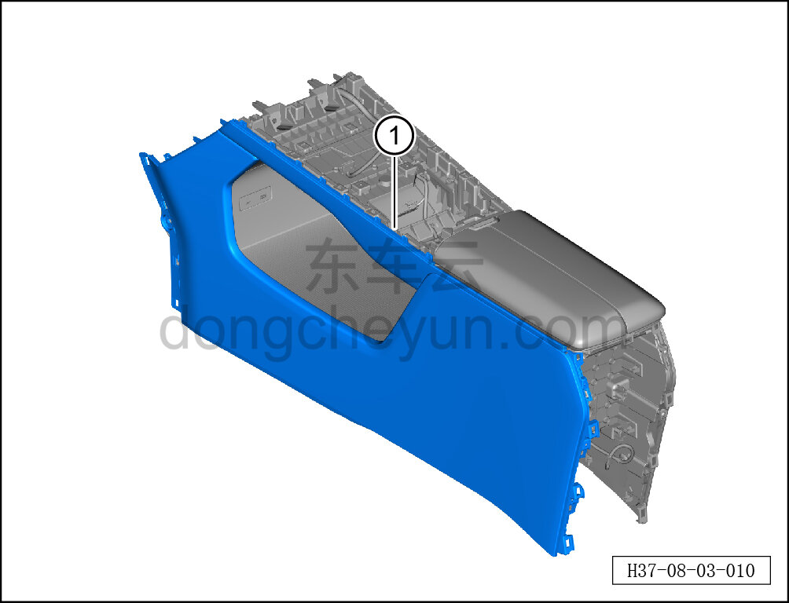

# Снятие и установка левой боковой панели центральной консоли

> Внутренняя и внешняя отделка › Центральная консоль › Снятие и установка центральной консоли  
> Оригинал: `拆卸与安装副仪表板左侧板` · [dongcheyun 56746](https://dongcheyun.com/p/56746), страница `6737a3440aca49999f9bc77b2199f77b` · [оглавление](../README.md)

**Порядок снятия**

**Примечание:**

**- Ниже описано снятие и установка левой боковой панели центральной консоли, правая выполняется по аналогии с левой.**

1. Выключите все электроприборы, отключите питание.

2. Выполните операцию обесточивания автомобиля для ремонта. См. [3.1.4.1 Обесточивание автомобиля](../03-техническое-обслуживание/005-обесточивание-автомобиля.md)

3. Снимите центральную консоль в сборе. См. [8.3.4.8 Снятие и установка центральной консоли в сборе](098-снятие-и-установка-центральной-консоли-в-сборе.md)

4. Снимите панель подстаканников. См. [8.3.4.20 Снятие и установка панели подстаканников](110-снятие-и-установка-панели-подстаканников.md)

5. Снимите левую боковую панель центральной консоли.

a. Головкой T25 выверните 3 крепёжных винта левой боковой панели центральной консоли.

Момент затяжки винта: 1.5±0.5 Н·м

**Внимание:**

**- При отжиме боковой панели съёмником обивки подложите под инструмент нетканый материал, чтобы не повредить окружающие элементы отделки в процессе снятия.**

b. Съёмником обивки отсоедините крепёжные защёлки левой боковой панели центральной консоли и снимите левую боковую панель центральной консоли ①.

**Порядок установки**

Установка выполняется в обратном порядке.

**Внимание:**

**-Проверьте крепёжные клипсы на отсутствие повреждений, при необходимости замените.**

**- После завершения установки проверьте, что левая боковая панель центральной консоли установлена без перекоса и не отходит.**
