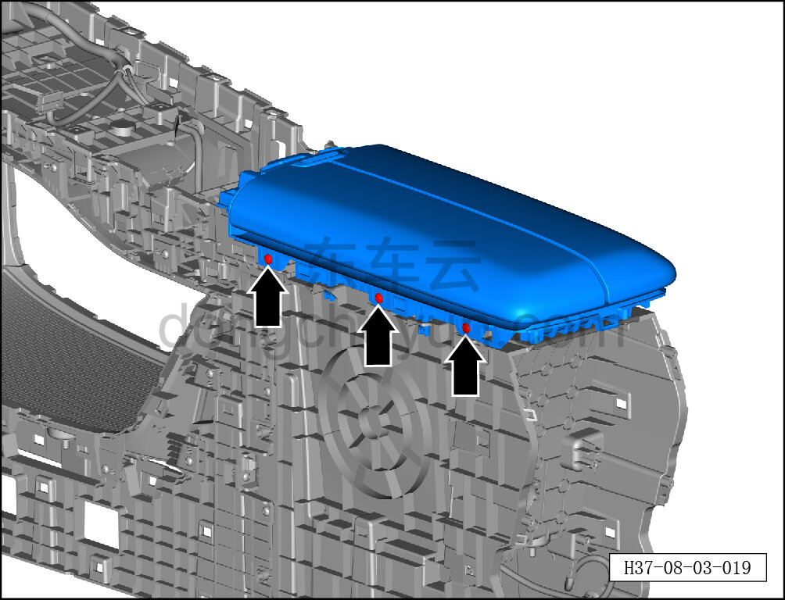
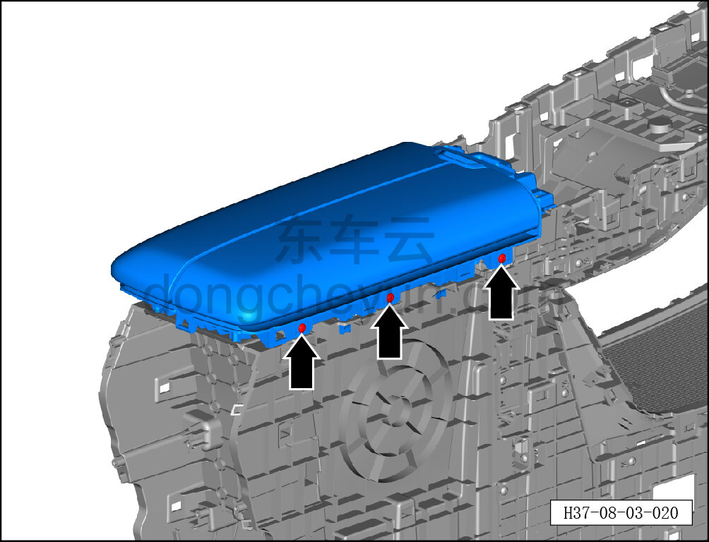
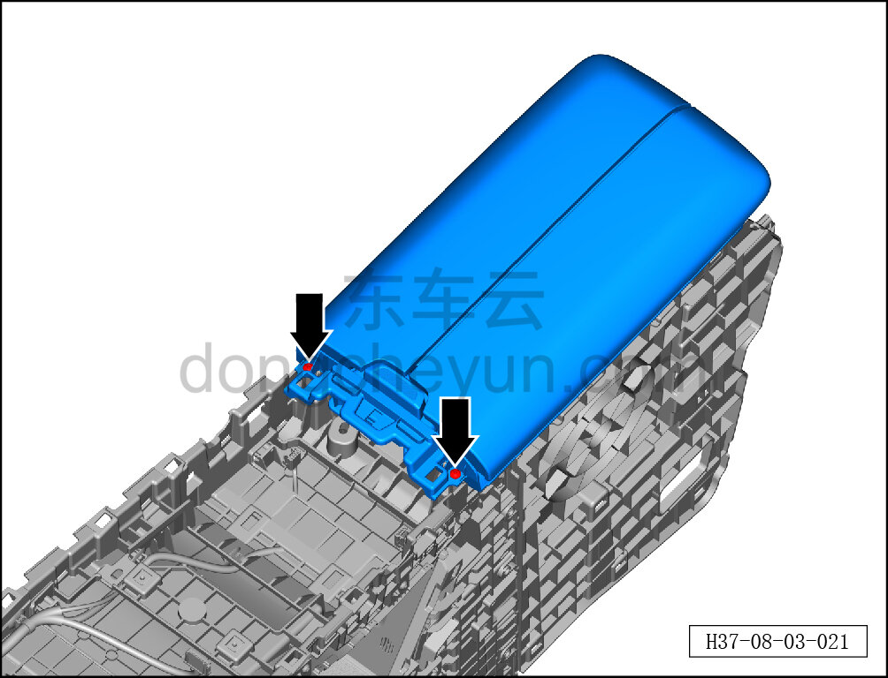
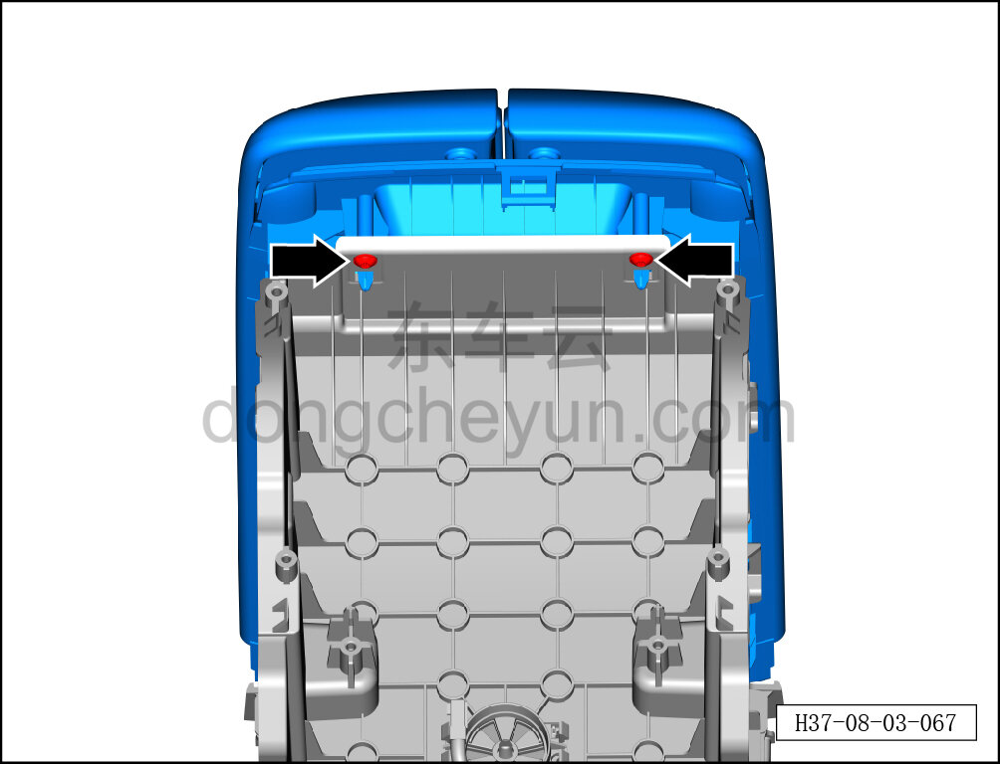
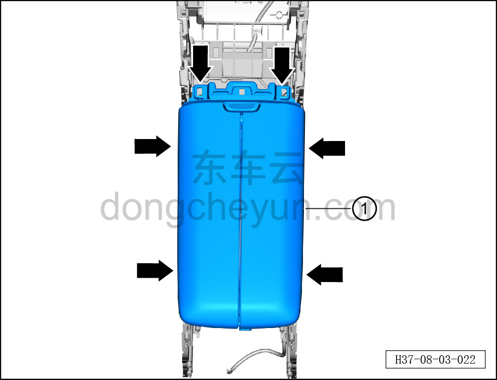

# Снятие и установка подлокотника центральной консоли

> Внутренняя и внешняя отделка › Центральная консоль › Снятие и установка центральной консоли  
> Оригинал: `拆卸与安装副仪表板扶手` · [dongcheyun 56746](https://dongcheyun.com/p/56746), страница `b1aaac62a18d4606904122821906f6e7` · [оглавление](../README.md)

**Порядок снятия**

1. Выключите все электроприборы, отключите питание.

2. Выполните операцию обесточивания автомобиля для ремонта. См. [3.1.4.1 Обесточивание автомобиля](../03-техническое-обслуживание/005-обесточивание-автомобиля.md)

3. Снимите центральную консоль в сборе. См. [8.3.4.8 Снятие и установка центральной консоли в сборе](098-снятие-и-установка-центральной-консоли-в-сборе.md)

4. Снимите панель подстаканников. См. [8.3.4.20 Снятие и установка панели подстаканников](110-снятие-и-установка-панели-подстаканников.md)

5. Снимите левую и правую боковые панели центральной консоли. См. [8.3.4.5 Снятие и установка левой боковой панели центральной консоли](095-снятие-и-установка-левой-боковой-панели-центральной.md)

6. Снимите подлокотник центральной консоли.

a. Головкой T25 выверните 3 крепёжных винта подлокотника центральной консоли.

Момент затяжки винта: 1.5±0.5 Н·м

b. Головкой T25 выверните 3 крепёжных винта подлокотника центральной консоли.

Момент затяжки винта: 1.5±0.5 Н·м

c. Головкой T25 выверните 2 крепёжных винта подлокотника центральной консоли.

Момент затяжки винта: 1.5±0.5 Н·м

d. Головкой T25 выверните 2 крепёжных винта подлокотника центральной консоли.

Момент затяжки винта: 1.5±0.5 Н·м

e. Съёмником обивки отсоедините 6 крепёжных защёлок подлокотника центральной консоли и снимите подлокотник центральной консоли ①.

**Внимание:**

**- При отжиме центральной консоли съёмником обивки подложите под инструмент нетканый материал, чтобы не повредить окружающие элементы отделки в процессе снятия.**

**Порядок установки**

Установка выполняется в обратном порядке.

**Внимание:**

**-Проверьте крепёжные клипсы на отсутствие повреждений, при необходимости замените.**

**- После завершения установки проверьте, что подлокотник центральной консоли установлен без перекоса и не отходит.**
