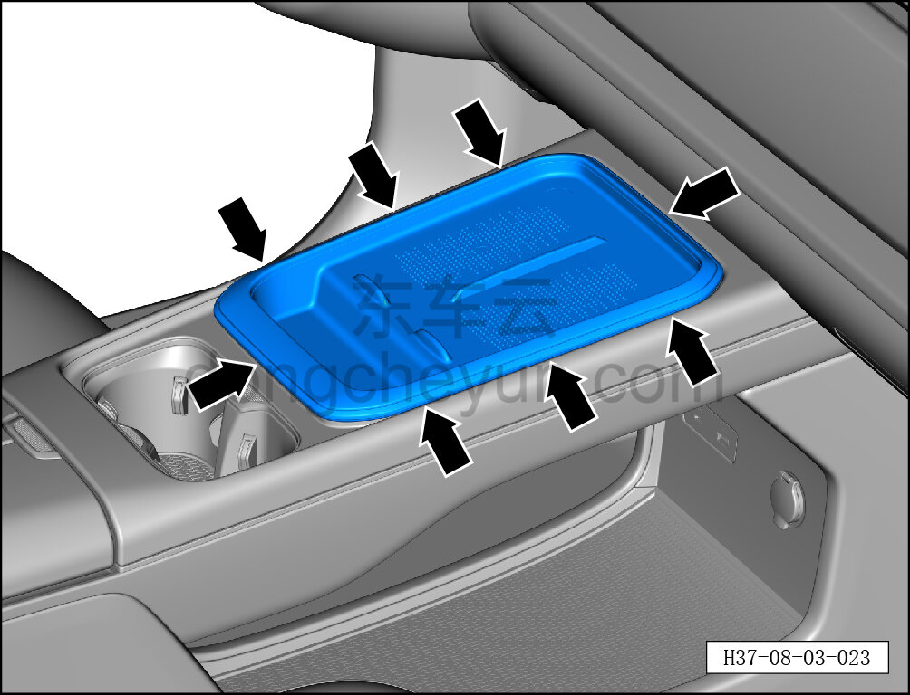
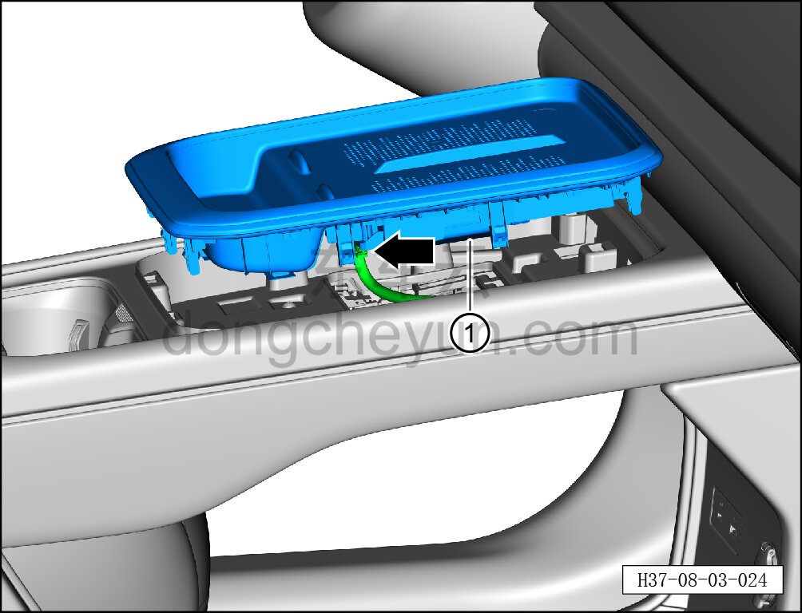

# Снятие и установка верхней панели в сборе

> Внутренняя и внешняя отделка › Центральная консоль › Снятие и установка центральной консоли  
> Оригинал: `拆卸与安装上面板总成` · [dongcheyun 56746](https://dongcheyun.com/p/56746), страница `828b3b2ec27d462a921754e93f47637e` · [оглавление](../README.md)

**Порядок снятия**

1. Выключите все электроприборы, отключите питание.

2. Выполните операцию обесточивания автомобиля для ремонта. См. [3.1.4.1 Обесточивание автомобиля](../03-техническое-обслуживание/005-обесточивание-автомобиля.md)

3. Снимите верхнюю панель в сборе.

**Внимание:**

**- К задней стороне верхней панели в сборе подключён жгут проводов; после отсоединения защёлок не тяните панель резко, чтобы не повредить жгут.**

a. Съёмником обивки отожмите 8 крепёжных защёлок верхней панели в сборе.

**Внимание:**

**- При отжиме верхней панели съёмником обивки подложите под инструмент нетканый материал, чтобы не повредить окружающие элементы отделки в процессе снятия.**

b. Нажмите на фиксатор разъёма и отсоедините разъём жгута проводов контроллера беспроводной зарядки телефона ①.

c. Снимите верхнюю панель в сборе ①.

**Порядок установки**

Установка выполняется в обратном порядке.

**Внимание:**

**-Проверьте крепёжные клипсы на отсутствие повреждений, при необходимости замените.**

**- После завершения установки проверьте, что верхняя панель в сборе установлена без перекоса и не отходит.**
