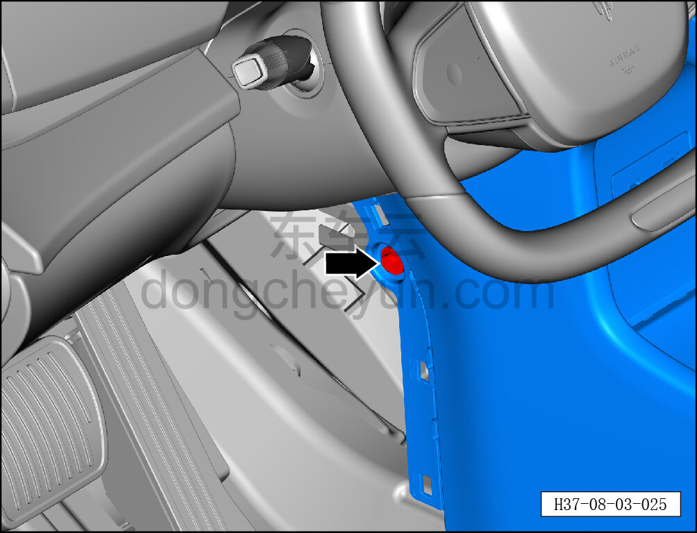
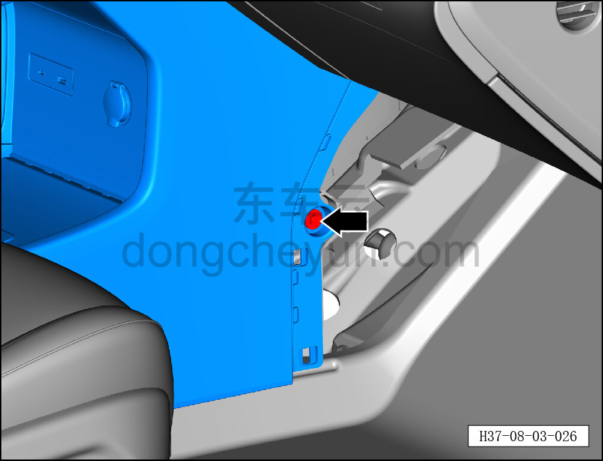
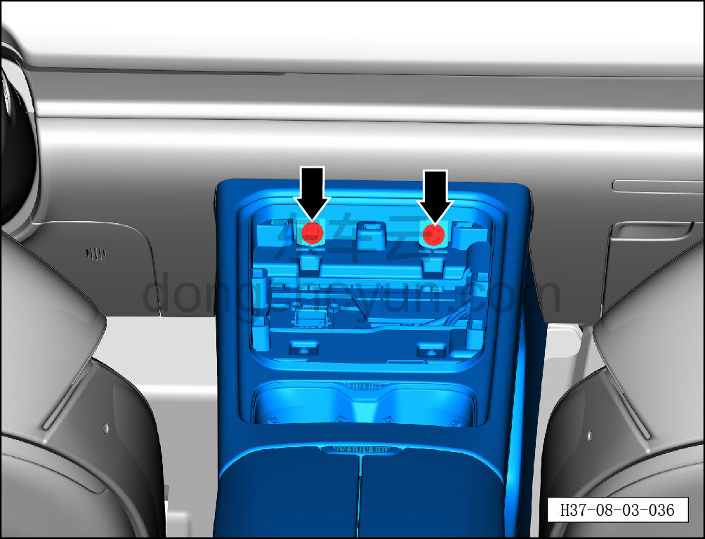
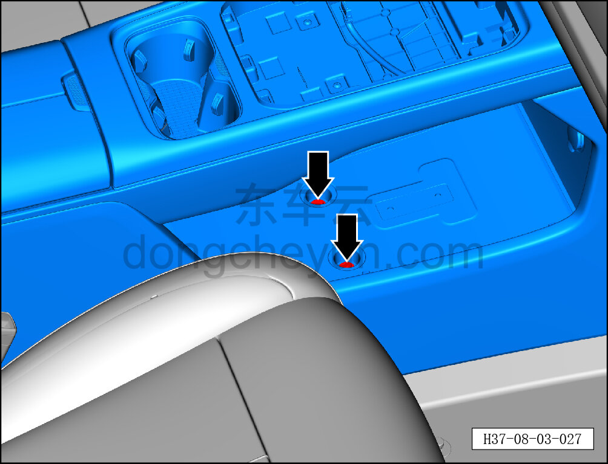
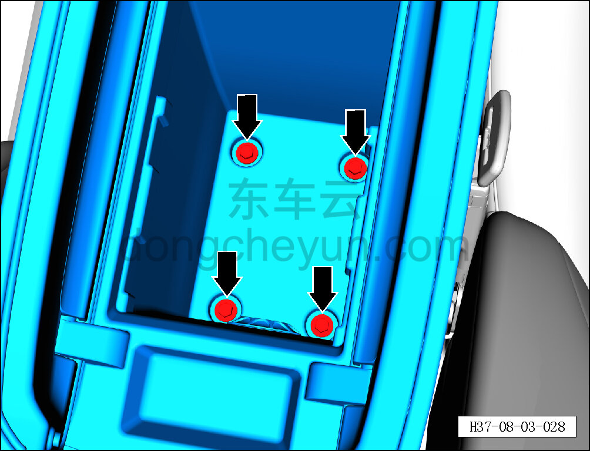
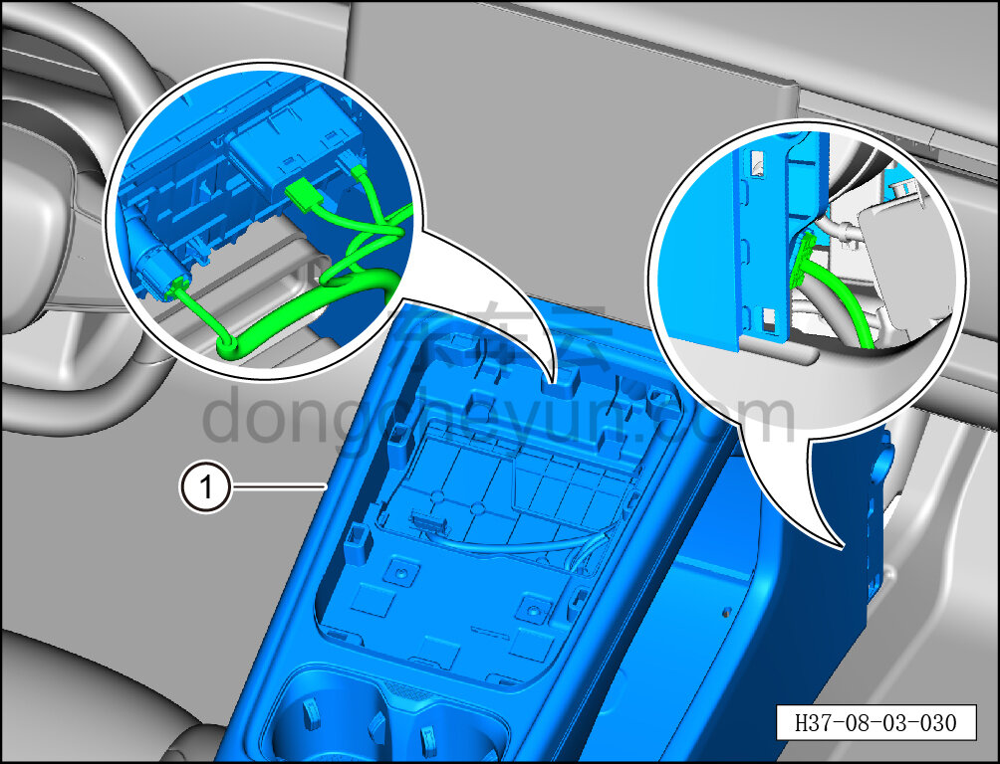

# Снятие и установка центральной консоли в сборе

> Внутренняя и внешняя отделка › Центральная консоль › Снятие и установка центральной консоли  
> Оригинал: `拆卸与安装副仪表板总成` · [dongcheyun 56746](https://dongcheyun.com/p/56746), страница `29c9a86e66ac416399b6a670a824e6d8` · [оглавление](../README.md)

**Порядок снятия**

1. Выключите все электроприборы, отключите питание.

2. Выполните операцию обесточивания автомобиля для ремонта. См. [3.1.4.1 Обесточивание автомобиля](../03-техническое-обслуживание/005-обесточивание-автомобиля.md)

3. Снимите левую переднюю расширительную панель. См. [8.3.4.1 Снятие и установка левой передней расширительной панели](091-снятие-и-установка-левой-передней-расширительной-панели.md)

4. Снимите правую переднюю расширительную панель. См. [8.3.4.2 Снятие и установка правой передней расширительной панели](092-снятие-и-установка-правой-передней-расширительной.md)

5. Снимите заднюю крышку. См. [8.3.4.12 Снятие и установка задней крышки](102-снятие-и-установка-задней-крышки.md)

6. Снимите задний участок заднего воздуховода вентиляции в лицо. См. [8.3.4.13 Снятие и установка заднего участка заднего воздуховода вентиляции в лицо](103-снятие-и-установка-заднего-участка-заднего-воздуховода.md)

7. Снимите верхнюю панель в сборе. См. [8.3.4.7 Снятие и установка верхней панели в сборе](097-снятие-и-установка-верхней-панели-в-сборе.md)

8. Снимите резиновый коврик вещевого отсека. См. [8.3.4.18 Снятие и установка резинового коврика вещевого отсека](108-снятие-и-установка-резинового-коврика-вещевого-отсека.md)

9. Снимите центральную консоль в сборе.

a. Торцевой головкой на 10 мм выверните крепёжный болт центральной консоли в сборе.

Момент затяжки болта: 4±1 Н·м

b. Торцевой головкой на 10 мм выверните крепёжный болт центральной консоли в сборе.

Момент затяжки болта: 4±1 Н·м

c. Торцевой головкой на 10 мм выверните 2 крепёжных болта центральной консоли в сборе.

Момент затяжки болта: 4±1 Н·м

d. Торцевой головкой на 10 мм выверните 2 крепёжных болта центральной консоли в сборе.

Момент затяжки болта: 4±1 Н·м

e. Торцевой головкой на 10 мм выверните 4 крепёжных болта центральной консоли в сборе.

Момент затяжки болта: 4±1 Н·м

f. Удерживая фиксатор разъёма, отсоедините разъёмы дополнительного USB-зарядного устройства, розетки 12 В и жгута проводов центральной консоли, и снимите центральную консоль в сборе ①.

**Внимание:**

**- Снимайте центральную консоль в сборе медленно, следя за отсутствием прочих помех.**

**Порядок установки**

Установка выполняется в обратном порядке.

**Внимание:**

**- После завершения установки проверьте исправность работы центральной консоли.**

**- После завершения установки проверьте, что центральная консоль в сборе установлена без перекоса и не отходит.**

**- Требуется провести дорожное испытание для проверки отсутствия посторонних шумов от панели приборов и очистить коды неисправностей.**
