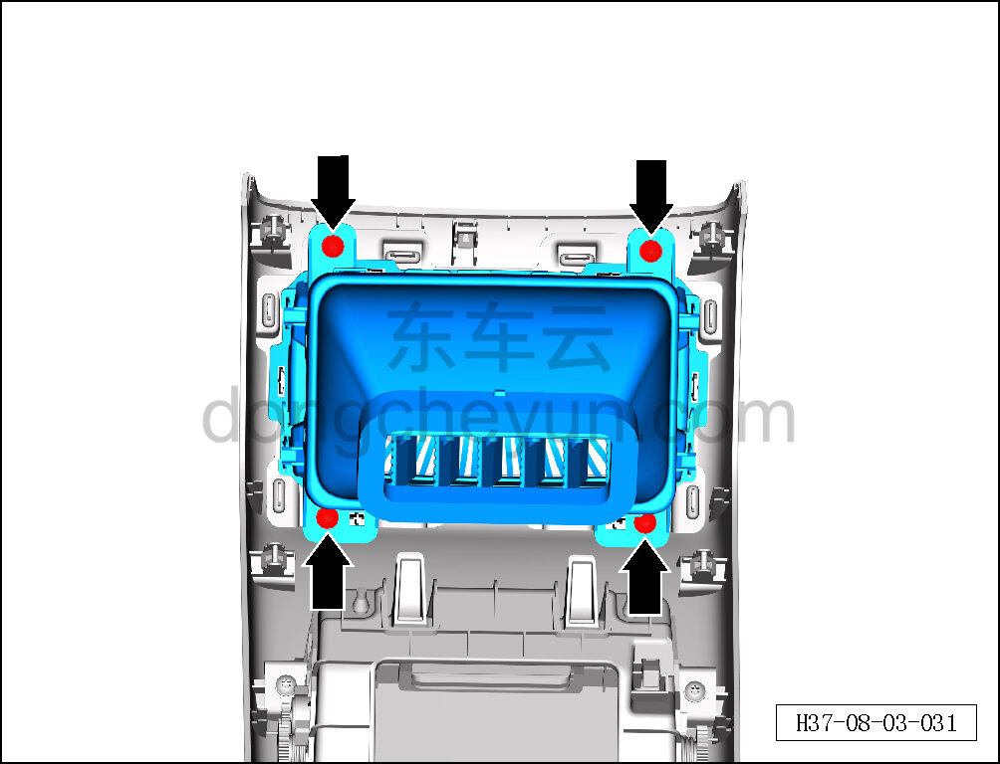
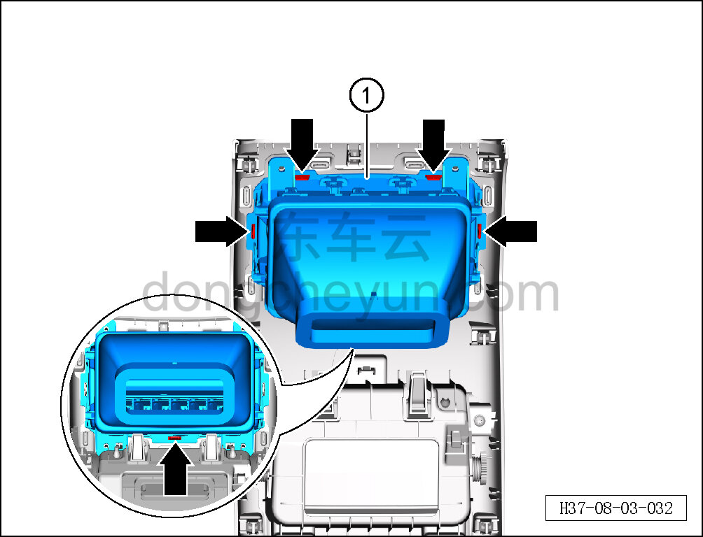

# Снятие и установка заднего воздуховыпускного канала

> Внутренняя и внешняя отделка › Центральная консоль › Снятие и установка центральной консоли  
> Оригинал: `拆卸与安装后出风口` · [dongcheyun 56746](https://dongcheyun.com/p/56746), страница `6bc40edd02c743398e64fad4aa791eba` · [оглавление](../README.md)

**Порядок снятия**

1. Выключите все электроприборы, отключите питание.

2. Выполните операцию обесточивания автомобиля для ремонта. См. [3.1.4.1 Обесточивание автомобиля](../03-техническое-обслуживание/005-обесточивание-автомобиля.md)

3. Снимите заднюю крышку. См. [8.3.4.12 Снятие и установка задней крышки](102-снятие-и-установка-задней-крышки.md)

4. Снимите задний воздуховыпускной канал в сборе.

a. Головкой T25 выверните 4 крепёжных винта заднего воздуховыпускного канала в сборе.

Момент затяжки винта: 1.5±0.5 Н·м

b. Съёмником обивки отсоедините 5 крепёжных защёлок заднего воздуховыпускного канала в сборе и снимите задний воздуховыпускной канал в сборе ①.

**Внимание:**

**- При отжиме воздуховыпускного отверстия съёмником обивки подложите под инструмент нетканый материал, чтобы не повредить окружающие элементы отделки в процессе снятия.**

**Порядок установки**

Установка выполняется в обратном порядке.

**Внимание:**

**-Проверьте крепёжные клипсы на отсутствие повреждений, при необходимости замените.**

**- После завершения установки проверьте, что задний воздуховыпускной канал установлен без перекоса и не отходит.**
