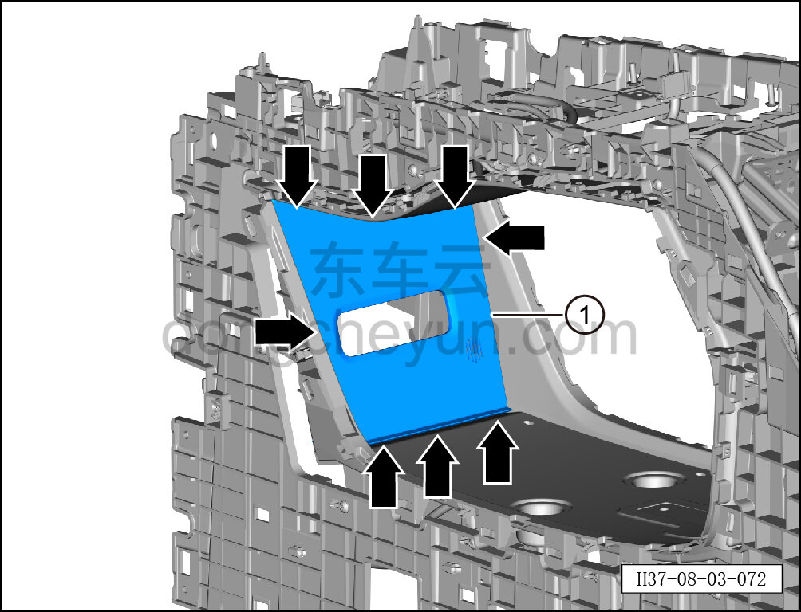

# Снятие и установка заглушки ароматизатора

> Внутренняя и внешняя отделка › Центральная консоль › Снятие и установка центральной консоли  
> Оригинал: `拆卸与安装香氛堵盖` · [dongcheyun 56746](https://dongcheyun.com/p/56746), страница `2acbe8eae6ed4fef84947b0fffa71352` · [оглавление](../README.md)

**Порядок снятия**

1. Выключите все электроприборы, отключите питание.

2. Выполните операцию обесточивания автомобиля для ремонта. См. [3.1.4.1 Обесточивание автомобиля](../03-техническое-обслуживание/005-обесточивание-автомобиля.md)

3. Снимите центральную консоль в сборе. См. [8.3.4.8 Снятие и установка центральной консоли в сборе](098-снятие-и-установка-центральной-консоли-в-сборе.md)

4. Снимите кронштейн ароматизатора. См. [8.3.4.11 Снятие и установка кронштейна ароматизатора](101-снятие-и-установка-кронштейна-ароматизатора.md)

5. Снимите заглушку ароматизатора.

a. Съёмником обивки отсоедините 8 крепёжных защёлок заднего воздуховыпускного канала в сборе и снимите заглушку ароматизатора ①.

**Внимание:**

**- При отжиме заглушки ароматизатора съёмником обивки подложите под инструмент нетканый материал, чтобы не повредить окружающие элементы отделки в процессе снятия.**

**Порядок установки**

Установка выполняется в обратном порядке.

**Внимание:**

**-Проверьте крепёжные клипсы на отсутствие повреждений, при необходимости замените.**

**- После завершения установки проверьте, что заглушка ароматизатора установлена без перекоса и не отходит.**
