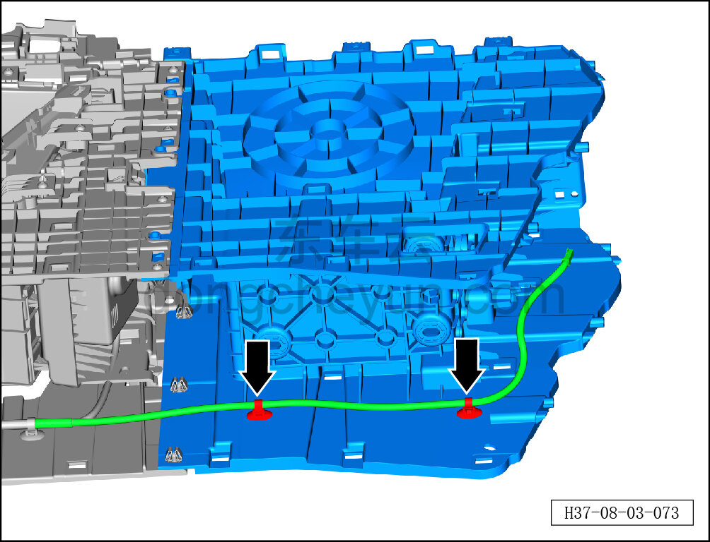
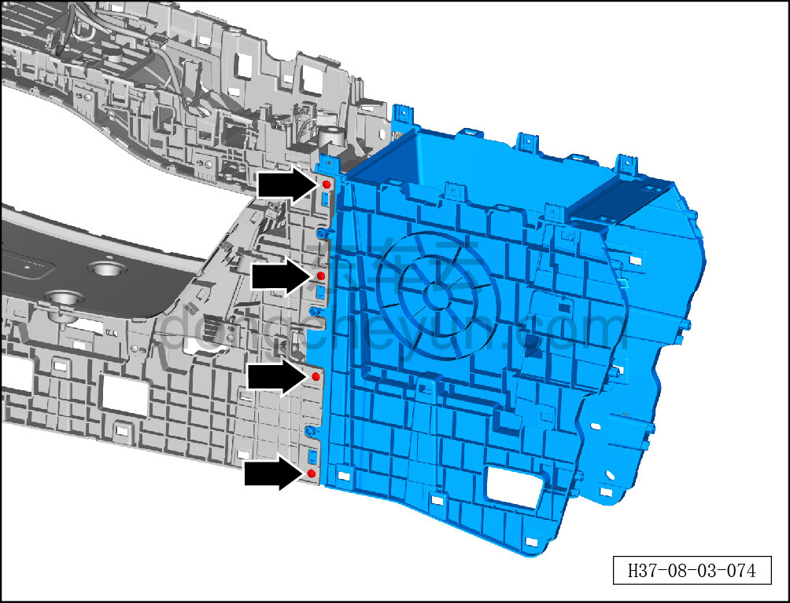
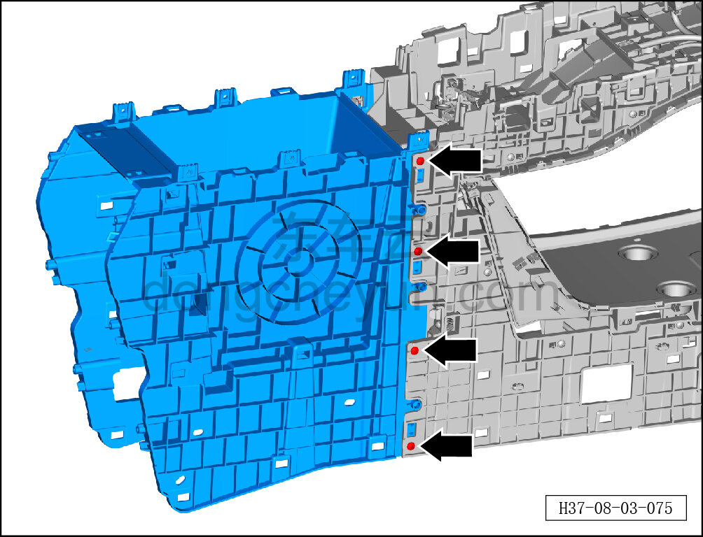
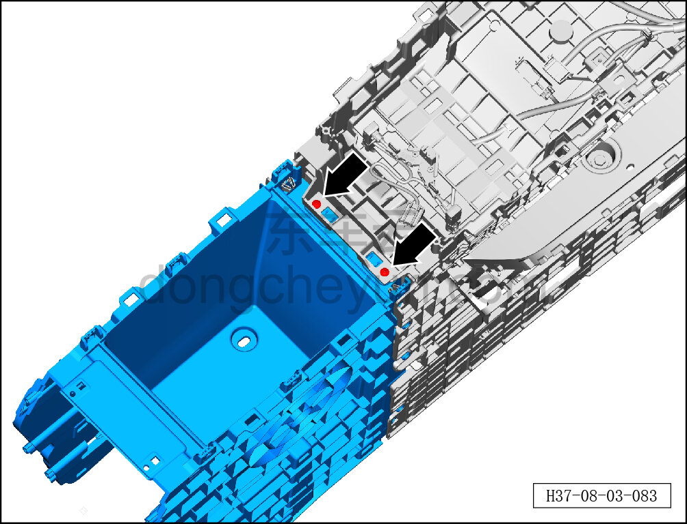
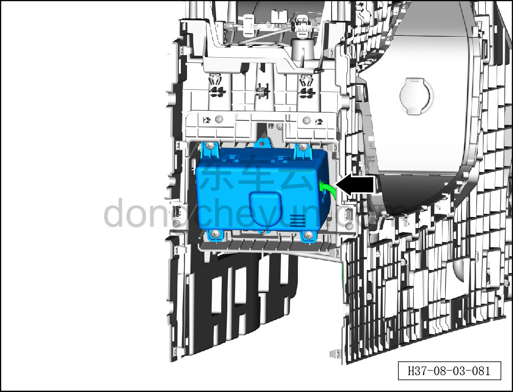
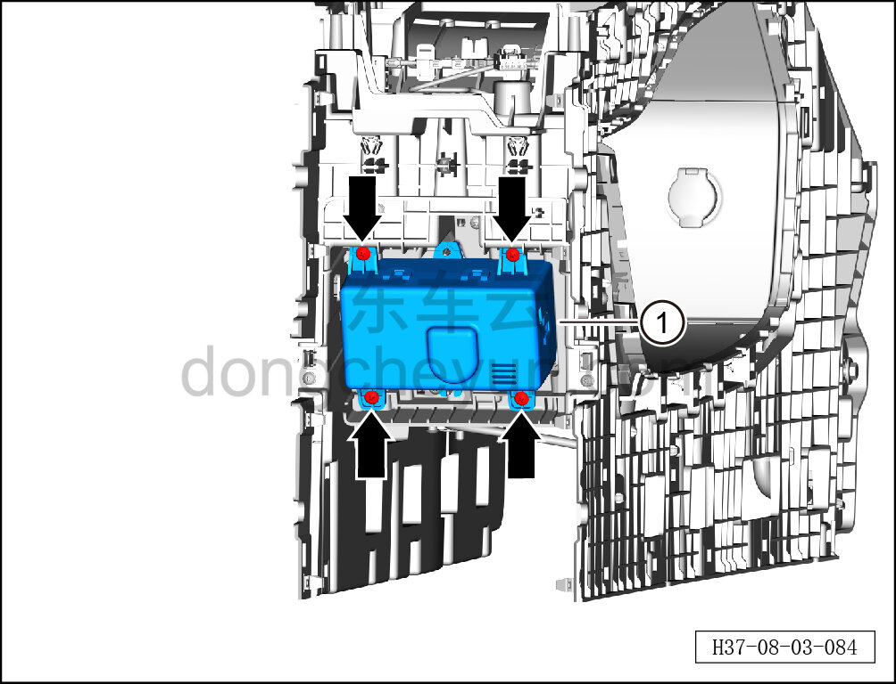
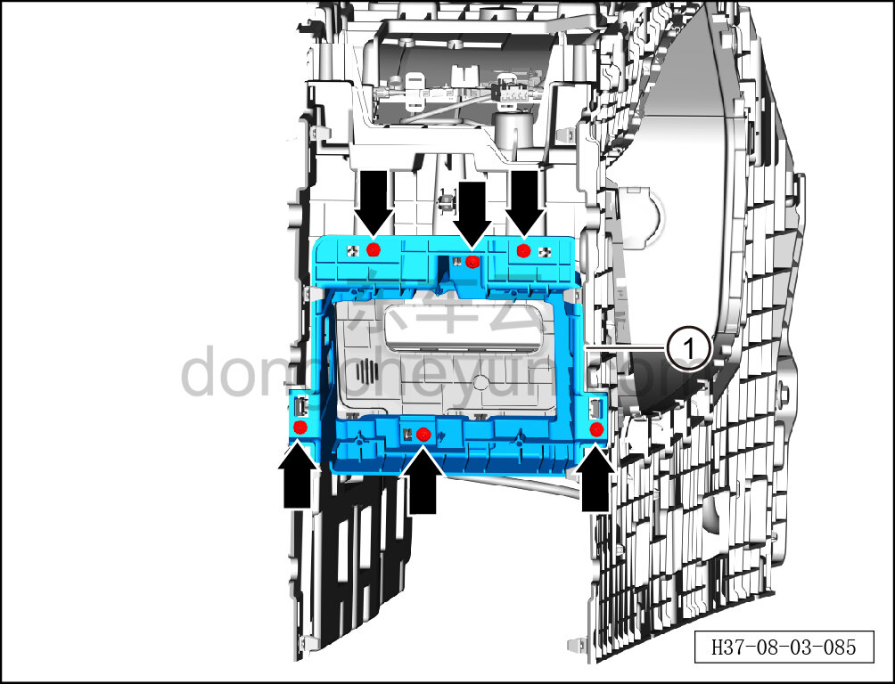

# Снятие и установка кронштейна ароматизатора

> Внутренняя и внешняя отделка › Центральная консоль › Снятие и установка центральной консоли  
> Оригинал: `拆卸与安装香氛支架` · [dongcheyun 56746](https://dongcheyun.com/p/56746), страница `09d95566f1574e64bb7624b752800e9a` · [оглавление](../README.md)

**Порядок снятия**

1. Выключите все электроприборы, отключите питание.

2. Выполните обесточивание автомобиля для ремонта. См. [3.1.4.1 Обесточивание автомобиля](../03-техническое-обслуживание/005-обесточивание-автомобиля.md)

3. Снимите центральную консоль в сборе. См. [8.3.4.8 Снятие и установка центральной консоли в сборе](098-снятие-и-установка-центральной-консоли-в-сборе.md)

4. Снимите панель подстаканников. См. [8.3.4.20 Снятие и установка панели подстаканников](110-снятие-и-установка-панели-подстаканников.md)

5. Снимите левую и правую боковые панели центральной консоли. См. [8.3.4.5 Снятие и установка левой боковой панели центральной консоли](095-снятие-и-установка-левой-боковой-панели-центральной.md)

6. Снимите подлокотник центральной консоли. См. [8.3.4.6 Снятие и установка подлокотника центральной консоли](096-снятие-и-установка-подлокотника-центральной-консоли.md)

7. Снимите кронштейн ароматизатора.

a. Съёмником обивки отсоедините 2 крепёжные защёлки жгута проводов центральной консоли.

b. Головкой T25 выверните 4 крепёжных винта с левой стороны заднего каркаса центральной консоли.

Момент затяжки винта: 1.5±0.5 Н·м

c. Головкой T25 выверните 4 крепёжных винта с правой стороны заднего каркаса центральной консоли.

Момент затяжки винта: 1.5±0.5 Н·м

d. Головкой T25 выверните 2 крепёжных винта сверху заднего каркаса центральной консоли и разъедините передний и задний каркасы центральной консоли.

Момент затяжки винта: 1.5±0.5 Н·м

e. Нажмите на фиксатор разъёма и отсоедините разъём жгута проводов генератора ароматизатора.

f. Крестовой отвёрткой выверните 4 крепёжных винта генератора ароматизатора и снимите генератор ароматизатора ①.

Момент затяжки винта: 1.5±0.5 Н·м

g. Головкой T25 выверните 6 крепёжных винтов кронштейна ароматизатора и снимите кронштейн ароматизатора ①.

Момент затяжки винта: 1.5±0.5 Н·м

**Порядок установки**

Установка выполняется в обратном порядке.

**Внимание:**

**-Проверьте крепёжные клипсы на отсутствие повреждений, при необходимости замените.**

**- После завершения установки проверьте надёжность крепления кронштейна ароматизатора.**
