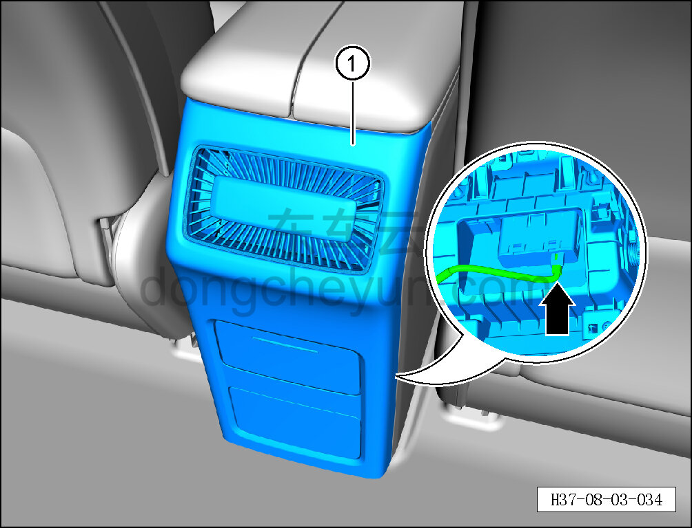
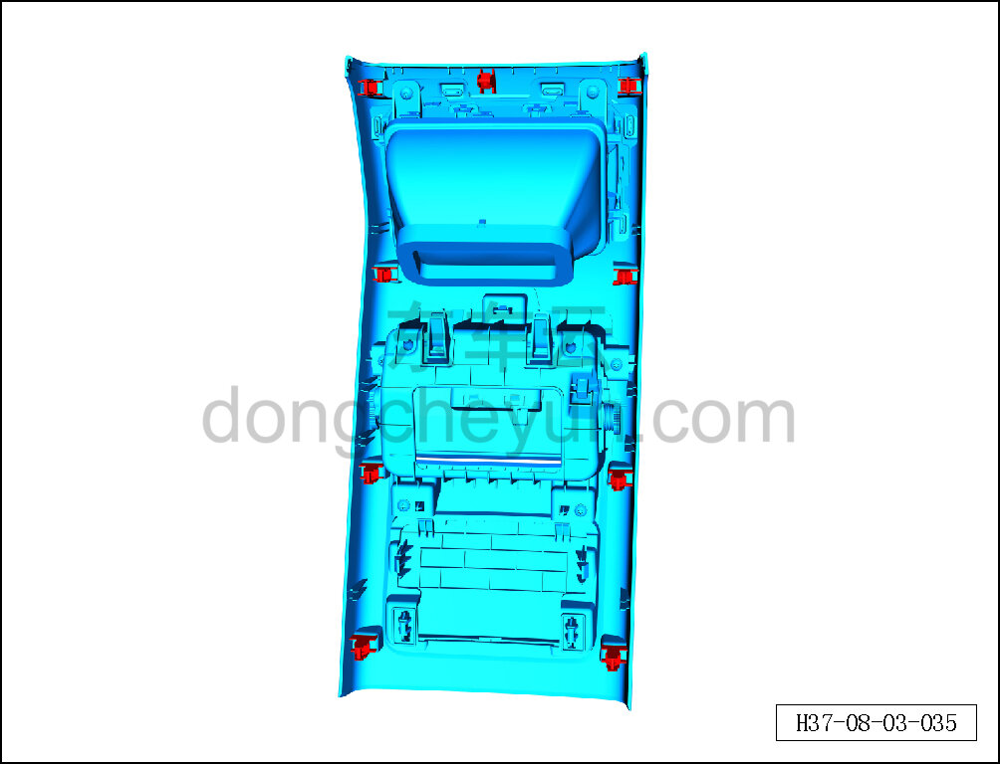

# Снятие и установка задней крышки

> Внутренняя и внешняя отделка › Центральная консоль › Снятие и установка центральной консоли  
> Оригинал: `拆卸与安装后盖板` · [dongcheyun 56746](https://dongcheyun.com/p/56746), страница `a4c81cd17acb42eea27709ac77bdf381` · [оглавление](../README.md)

**Порядок снятия**

1. Выключите все электроприборы, отключите питание.

2. Выполните операцию обесточивания автомобиля для ремонта. См. [3.1.4.1 Обесточивание автомобиля](../03-техническое-обслуживание/005-обесточивание-автомобиля.md)

3. Снимите заднюю крышку.

**Внимание:**

**- К задней стороне задней крышки подключён жгут проводов; после отсоединения защёлок не тяните крышку резко, чтобы не повредить жгут.**

a. Съёмником обивки отсоедините крепёжные защёлки задней крышки.

b. Отсоедините разъём жгута проводов USB-зарядного устройства и снимите заднюю крышку ①.

**Внимание:**

**- При отжиме задней крышки съёмником обивки подложите под инструмент нетканый материал, чтобы не повредить окружающие элементы отделки в процессе снятия.**

c. Крепёжные защёлки задней крышки показаны на рисунке слева.

**Порядок установки**

Установка выполняется в обратном порядке.

**Внимание:**

**-Проверьте крепёжные клипсы на отсутствие повреждений, при необходимости замените.**

**- После завершения установки проверьте, что кронштейн ароматизатора установлен без перекоса и не отходит.**

**- Проверьте исправность работы USB-зарядного устройства.**
