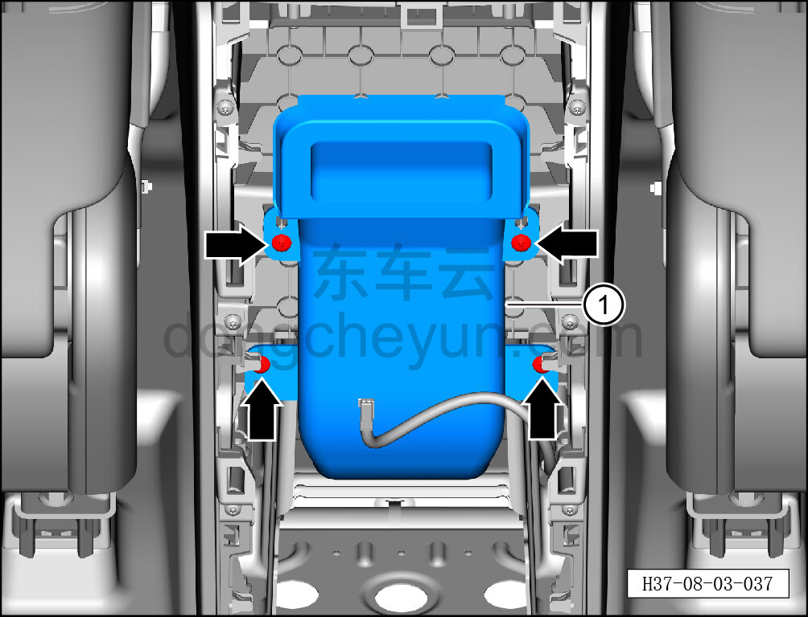

# Снятие и установка заднего участка заднего воздуховода вентиляции в лицо

> Внутренняя и внешняя отделка › Центральная консоль › Снятие и установка центральной консоли  
> Оригинал: `拆卸与安装后吹面风道后部` · [dongcheyun 56746](https://dongcheyun.com/p/56746), страница `8b00e4bd7d6242779861f0e81788b13c` · [оглавление](../README.md)

**Порядок снятия**

1. Выключите все электроприборы, отключите питание.

2. Выполните операцию обесточивания автомобиля для ремонта. См. [3.1.4.1 Обесточивание автомобиля](../03-техническое-обслуживание/005-обесточивание-автомобиля.md)

3. Снимите заднюю крышку. См. [8.3.4.12 Снятие и установка задней крышки](102-снятие-и-установка-задней-крышки.md)

4. Снимите задний участок заднего воздуховода вентиляции в лицо.

a. Головкой T25 выверните 4 крепёжных винта заднего участка заднего воздуховода вентиляции в лицо и снимите задний участок заднего воздуховода вентиляции в лицо ①.

Момент затяжки винта: 1.5±0.5 Н·м

**Порядок установки**

Установка выполняется в обратном порядке.

**Внимание:**

**- После завершения установки проверьте нормальность обдува воздухом из заднего дефлектора.**
