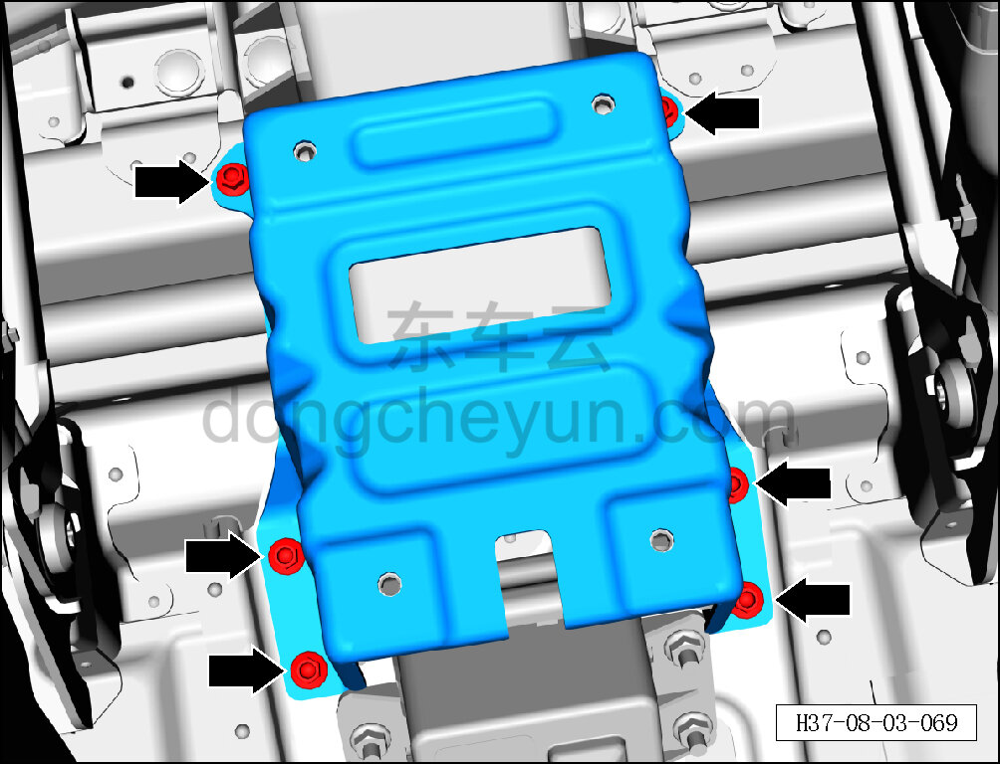
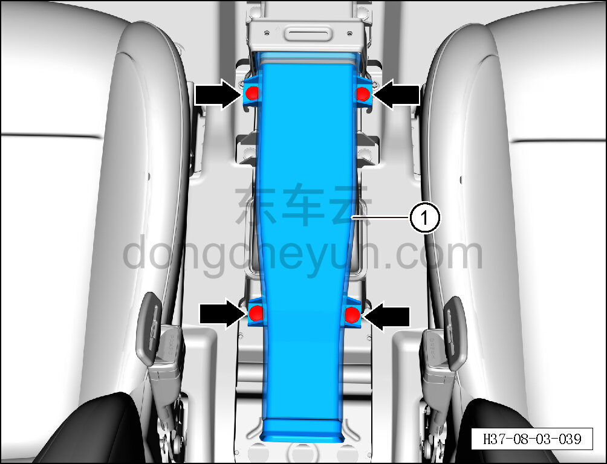

# Снятие и установка среднего участка заднего воздуховода вентиляции в лицо в сборе

> Внутренняя и внешняя отделка › Центральная консоль › Снятие и установка центральной консоли  
> Оригинал: `拆卸与安装后吹面风道中段总成` · [dongcheyun 56746](https://dongcheyun.com/p/56746), страница `fd2a3ba7149a4de1b72fd4026fe20cb9` · [оглавление](../README.md)

**Порядок снятия**

1. Выключите все электроприборы, отключите питание.

2. Выполните операцию обесточивания автомобиля для ремонта. См. [3.1.4.1 Обесточивание автомобиля](../03-техническое-обслуживание/005-обесточивание-автомобиля.md)

3. Снимите центральную консоль в сборе. См. [8.3.4.8 Снятие и установка центральной консоли в сборе](098-снятие-и-установка-центральной-консоли-в-сборе.md)

4. Снимите средний участок заднего воздуховода вентиляции в лицо в сборе.

a. Торцевой головкой на 10 мм выверните 6 крепёжных болтов заднего монтажного кронштейна центральной консоли в сборе и снимите задний монтажный кронштейн центральной консоли.

b. Съёмником обивки отсоедините 4 крепёжные защёлки среднего участка заднего воздуховода вентиляции в лицо в сборе и снимите средний участок заднего воздуховода вентиляции в лицо в сборе ①.

**Порядок установки**

Установка выполняется в обратном порядке.

**Внимание:**

**- Проверьте крепёжные защёлки на повреждения и при необходимости замените их.**

**- После завершения установки проверьте нормальность обдува воздухом из заднего дефлектора.**
