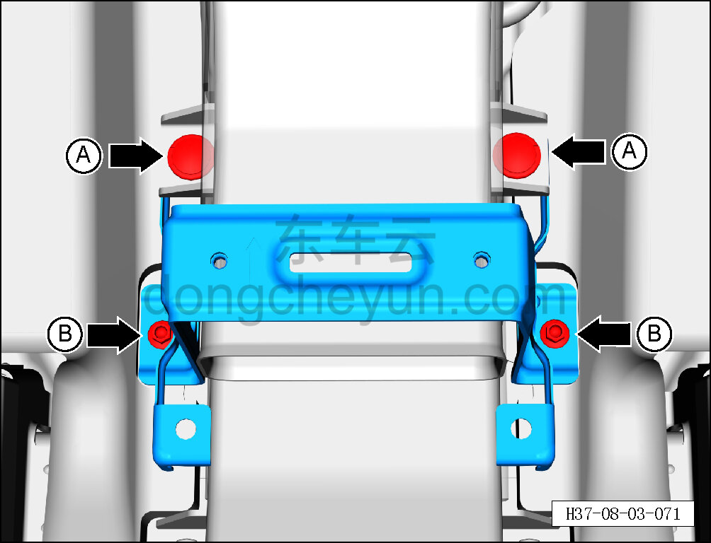
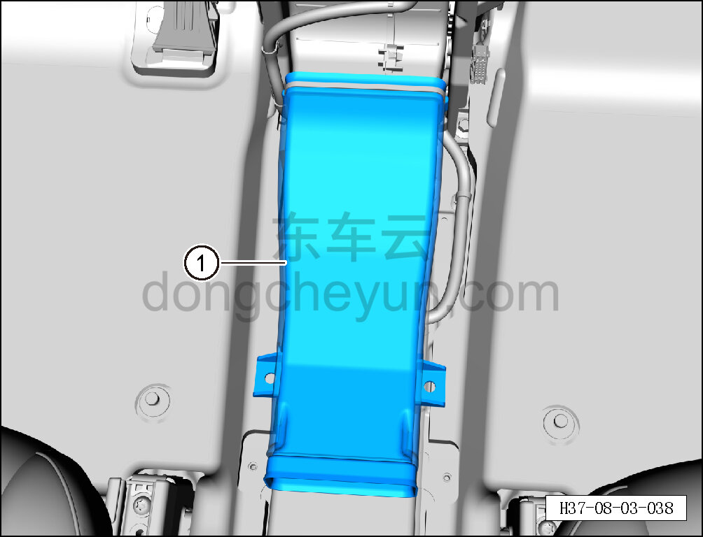

# Снятие и установка переднего участка заднего воздуховода вентиляции в лицо

> Внутренняя и внешняя отделка › Центральная консоль › Снятие и установка центральной консоли  
> Оригинал: `拆卸与安装后吹面风道前段` · [dongcheyun 56746](https://dongcheyun.com/p/56746), страница `b4576fac897e419dbad8a9d51bb62786` · [оглавление](../README.md)

**Порядок снятия**

1. Выключите все электроприборы, отключите питание.

2. Выполните операцию обесточивания автомобиля для ремонта. См. [3.1.4.1 Обесточивание автомобиля](../03-техническое-обслуживание/005-обесточивание-автомобиля.md)

3. Снимите центральную консоль в сборе. См. [8.3.4.8 Снятие и установка центральной консоли в сборе](098-снятие-и-установка-центральной-консоли-в-сборе.md)

4. Снимите средний участок заднего воздуховода вентиляции в лицо в сборе. См. [8.3.4.14 Снятие и установка среднего участка заднего воздуховода вентиляции в лицо в сборе](104-снятие-и-установка-среднего-участка-заднего.md)

5. Снимите передний участок заднего воздуховода вентиляции в лицо.

a. Съёмником обивки отсоедините 2 крепёжные защёлки A переднего участка заднего воздуховода вентиляции в лицо.

b. Торцевой головкой на 10 мм выверните 6 крепёжных болтов B среднего монтажного кронштейна центральной консоли и снимите средний монтажный кронштейн центральной консоли.

c. Снимите передний участок заднего воздуховода вентиляции в лицо ①.

**Порядок установки**

Установка выполняется в обратном порядке.

**Внимание:**

**- Проверьте крепёжные защёлки на повреждения и при необходимости замените их.**

**- После завершения установки проверьте нормальность обдува воздухом из заднего дефлектора.**
