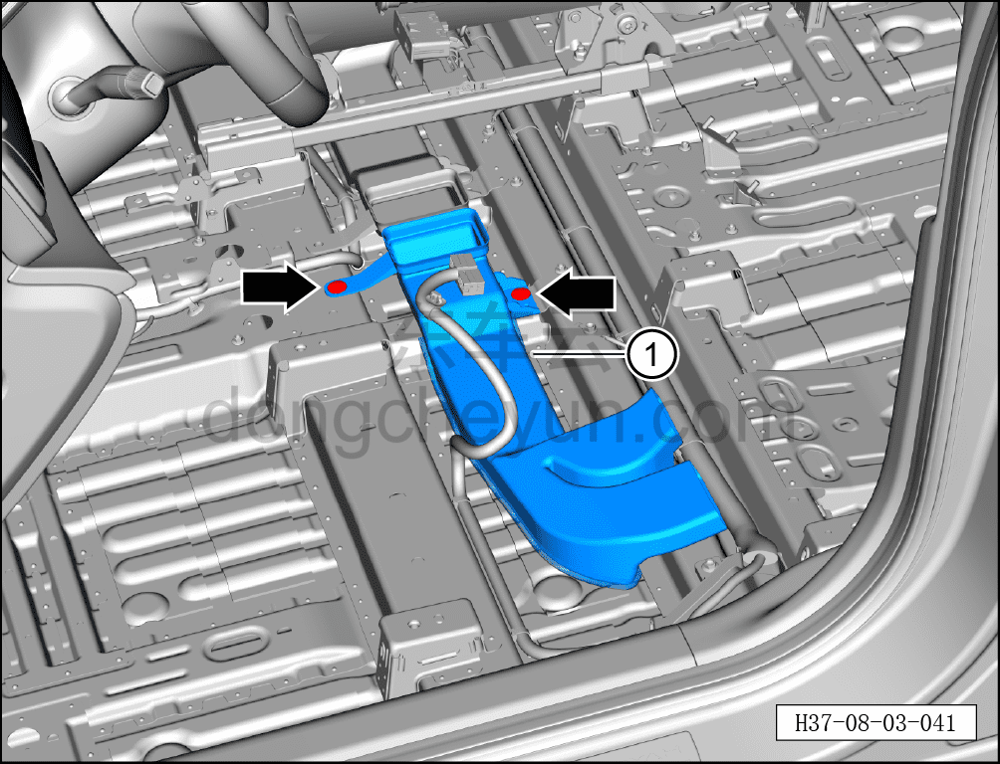

# Снятие и установка заднего участка левого заднего воздуховода обдува ног

> Внутренняя и внешняя отделка › Центральная консоль › Снятие и установка центральной консоли  
> Оригинал: `拆卸与安装左后吹足管道后段` · [dongcheyun 56746](https://dongcheyun.com/p/56746), страница `c9578207034946579975ff33a6a1e249` · [оглавление](../README.md)

**Порядок снятия**

**Примечание:**

**- Ниже описано снятие и установка заднего участка левого заднего воздуховода обдува ног, правая сторона выполняется по аналогии с левой.**

1. Выключите все электроприборы, отключите питание.

2. Выполните операцию обесточивания автомобиля для ремонта. См. [3.1.4.1 Обесточивание автомобиля](../03-техническое-обслуживание/005-обесточивание-автомобиля.md)

3. Снимите центральную консоль в сборе. См. [8.3.4.8 Снятие и установка центральной консоли в сборе](098-снятие-и-установка-центральной-консоли-в-сборе.md)

4. Снимите передний участок левого заднего воздуховода обдува ног. См. [8.3.4.16 Снятие и установка переднего участка левого заднего воздуховода обдува ног](106-снятие-и-установка-переднего-участка-левого-заднего.md)

5. Снимите переднее сиденье водителя в сборе. См. [8.1.3.1 Снятие и установка переднего сиденья в сборе](003-снятие-и-установка-сиденья-водителя-в-сборе.md)

6. Откиньте передний ковёр переднего пола в зоне водителя.

7. Снимите задний участок левого заднего воздуховода обдува ног.

a. Съёмником обивки отсоедините 2 крепёжные защёлки заднего участка левого заднего воздуховода обдува ног и снимите задний участок левого заднего воздуховода обдува ног ①.

**Порядок установки**

Установка выполняется в обратном порядке.

**Внимание:**

**- Проверьте крепёжные защёлки на повреждения и при необходимости замените их.**

**- После завершения установки проверьте нормальность обдува воздухом из заднего дефлектора.**
